---
## Front matter
title: "Лабораторная работа No 2.  Markdown"
subtitle: "Работа с Markdown"
author: "Стрельникова Ольга Александровна"

## Generic otions
lang: ru-RU
toc-title: "Содержание"

## Bibliography
bibliography: bib/cite.bib
csl: pandoc/csl/gost-r-7-0-5-2008-numeric.csl

## Pdf output format
toc: true # Table of contents
toc-depth: 2
lof: true # List of figures
lot: true # List of tables
fontsize: 12pt
linestretch: 1.5
papersize: a4
documentclass: scrreprt
## I18n polyglossia
polyglossia-lang:
  name: russian
  options:
	- spelling=modern
	- babelshorthands=true
polyglossia-otherlangs:
  name: english
## I18n babel
babel-lang: russian
babel-otherlangs: english
## Fonts
mainfont: PT Serif
romanfont: PT Serif
sansfont: PT Sans
monofont: PT Mono
mainfontoptions: Ligatures=TeX
romanfontoptions: Ligatures=TeX
sansfontoptions: Ligatures=TeX,Scale=MatchLowercase
monofontoptions: Scale=MatchLowercase,Scale=0.9
## Biblatex
biblatex: true
biblio-style: "gost-numeric"
biblatexoptions:
  - parentracker=true
  - backend=biber
  - hyperref=auto
  - language=auto
  - autolang=other*
  - citestyle=gost-numeric
## Pandoc-crossref LaTeX customization
figureTitle: "Рис."
tableTitle: "Таблица"
listingTitle: "Листинг"
lofTitle: "Список иллюстраций"
lotTitle: "Список таблиц"
lolTitle: "Листинги"
## Misc options
indent: true
header-includes:
  - \usepackage{indentfirst}
  - \usepackage{float} # keep figures where there are in the text
  - \floatplacement{figure}{H} # keep figures where there are in the text
---

РОССИЙСКИЙ УНИВЕРСИТЕТ ДРУЖБЫ НАРОДОВ
Факультет физико-математических и естественных наук
Кафедра прикладной информатики и теории вероятностей

ОТЧЕТ 
ПО ЛАБОРАТОРНОЙ РАБОТЕ № 2.
дисциплина:	Операционные системы		 

Студент: Стрельникова О.А.                                    

	Группа: НПМбв-01-19                                       

МОСКВА
2023 г.

# Цель работы
Изучить идеологию и применение средств контроля версий. Освоить умения по работе с git.

# Задание

Задание к лабораторной работе:
- Создать базовую конфигурацию для работы с git.
- Создать ключ SSH.
- Создать ключ PGP.
- Настроить подписи git.
- Зарегистрироваться на Github.
- Создать локальный каталог для выполнения заданий по предмету

# Выполнение лабораторной работы

1. Создать и базово настроить учётную запись на https://github.com. Было задано имя для гитхаб, установлен часовой пояс и подтверждён эмаил. (рис. @fig:001). 
{#fig:001 width=70%}
2. Далее производим установку git-flow.  Для этого с помощью команды su - root, мы заходим в супер пользователя, так как установка нужных нам компонентов доступна только из под него. И с помощью команды  $ yum install epel-release устанавливаем репозиторий Epel. (рис. @fig:002). После этого устанавливаем git-flow с помощью команды $ yum install git-flow. (рис. @fig:003).
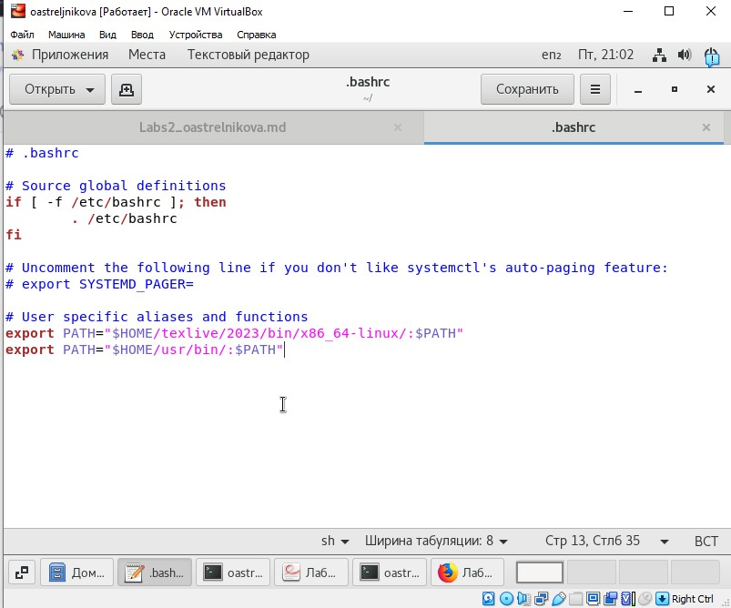{#fig:002 width=70%}
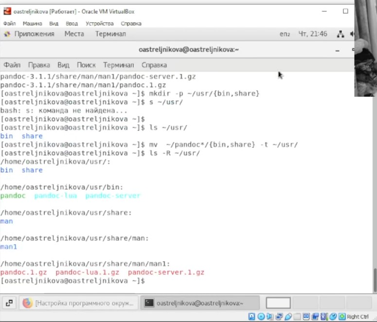{#fig:003 width=70%}
 

3. Далее в лабораторной работе присутствует такая команда как sudo dnf install gh  для CentOS она является не актуальной, в таком виде команда не была найдена системой и была заменена на sudo yum install git. (рис. @fig:004) Информация по данной команде была взята из открытых источников по работе с Git в системе CentOS в сети интернет.
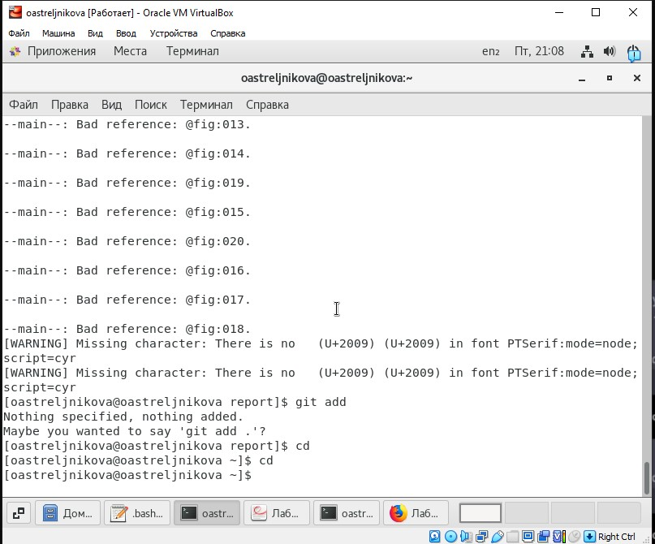{#fig:004 width=70%}

4. Производим базовую настройку GIT.
 4. Зададим имя и email владельца репозитория командами: git config --global user.name "Name Surname" ,   git config --global user.email "work@mail".  Настроим utf-8 в выводе сообщений git: git config --global core.quotepath false.  (рис. @fig:005) Во избежании публикации личных данных, и по политике сохранения личных данных, информация на скриншоте была замазана.
{#fig:005 width=70%} 
 4. Настраиваем подписание и верификацию коммитов. В лабораторной работе этот пункт идёт следующим. Так же начался выполняться заранее, но в ходе выполнения и анализа было установлено, что его выполнение происходит позже в ходе выполнения следующих пунктов лабораторной работы. Заранее был сгенерирован ключ, который в последствии был переделан, так как не удовлетворял заданным условиям. Автоматическое подписание коммитов было настроено в ходе лабораторки позже.
 4. Зададим имя начальной ветки (будем называть её master): git config --global init.defaultBranch master. (рис. @fig:006)
Настроим параметр autocrlf: git config --global core.autocrlf input. (рис. @fig:006)
Настроим параметр safecrlf:  git config --global core.safecrlf warn . (рис. @fig:006)
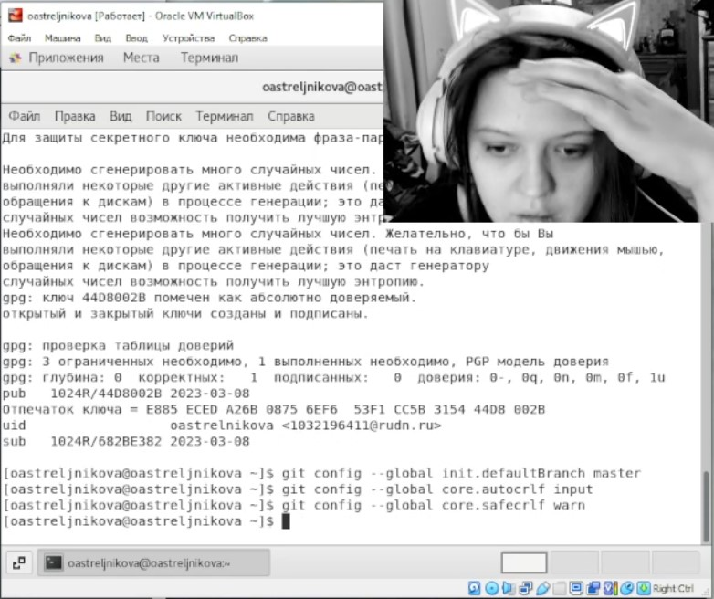{#fig:006 width=70%} 

5. Создаём ключ ssh c помощью команд – по алгоритму rsa с ключём размером 4096 бит: ssh-keygen -t rsa -b 4096. По алгоритму ed25519: ssh-keygen -t ed25519. В результате в последствии мы добавляем ключ SSH в наш гитхаб, так как для экспорта он нам понадобится. Для сохранения и безопасности личной информации, так как ключи являются путём доступа, скриншот выполнения данных команд не предоставляется, но предоставляется, но ниже представлен скриншот подтверждающий добавления ключа в гитхаб. (рис. @fig:007)
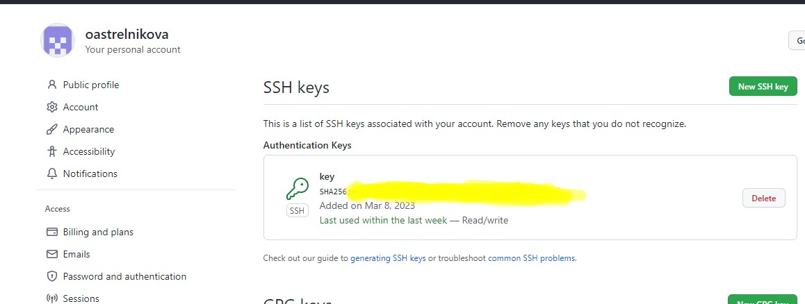{#fig:007 width=70%} 

6. Создание и добавления ключа GPG.
С помощью команды gpg --full-generate-key, был сгенерирован по заданным в условиях лабораторной работы ключ.  Скриншот его добавления не предоставляется во избежание потери личной информации, но эти данные есть в скринкасте. После этого мы добавляем данный ключ по пути указанном в лабораторной работе в гитхаб.  (рис. @fig:008) В следствии не работы буфера обмена, ключ добавлялся из внутреннего браузера виртуальной машины. (все настройки для того что бы буфер работал были произведены, однако он всё равно не работает).
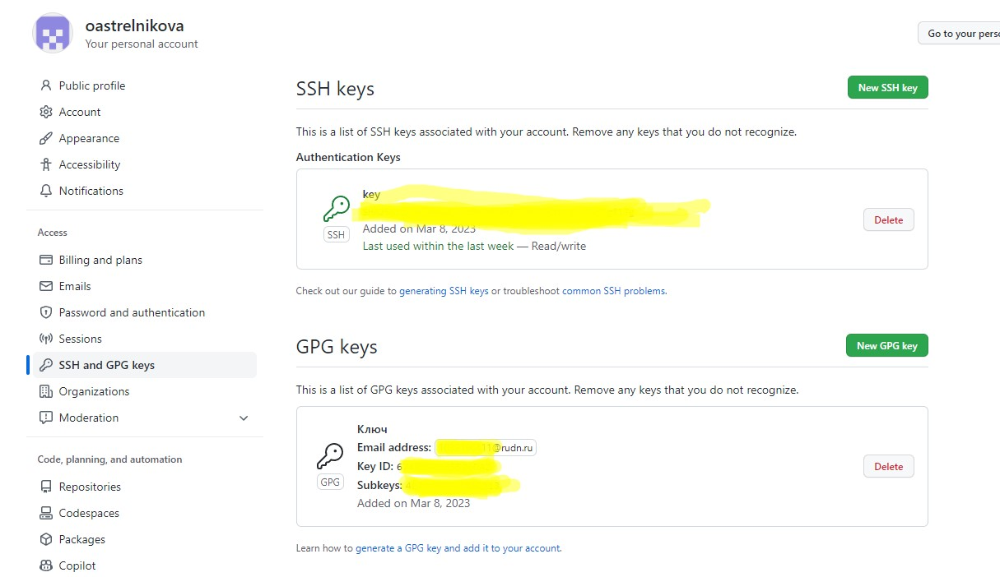{#fig:008 width=70%} 
 

7. Настройка автоматических подписей коммитов git.
Вот на этом моменте мы дошли до ранее упомянутой настройки подписей, выполняем настройку автоматических подписей коммитов используя ранее сгенерированный ключ PGP. Последовательно вводим в консоль такие команды как git config --global user.signingkey <PGP Fingerprint>, где <PGP Fingerprint> ранее сгенерированый PGP ключ, а точнее только его отпечаток. Далее выполняем  git config --global commit.gpgsign true. И последней командой в консоль вводим  git config --global gpg.program $(which gpg2). (рис. @fig:009) После данных манипуляций коммиты будут подписываться автоматически с помощью нашего ключа, в котором закодировано наше имя и эмайл.
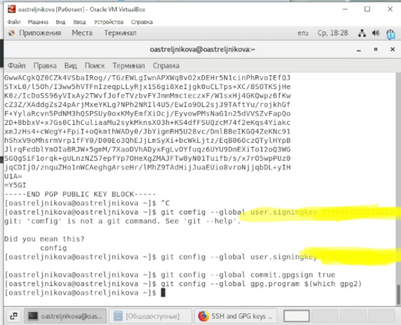{#fig:009 width=70%} 

8. Копируем шаблон рабочего пространства с предоставленной в лабораторной работе ссылки. Используя вот такие настройки при копировании в свой аккаунт гитхаб. (рис. @fig:010) В последствии имя репозитория было изменено на study_2022-2023_os-intro, для удовлетворения соглашения об именовании. 
{#fig:010 width=70%} 

9. Создание репозитория курса на основе шаблона.
 9. Для соблюдения соглашения об именовании, создаём требуемые папки в рабочем пространсве. С помощью команды mkdir -p ~/work/study/2021-2022/"Операционные системы". Создаём нужные нам директории, грамматические ошибки допущенные в ходе создания в последствии были устранены вручную. В частности, лишняя буква «н». (рис. @fig:011) 
 9. Производим клонирование из гитхаба, в операционную систему готового шаблона, ранее добавленного на аккаунта гитхаб с помощью команды. git clone –recursive git@github.com:<owner>/study_2021-2022_os-intro.git os-intro. (рис. @fig:012) 
Команда что упоминается в лабораторной работе ранее для нашей версии является неактуальной.
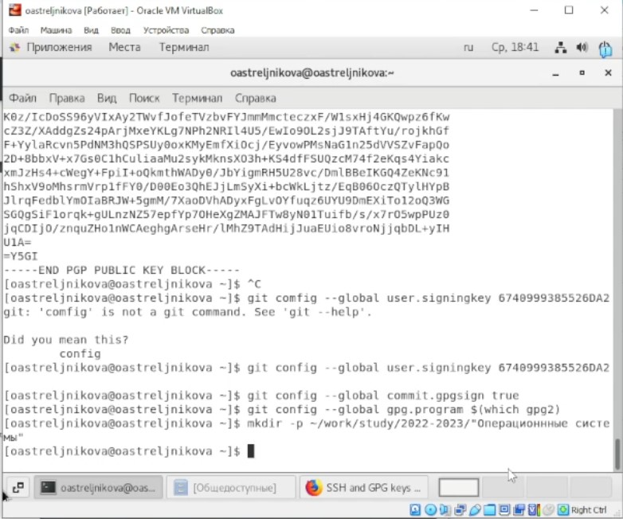{#fig:011 width=70%}
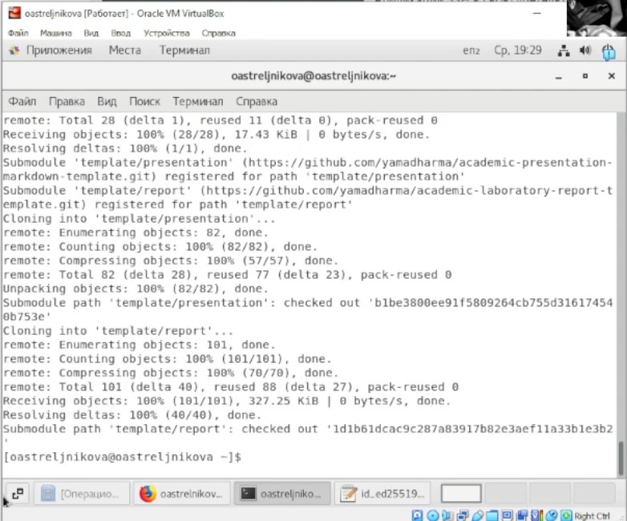{#fig:012 width=70%} 
 

10. Настройки каталога курса.
 10. Ввиду допущенных ранее грамматических ошибок в именовании папок путь был чуть длиннее, так как переходы осуществлялись последовательно в каждую директорию. По пути исправлялись допущенные ошибки в именовании файлов. Используемая команда cd ~/work/study/2021-2022/"Операционные системы"/os-intro. (рис. @fig:013)
{#fig:013 width=70%} 
 
 10. Удаление лишнего файла с помощью команды rm package.json. (рис. @fig:014). В последствии в Гитхабе при сравнении начальной версии, и версии, которая на моём аккаунте после импорта файлов мы её не обнаружим (рис. @fig:019)
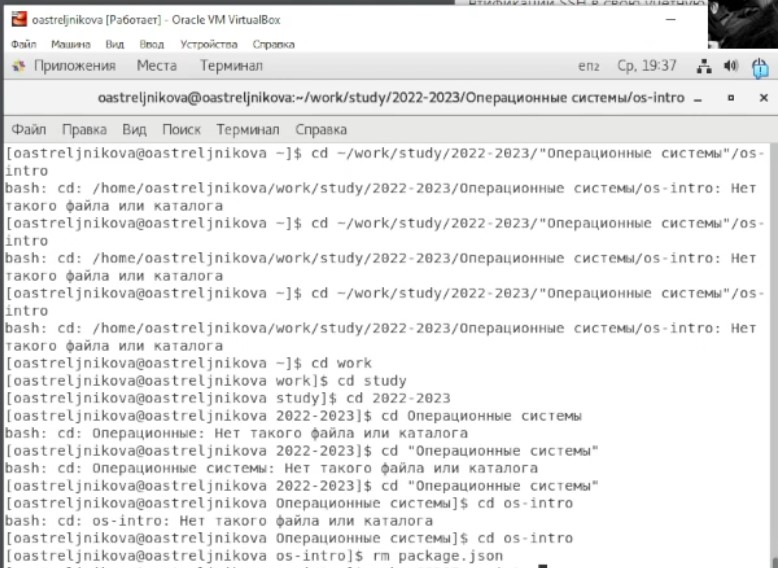{#fig:014 width=70%} 

 10. Создаём необходимый каталог используя команду  make COURSE=os-intro. (рис. @fig:015) на скрине немного криво, но в последствии команда была выполнена правильно. Свидетельство тому появившаяся папочка labs. (рис. @fig:020)
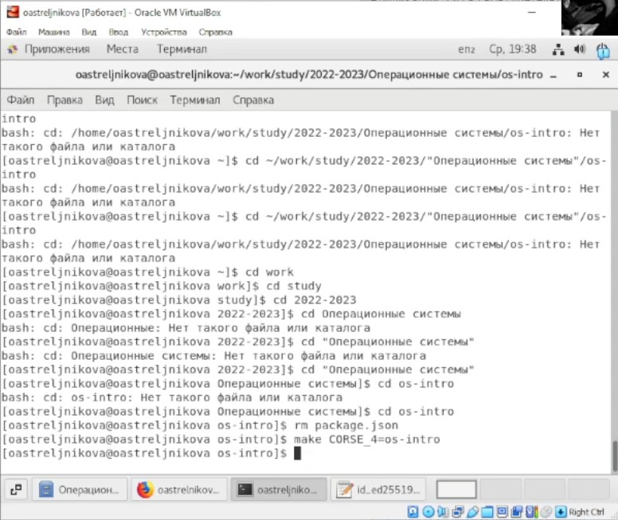{#fig:015 width=70%} 

 10. Отправьте файлы на сервер: с помощью последовательного выполнения комманд. git add . ((рис. @fig:016) ,  git commit -am 'feat(main): make course structure', (рис. @fig:017) git push. (рис. @fig:018)
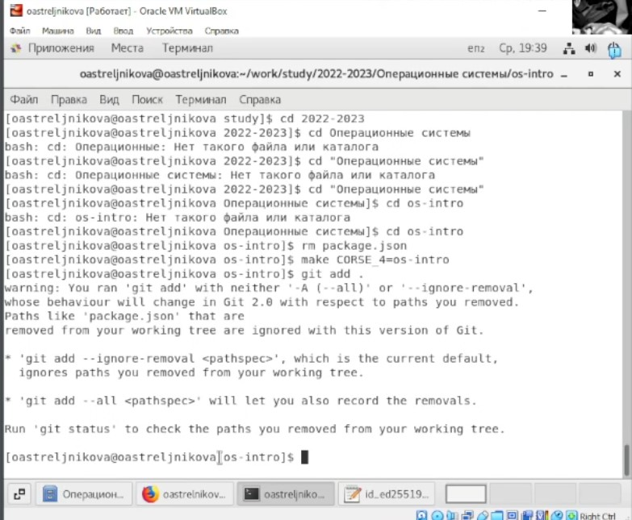{#fig:016 width=70%} 
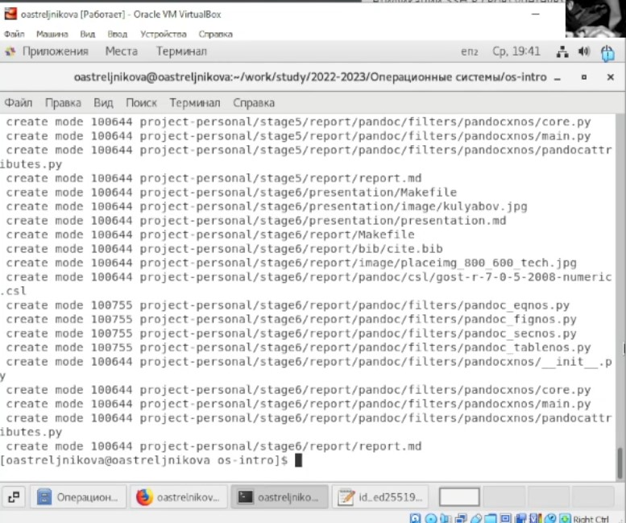{#fig:017 width=70%} 
{#fig:018 width=70%} 
{#fig:019 width=70%} 
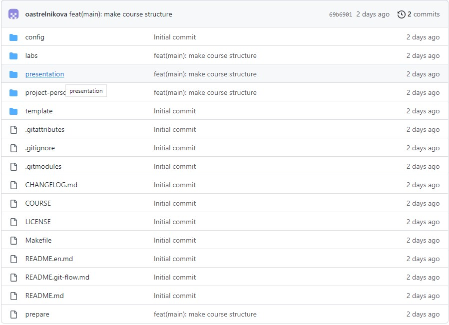{#fig:020 width=70%} 
 
# Выводы

В данной лабораторный работе была изучиена идеология и применение средств контроля версий, пошагово была произведена подготовка  и интеграция системы GitHub как системы хранения и контроля данных в репозиториях. Это необходимо применять когда с файлами репозитория работают не 1 , а несколько человек. Так же при таком хранении файлы всегда легко можно перенести между разными операционными системами.
Были преобретены навыки работы с git, с ключами GPG и SSH формата, их создания и интеграция в GitHab.

# Ответы на контрольные вопросы:
1. Что такое системы контроля версий (VCS) и для решения каких задач они предназначаются?
Программное обеспечение для облегчения работы с изменяющейся информацией. Система управления версиями позволяет хранить несколько версий одного и того же документа, при необходимости возвращаться к более ранним версиям, определять, кто и когда сделал то или иное изменение, и многое другое.
Такие системы наиболее широко используются при разработке программного обеспечения для хранения исходных кодов разрабатываемой программы. Однако они могут с успехом применяться и в других областях, в которых ведётся работа с большим количеством непрерывно изменяющихся электронных документов. В частности, системы управления версиями применяются в САПР, обычно в составе систем управления данными об изделии (PDM). Управление версиями используется в инструментах конфигурационного управления (Software Configuration Management Tools).2. Объясните следующие понятия VCS и их отношения: хранилище, commit, история, рабочая копия.
2. Объясните следующие понятия VCS и их отношения: хранилище, commit, история, рабочая копия.
Хранилище (репозиторий) – это система, которая обеспечивает хранение всех существовавших версий файлов. Commit - запись изменений. История - список предыдущих изменений. Рабочая копия – копия файла, с которой непосредственно ведётся работа (находится вне репозитория) С помощью коммитов изменения, внесённые в рабочую копию, заносятся в хранилище.
3. Что представляют собой и чем отличаются централизованные и децентрализованные
VCS? Приведите примеры VCS каждого вида.
Централизованные VCS- Клиент-серверная модель: один центральный репозиторий, с которым разработчики взаимодействуют по сети. 
Централизованные VCS: Примеры
• CVS- одна из первых систем второго и поколения (1986г.). Обладает множеством недостатков и считается устаревшей.
• Subversion (SVN) – система второго поколения, созданная для замены CVS. Одна из самых распространенных систем контроля версий.
Децентрализованная VCS - В отличие от централизованной модели, может существовать несколько экземпляров репозитория, которые время от времени синхронизируются между собой.
Децентрализованная VCS: примеры
• Git- Децентрализованная система управления версиями, созданная Л. Торвальдсом для управления разработкой ядра Linux.
• Mercurial- другая децентрализованная я VCS. Создана в 2005 году М. Макалом с практически одновременно с началом разработке git’а и с аналогичными целями.
4. Опишите действия с VCS при единоличной работе с хранилищем.
По окончанию работы необходимо отправлять изменения в репозиторий. При единоличном владении и работе нету необходимости отправлять изменения после каждого внесённой правки. Но по окончанию работы, для поддержания актуальности данные необходимо отправлять. Это поможет всегда иметь доступ к своим файлам с любого устройства.
5. Опишите порядок работы с общим хранилищем VCS.
Работа пользователя со своей веткой начинается с проверки и получения изменений из центрального репозитория (при этом в локальное дерево до начала этой процедуры не должно было вноситься изменений):
1 git checkout master
2 git pull
3 git checkout -b имя_ветки
Затем можно вносить изменения в локальном дереве и/или ветке.
После завершения внесения какого-то изменения в файлы и/или каталоги проекта необходимо разместить их в центральном репозитории.Для этого необходимо проверить, какие файлы изменились к текущему моменту:
1 git status
и при необходимости удаляем лишние файлы, которые не хотим отправлять в центральный репозиторий.
Затем полезно просмотреть текст изменений на предмет соответствия правилам ведения чистых коммитов:
1 git diff
Если какие-либо файлы не должны попасть в коммит, то помечаем только те файлы, изменения которых нужно сохранить. Для этого используем команды добавления и/или удаления с нужными опциями:
1 git add …
2 git rm …
Если нужно сохранить все изменения в текущем каталоге, то используем:
1 git add .
Затем сохраняем изменения, поясняя, что было сделано:
1 git commit -am "Some commit message"
и отправляем в центральный репозиторий:
1 git push origin имя_ветки
или
1 git push
6. Каковы основные задачи, решаемые инструментальным средством git?
Git — это система управления версиями. У Git две основных задачи: первая — хранить информацию о всех изменениях в вашем коде, начиная с самой первой строчки, а вторая — обеспечение удобства командной работы над кодом.
7. Назовите и дайте краткую характеристику командам git.
1. Как задать имя пользователя и адрес электронной почты
Имя пользователя нужно, чтобы привязывать коммиты к вашему имени. Это не то же самое, что имя пользователя учётной записи GitHub, с помощью которого выполняется вход в профиль на GitHub. Задать или изменить имя пользователя можно с помощью команды git config. Новое имя будет автоматически отображаться в последующих коммитах, отправленных на GitHub через командную строку. Если хотите скрыть своё реальное имя, можно использовать в качестве имени пользователя Git произвольный набор символов.
git config --global user.name "Tara Routray"
Кроме того, командой git config можно изменять адрес электронной почты, привязанный к вашим коммитам Git. Новый адрес электронной почты будет автоматически отображаться во всех дальнейших коммитах, поданных на GitHub через командную строку.
git config --global user.email "dev@tararoutray.com"
2. Кэширование учётных данных
Кэшировать учётные данные можно с помощью параметра config с флагом --global. Так вы избавитесь от необходимости вручную вводить имя пользователя и пароль при создании нового коммита.
git config --global credential.helper cache
3. Инициализация репозитория
Создать пустой репозиторий Git или вновь инициализировать существующий можно параметром init. При инициализации он создаст скрытую папку. В ней содержатся все объекты и ссылки, которые Git использует и создаёт в истории работы над проектом.
git init
4. Добавление отдельных файлов или всех файлов в область подготовленных файлов
Добавить отдельный файл в область подготовленных файлов можно параметром add с указанием имени файла. Просто замените somefile.js на актуальное имя.
git add somefile.js
Кроме того, можно добавить все файлы и папки в эту область, предоставив wildcard . вместо имени файла:
git add .
5. Проверка статуса репозитория
Просмотреть статус нужного репозитория можно по ключевому слову status: его действие распространяется на подготовленные, неподготовленные и неотслеживаемые файлы.
git status
6. Внесение изменений однострочным сообщением или через редактор
При создании коммита в репозитории можно добавить однострочное сообщение с помощью параметра commit с флагом -m. Само сообщение вводится непосредственно после флага, в кавычках.
git commit -m "Your short summary about the commit"
Также можно открыть текстовый редактор в терминале для написания полного сообщения коммита. Оно может состоять из нескольких строк текста, в котором подробно характеризуются изменения, внесённые в репозиторий.
git commit
7. Просмотр истории коммитов с изменениями
Просматривать изменения, внесённые в репозиторий, можно с помощью параметра log. Он отображает список последних коммитов в порядке выполнения. Кроме того, добавив флаг -p, вы можете подробно изучить изменения, внесённые в каждый файл.
git log -p
8. Просмотр заданного коммита
Просмотреть полный список изменений, внесённых конкретным коммитом, можно с помощью параметра show, указав идентификатор или хеш коммита. Значение хеша уникально для каждого коммита, созданного в вашем репозитории.
git show 1af17e73721dbe0c40011b82ed4bb1a7dbe3ce29
Также можно использовать сокращённый хеш.
git show 1af17e
9. Просмотр изменений до коммита
Можно просматривать список изменений, внесённых в репозиторий, используя параметр diff. По умолчанию отображаются только изменения, не подготовленные для фиксации.
git diff
Для просмотра подготовленных изменений необходимо добавить флаг --staged.
git diff --staged
Также можно указать имя файла как параметр и просмотреть изменения, внесённые только в этот файл.
git diff somefile.js
10. Удаление отслеживаемых файлов из текущего рабочего дерева
Удалять файлы из текущего рабочего дерева можно с помощью параметра rm. При этом файлы удаляются и из индекса.
git rm dirname/somefile.js
Можно также использовать маски файлов (например *.js) для удаления всех файлов, соответствующих критерию.
git rm dirname/*.html
11. Переименование файлов
Переименовать файл или папку можно параметром mv. Для него указывается источник source и назначение destination. Источник — реально существующий файл или папка, а назначение — существующая папка.
git mv dir1/somefile.js dir2
При выполнении команды файл или папка, указанные как источник, будут перемещены в папку назначения. Индекс будет обновлён соответственно, но изменения нужно записать.
12. Отмена подготовленных и неподготовленных изменений
Восстановить файлы рабочего дерева, не подготовленные к коммиту, можно параметром checkout. Для проведения операции требуется указать путь к файлу. Если путь не указан, параметр git checkout изменит указатель HEAD, чтобы задать указанную ветку как текущую.
git checkout somefile.js
Восстановить подготовленный файл рабочего дерева можно параметром reset. Потребуется указать путь к файлу, чтобы убрать его из области подготовленных файлов. При этом не будет производиться откат никаких изменений или модификаций — однако файл перейдёт в категорию не подготовленных к коммиту.
git reset HEAD somefile.js
Если нужно выполнить это действие для всех подготовленных файлов, путь к ним указывать не надо.
git reset HEAD
13. Изменение последнего коммита
Внести изменения в последний коммит можно параметром commit с флагом --amend. Например, вы записали изменения, внесённые в ряд файлов, и поняли, что допустили ошибку в сообщении коммита. В этом случае можете воспользоваться указанной командой, чтобы отредактировать сообщение предыдущего коммита, не изменяя его снимок.
git commit --amend -m "Updated message for the previous commit"
Также можно вносить изменения в файлы, отправленные ранее. Например, вы изменили несколько файлов в ряде папок и хотите их записать как единый снимок, но забыли добавить в коммит одну из папок. Чтобы исправить такую ошибку, достаточно подготовить для фиксации остальные файлы и папки и создать коммит с флагами --amend и --no-edit.
git add dir1
git commit
git add dir2
git commit --amend --no-edit
Флаг --no-edit позволит внести в коммит поправку без изменения сообщения коммита. В этом случае итоговый коммит заменит неполный, а выглядеть это будет так, как будто мы отправили изменения ко всем файлам в нужных папках как единый снимок.
С помощью amend прекрасно исправляются локальные коммиты, а исправления можно передать в общий репозиторий. Однако изменять коммиты, уже доступные другим пользователям, не следует. Помните, что изменённые коммиты являются совершенно новыми, а предыдущий коммит уже не будет доступен в текущей ветке. Последствия будут такими же, как при отмене изменений публичного снимка.
14. Откат последнего коммита
Откатить последний коммит можно с помощью параметра revert. Создастся новый коммит, содержащий обратные преобразования относительно предыдущего, и добавится к истории текущей ветки.
git revert HEAD
▍ Разница между revert и reset
Команда git revert отменяет изменения, записанные только одним коммитом. Она не откатывает проект к более раннему состоянию, удаляя все последующие коммиты, как это делает команда git reset.
У команды revert есть два крупных преимущества по сравнению с reset. Во-первых, она не меняет историю проекта и производит операцию, безопасную для коммитов. Во-вторых, её объектом выступает конкретный коммит, созданный в любой момент истории, а git reset всегда берёт за точку отсчёта текущий коммит. К примеру, если нужно отменить старый коммит с помощью git reset, придётся удалить все коммиты, поданные после целевого, а затем выполнить их повторно. Следовательно, команда git revert — гораздо более удобный и безопасный способ отмены изменений.
15. Откат заданного коммита
Откатить проект до заданного коммита можно с помощью параметра revert и идентификатора коммита. Создастся новый коммит — копия коммита с предоставленным идентификатором — и добавится к истории текущей ветки.
git revert 1af17e
16. Создание новой ветки и переход в неё
Создать новую ветку можно с помощью параметра branch, указав имя ветки.
git branch new_branch_name
Но Git не переключится на неё автоматически. Для автоматического перехода нужно добавить флаг -b и параметр checkout.
git checkout -b new_branch_name
17. Просмотр списка веток
Можно просматривать полный список веток, используя параметр branch. Команда отобразит все ветки, отметит текущую звёздочкой (*) и выделит её цветом.
git branch
Также можно вывести список удалённых веток с помощью флага -a.
git branch -a
18. Удаление ветки
Удалить ветку можно параметром branch с добавлением флага -d и указанием имени ветки. Если вы завершили работу над веткой и объединили её с основной, можно её удалить без потери истории. Однако, если выполнить команду удаления до слияния — в результате появится сообщение об ошибке. Этот защитный механизм предотвращает потерю доступа к файлам.

git branch -d existing_branch_name
Для принудительного удаления ветки используется флаг -D с заглавной буквой. В этом случае ветка будет удалена независимо от текущего статуса, без предупреждений.
git branch -D existing_branch_name
Вышеуказанные команды удаляют только локальную копию ветки. В удалённом репозитории она может сохраниться. Если хотите стереть удалённую ветку, выполните следующую команду:
git push origin --delete existing_branch_name
19. Слияние двух веток
Объединить две ветки можно параметром merge с указанием имени ветки. Команда объединит указанную ветку с основной.
git merge existing_branch_name
Если надо выполнить коммит слияния, выполните команду git merge с флагом --no-ff.
git merge --no-ff existing_branch_name
Указанная команда объединит заданную ветку с основной и произведёт коммит слияния. Это необходимо для фиксации всех слияний в вашем репозитории.
20. Отображение журнала фиксации в виде графика для текущей или всех веток
Просмотреть историю коммитов в виде графика для текущей ветки можно с помощью параметра log и флагов --graph --oneline --decorate. Опция --graph выведет график в формате ASCII, отражающий структуру ветвления истории коммитов. В связке с флагами --oneline и --decorate, этот флаг упрощает понимание того, к какой ветке относится каждый коммит.
git log --graph --oneline --decorate
Для просмотра истории коммитов по всем веткам используется флаг --all.
git log --all --graph --oneline --decorate
21. Прекращение слияния при конфликте
Прервать слияние в случае конфликта можно параметром merge с флагом --abort. Он позволяет остановить процесс слияния и вернуть состояние, с которого этот процесс был начат.
git merge --abort
Также при конфликте слияния можно использовать параметр reset, чтобы восстановить конфликтующие файлы до стабильного состояния.
git reset
22. Добавление удалённого репозитория
Добавить удалённый репозиторий можно параметром remote add, указав shortname и url требуемого репозитория.
git remote add awesomeapp https://github.com/someurl..
23. Просмотр удалённых URL-адресов
Просматривать удалённые URL-адреса можно параметром remote с флагом -v. Этот параметр отображает удалённые подключения к другим репозиториям.
git remote -v
Такая команда открывает доступ к интерфейсу управления удалёнными записями, которые хранятся в файле .git/config репозитория.
24. Получение дополнительных сведений об удалённом репозитории
Получить подробные сведения об удалённом репозитории можно с помощью параметра remote show с указанием имени репозитория — например, origin.
git remote show origin
Эта команда отображает список веток, связанных с удалённым репозиторием, а также рабочих станций, подключённых для получения и отправки файлов.
25. Отправка изменений в удалённый репозиторий
Отправлять изменения в удалённый репозиторий можно параметром push с указанием имени репозитория и ветки.

git push origin main
Эта команда передаёт локальные изменения в центральный репозиторий, где с ними могут ознакомиться другие участники проекта.
26. Получение изменений из удалённого репозитория
Для загрузки изменений из удалённого репозитория используется параметр pull. Он скачивает копию текущей ветки с указанного удалённого репозитория и объединяет её с локальной копией.
git pull
Также можно просмотреть подробные сведения о загруженных файлах с помощью флага --verbose.
git pull --verbose
27. Слияние удалённого репозитория с локальным
Слияние удалённого репозитория с локальным выполняется параметром merge с указанием имени удалённого репозитория.
git merge origin
28. Отправка новой ветки в удалённый репозиторий
Передать новую ветку в удалённый репозиторий можно параметром push с флагом -u, указав имя репозитория и имя ветки.
git push -u origin new_branch
29. Удаление удалённой ветки
Чтобы избавиться от удалённой ветки, используйте параметр push с флагом --delete, указав имя удалённого репозитория и имя ветки.
git push --delete origin existing_branch
30. Использование перебазирования
Для доступа к этой функции используйте параметр rebase с указанием имени ветки. Перебазирование — это процесс объединения или перемещения последовательности коммитов на новый родительский снимок.
git rebase branch_name
Эта команда изменит основу ветки с одного коммита на другой, как если бы вы начали ветку с другого коммита. В Git это достигается за счёт создания новых коммитов и применения их к указанному базовому коммиту. Необходимо понимать, что, хотя ветка и выглядит такой же, она состоит из совершенно новых коммитов.
8. Приведите примеры использования при работе с локальным и удалённым репозиториями.
Получение изменений из удалённого репозитория — Fetch и Pull
Как вы только что узнали, для получения данных из удалённых проектов, следует выполнить:
$ git fetch [remote-name]
Данная команда связывается с указанным удалённым проектом и забирает все те данные проекта, которых у вас ещё нет. После того как вы выполнили команду, у вас должны появиться ссылки на все ветки из этого удалённого проекта, которые вы можете просмотреть или слить в любой момент.
При работе с локальным репозиторием вы копируете все данные себе на компьютер, и отправляете уже только после окончания работы репозиторий целиком, а не только свою ветку.
Локальный предполагает хранение данных у себя на устройстве, удалённых на сервере.

9. Что такое и зачем могут быть нужны ветви (branches)?
При помощи веток в VCS можно:
•	Реализовать фичу, не мешая остальным.
•	Проводить модерацию (кодревью) нового кода перед непосредственным добавлением в кодовую базу.
•	Отвлечься от реализации фичи и починить баг в другом месте.
•	Вовсе отложить начатую фичу до лучших времен.
•	Получить запрос на доработку старой версии программы от заказчика и поддерживать далее несколько версий ПО.
•	Поэкспериментировать с кодом без страха сломать билд.
•	Организовать процесс поэтапного выпуска программы (разработка - тестирование - релиз), не блокируя разработку следующей версии.
•	Организовать работу с open source сообществом или подрядчиком.
•	Запилить постоянную автоматическую сборку с рабочей ветки с прогоном тестов и ручную авторизованную сборку релиза с релиз-ветки.
В случае с гитом сама распределенная работа неразрывно связана с понятием локальных и удаленных веток и синхронизацией коммитов между ними.
10. Как и зачем можно игнорировать некоторые файлы при commit?
Игнорируемый файл — файл, явным образом помеченный для Git как файл, который необходимо игнорировать.
Игнорируемые файлы — это, как правило, артефакты сборки и файлы, генерируемые машиной из исходных файлов в вашем репозитории, либо файлы, которые по какой-либо иной причине не должны попадать в коммиты. Вот некоторые распространенные примеры таких файлов:
•	кэши зависимостей, например содержимое /node_modules или /packages;
•	скомпилированный код, например файлы .o, .pyc и .class ;
•	каталоги для выходных данных сборки, например /bin, /out или /target;
•	файлы, сгенерированные во время выполнения, например .log, .lock или .tmp;
•	скрытые системные файлы, например .DS_Store или Thumbs.db;
•	личные файлы конфигурации IDE, например .idea/workspace.xml.
Игнорируемые файлы отслеживаются в специальном файле .gitignore, который регистрируется в корневом каталоге репозитория. В Git нет специальной команды для указания игнорируемых файлов: вместо этого необходимо вручную отредактировать файл .gitignore, чтобы указать в нем новые файлы, которые должны быть проигнорированы. Файлы .gitignore содержат шаблоны, которые сопоставляются с именами файлов в репозитории для определения необходимости игнорировать эти файлы.

::: {#refs}
:::
