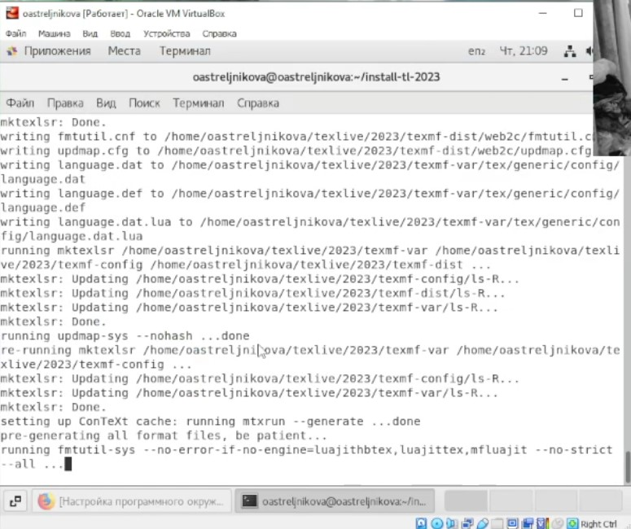
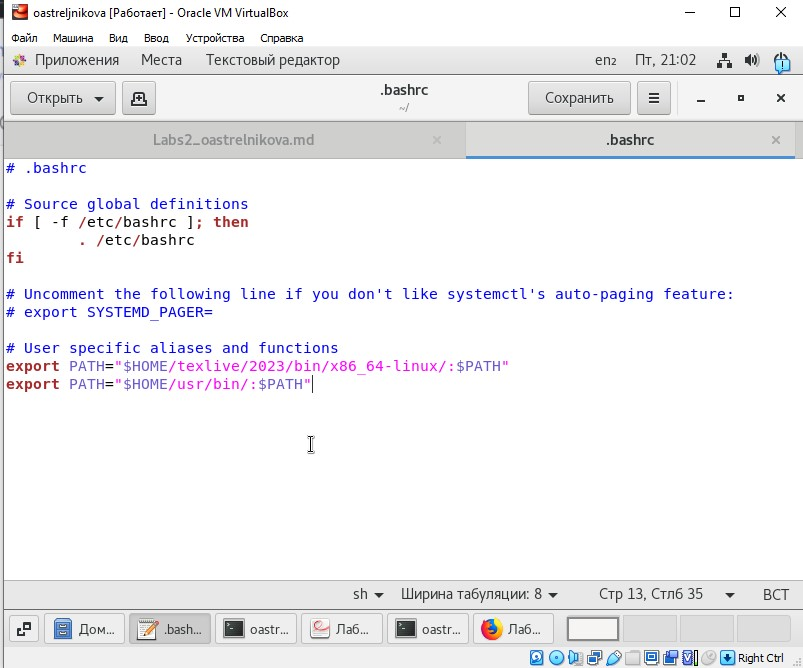
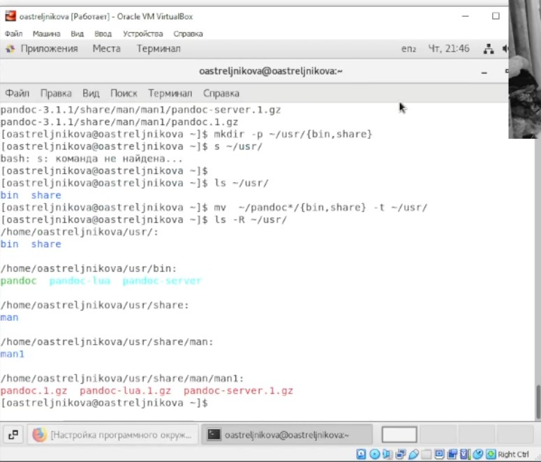
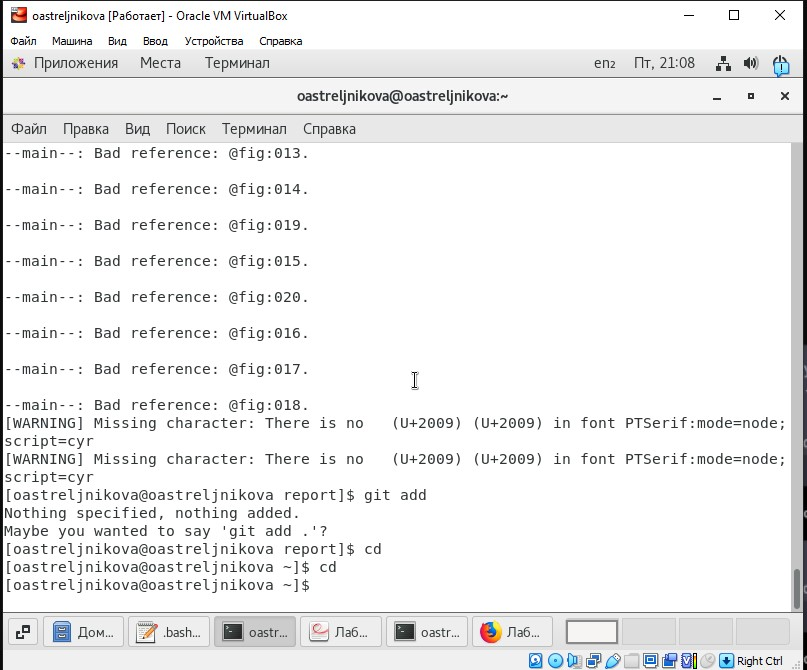
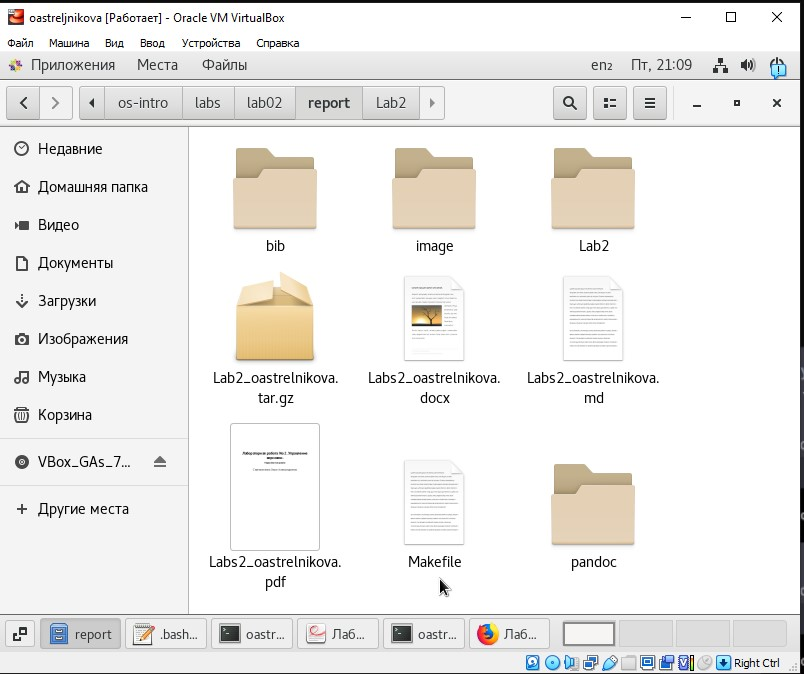

---
## Front matter
title: "Лабораторная работа No 3. Markdown."
subtitle: "Markdown"
author: "Стрельникова Ольга Александровна"

## Generic otions
lang: ru-RU
toc-title: "Содержание"

## Bibliography
bibliography: bib/cite.bib
csl: pandoc/csl/gost-r-7-0-5-2008-numeric.csl

## Pdf output format
toc: true # Table of contents
toc-depth: 2
lof: true # List of figures
lot: true # List of tables
fontsize: 12pt
linestretch: 1.5
papersize: a4
documentclass: scrreprt
## I18n polyglossia
polyglossia-lang:
  name: russian
  options:
	- spelling=modern
	- babelshorthands=true
polyglossia-otherlangs:
  name: english
## I18n babel
babel-lang: russian
babel-otherlangs: english
## Fonts
mainfont: PT Serif
romanfont: PT Serif
sansfont: PT Sans
monofont: PT Mono
mainfontoptions: Ligatures=TeX
romanfontoptions: Ligatures=TeX
sansfontoptions: Ligatures=TeX,Scale=MatchLowercase
monofontoptions: Scale=MatchLowercase,Scale=0.9
## Biblatex
biblatex: true
biblio-style: "gost-numeric"
biblatexoptions:
  - parentracker=true
  - backend=biber
  - hyperref=auto
  - language=auto
  - autolang=other*
  - citestyle=gost-numeric
## Pandoc-crossref LaTeX customization
figureTitle: "Рис."
tableTitle: "Таблица"
listingTitle: "Листинг"
lofTitle: "Список иллюстраций"
lotTitle: "Список таблиц"
lolTitle: "Листинги"
## Misc options
indent: true
header-includes:
  - \usepackage{indentfirst}
  - \usepackage{float} # keep figures where there are in the text
  - \floatplacement{figure}{H} # keep figures where there are in the text
---

# Цель работы

Научится оформлять отчёты с помощью легковесного языка разметки Markdown.

# Задание

- Создать отчёт по предыдущей лабороторной работе в формате Markdown

# Выполнение лабораторной работы

1. Для работы и компиляции файлов в данной разметке, на устройство в ОС устанавливаем дополнительное программное обеспечение. TEXLive установочно скачиваем с сайта приложенного в дополнительном файле по установке программы. Скачиваем архив и с помощью команд, и по инструкции устанавливаем программное обеспечение которое нам дальше понадобится.

   Последовательность вводимых команд:
   yum install wget tar -y
   wget https://mirror.ctan.org/systems/texlive/tlnet/install-tl-unx.tar.gz ls | grep tar
   tar -xzvf install-tl-unx.tar.gz
   cd install-tl-20231403 
   ./install-tl

   Установщик работает в текстовом режиме и позволяет настроить параметры установки. Нам необходимо изменить только один параметр — каталог, куда будут загружены все требующиеся файлы. Для изменения каталога следует произвести следующие действия по порядку: • нажимаем клавишу D , а затем Enter для подтверждения; • откроется новое меню, где мы введем 1 и нажмем Enter для подтверждения; • теперь вводим путь до основного каталога установки: ~/texlive/2023 и нажимаем Enter ; • после чего вводим R и нажмем Enter . И попадаем снова на установку только с верным путём повторяем. И в конечном итоге получаем установленный софт. (рис. @fig:001). 

{#fig:001 width=70%}

2. После окончания установки требуется добавить путь до исполняемых файлов TEXLive в переменную окружения PATH. О чем сообщит сам установщик, выдав следующее сообщение: Добавьте /home/mng/texlive/2021/texmf-dist/doc/man в MANPATH. Добавьте /home/mng/texlive/2021/texmf-dist/doc/info в INFOPATH. И самое главное, добавьте /home/mng/texlive/2021/bin/x86_64-linux в ваш PATH для текущей и будущих сессий. Переменная PATH создается интерпретатором командной строки автоматически и в ней содержатся пути до каталогов, где находятся исполняемые файлы различных программ. Текущее значение этой переменной можно посмотреть с помощью команды echo $PATH
   Так как  у мамы "программист" и с помощью команд вытащить необходимые данные не получилось, переходим в корневой каталог отображаем скрытые файлы и ручками вводим в .bashrc команду export PATH="$HOME/texlive/2021/bin/x86_64-linux/:$PATH" , что бы не вводить её всегда в консоли. (рис. @fig:002).

{#fig:002 width=70%}

3. Далее устанавливаем Pandoc.  (В последствии доставляли ещё отдельно несколько пакетов отдельно вручную)  yum install wget tar -y Скачиваем архив: wget https://github.com/jgm/pandoc/releases/download/3.1.1/pandoc-3.1.1-linux-amd ⌋ ↪ 64.tar.gz Обязательно проверьте ссылку, так как указанная здесь может устареть до того времени, когда вы начнете выполнять данную лабораторную работу. Если все верно и архив был загружен, то разархивируем его: tar -xzvf pandoc-3.1.1-linux-amd64.tar.gz Создаем ряд каталогов и переносим в них содержимое архива mkdir -p ~/usr/{bin,share} # Проверяем, что все создалось ls ~/usr/ # переносим файлы из разархивированного архива mv ~/pandoc*/{bin,share} -t ~/usr/ # проверяем, что все файлы на месте ls -R ~/usr/ # или # tree ~/usr/  (рис. @fig:003). Вносим путь до исполняемых файлов в переменную окружения PATH, добавив команду export PATH="$HOME/usr/bin/:$PATH". Точно так же ручками вносим её в файл .bashrc. (рис. @fig:002).

{#fig:003 width=70%}

4. После подгонки файла под новую разметку (и нескольких выпитых бутыльков валерьянки, так как прежде чем найти что эта система от меня хочет я поседела) мы с помощью команды make компилируем файлы. Игнорируем пару ошибок, так как документ изначально был WORD и какие то символы не читаются (рис. @fig:004). 

   

   {#fig:004 width=70%}

   

 5. Проверяем правильность компиляции и радуемся полученным документам. Мы победили!! (рис. @fig:005).

{#fig:005 width=70%}

# Выводы

В данной лабораторной работе мы изучили легковесный языка разметки Markdown.
Установили необходимое для этого ПО.  Научились исправлять ошибки неокончательной установки программ.

::: {#refs}
:::
