---
## Front matter
title: "Лабораторная работа №5"
subtitle: "Основы интерфейса взаимодействия пользователя с системой Unix на уровне командной строки"
author: "Стрельникова Ольга Александровна"

## Generic otions
lang: ru-RU
toc-title: "Содержание"

## Bibliography
bibliography: bib/cite.bib
csl: pandoc/csl/gost-r-7-0-5-2008-numeric.csl

## Pdf output format
toc: true # Table of contents
toc-depth: 2
lof: true # List of figures
lot: true # List of tables
fontsize: 12pt
linestretch: 1.5
papersize: a4
documentclass: scrreprt
## I18n polyglossia
polyglossia-lang:
  name: russian
  options:
	- spelling=modern
	- babelshorthands=true
polyglossia-otherlangs:
  name: english
## I18n babel
babel-lang: russian
babel-otherlangs: english
## Fonts
mainfont: PT Serif
romanfont: PT Serif
sansfont: PT Sans
monofont: PT Mono
mainfontoptions: Ligatures=TeX
romanfontoptions: Ligatures=TeX
sansfontoptions: Ligatures=TeX,Scale=MatchLowercase
monofontoptions: Scale=MatchLowercase,Scale=0.9
## Biblatex
biblatex: true
biblio-style: "gost-numeric"
biblatexoptions:
  - parentracker=true
  - backend=biber
  - hyperref=auto
  - language=auto
  - autolang=other*
  - citestyle=gost-numeric
## Pandoc-crossref LaTeX customization
figureTitle: "Рис."
tableTitle: "Таблица"
listingTitle: "Листинг"
lofTitle: "Список иллюстраций"
lotTitle: "Список таблиц"
lolTitle: "Листинги"
## Misc options
indent: true
header-includes:
  - \usepackage{indentfirst}
  - \usepackage{float} # keep figures where there are in the text
  - \floatplacement{figure}{H} # keep figures where there are in the text
---

# Цель работы

Приобретение практических навыков взаимодействия пользователя с системой посредством командной строки.

# Задание

1. Определить полное имя домашнего каталога. Далее относительно этого каталога будут выполняться последующие упражнения.
2. Выполнить следующие действия:
   1. Перейти в каталог /tmp.
   2. Вывести на экран содержимое каталога /tmp. Для этого использовать команду ls с различными опциями. Пояснить разницу в выводимой на экран информации.
   3. Определить, есть ли в каталоге /var/spool подкаталог с именем cron?
   4. Перейти в домашний каталог и вывести на экран его содержимое. Определить, кто является владельцем файлов и подкаталогов?
3. Выполнить следующие действия:
   1. В домашнем каталоге создать новый каталог с именем newdir.
   2. В каталоге ~/newdir создать новый каталог с именем morefun.
   3. В домашнем каталоге создать одной командой три новых каталога с именами letters, memos, misk. Затем удалить эти каталоги одной командой.
   4. Попробовать удалить ранее созданный каталог ~/newdir командой rm. Проверить, был ли каталог удалён.
   5. Удалить каталог ~/newdir/morefun из домашнего каталога. Проверить, был ли каталог удалён.
4. С помощью команды man определить, какую опцию команды ls нужно использовать для просмотра содержимого не только указанного каталога, но и подкаталогов, входящих в него.
5. С помощью команды man определить набор опций команды ls, позволяющий отсортировать по времени последнего изменения выводимый список содержимого каталога с развёрнутым описанием файлов.
6. Использоватт команду man для просмотра описания следующих команд: cd, pwd, mkdir, rmdir, rm. Пояснить основные опции этих команд.
7. Используя информацию, полученную при помощи команды history, выполнить модификацию и исполнение нескольких команд из буфера команд.

# Выполнение лабораторной работы

1. Определим полное имя домашнего каталога в моём случае это /home/oastrejnikova (рис. @fig:001):

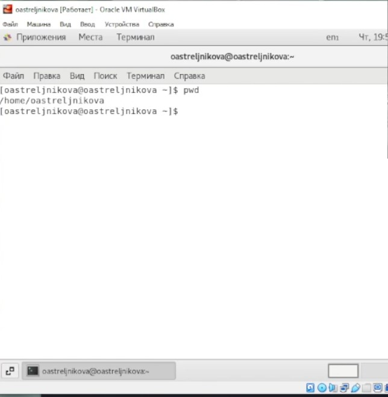{#fig:001 width=70%}

2. Выполняем ниже приведённый список действий:

  1. Перейдем в каталог /tmp и выведем на экран содержимое каталога используем команду, cd tmp  и ls последовательно для вывода содержимого каталога.(рис. @fig:002): 

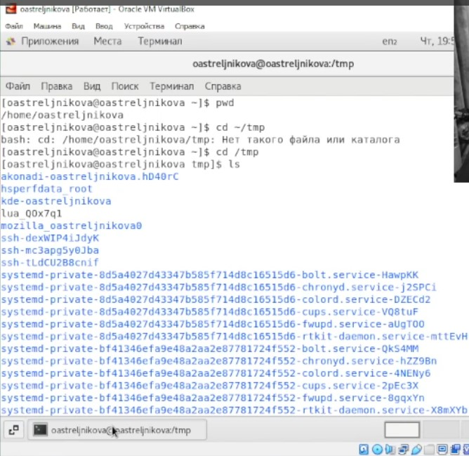{#fig:002 width=70%}

ls -a (просмотр содержимого и скрытых файлов) (рис. @fig:003):

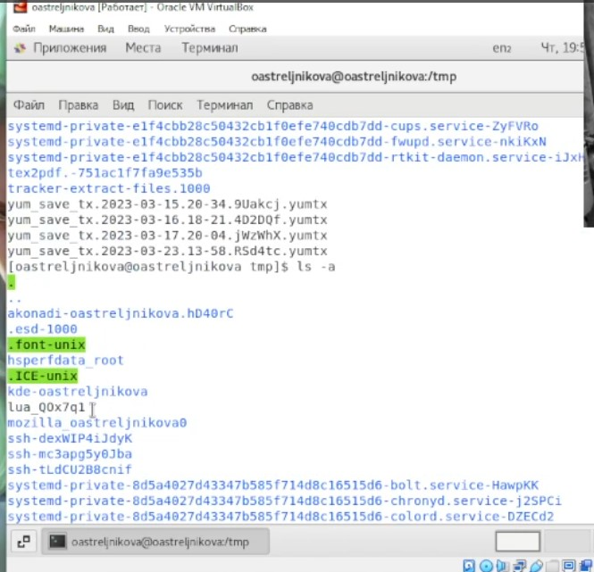{#fig:003 width=70%}

ls -alF просмотр содержимого со скрытыми файлами, с типами, и с подробным описанием. (рис. @fig:004):

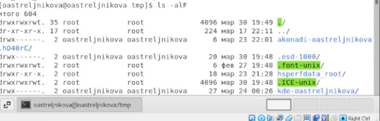{#fig:004 width=70%}

ls -l (просмотр содержимого с подробным описанием) (рис. @fig:005): 

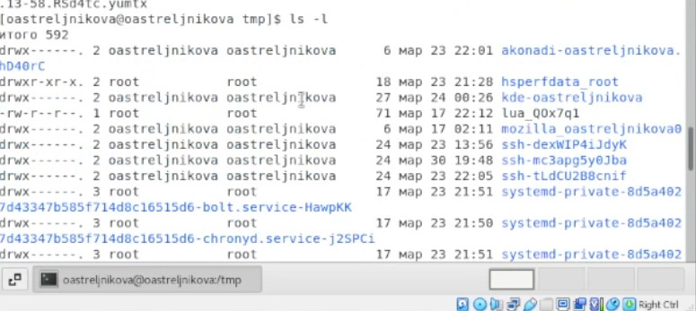{#fig:005 width=70%}

  2. Определим, есть ли в каталоге /var/spool подкаталог с именем cron на изображении(рис. @fig:006) видно что такой каталог присутвует в папке. 

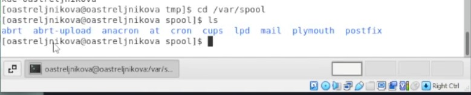{#fig:006 width=70%}

  3. Перейдем в домашний каталог и выведем на экран его содержимое 
(рис. @fig:007): 

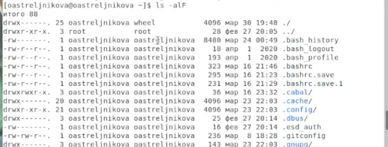{#fig:007 width=70%}

Как видно, вледельцем файлов и каталогов являюсь я.

	
3. Выполняем ниже приведённый список действий:
   1. В домашнем каталоге создим новый каталог с именем newdir и в каталоге ~/newdir создадим новый каталог с именем morefun (рис. @fig:008):

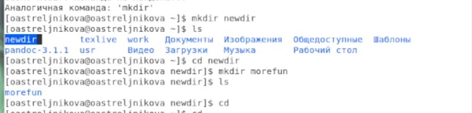{#fig:008 width=70%}

А затем следуя выполнению лабороторной работы далльше удалим их в видео мы это делали последовательно, но тут приведу выполнение команд чуть раньше.. (рис. @fig:009):

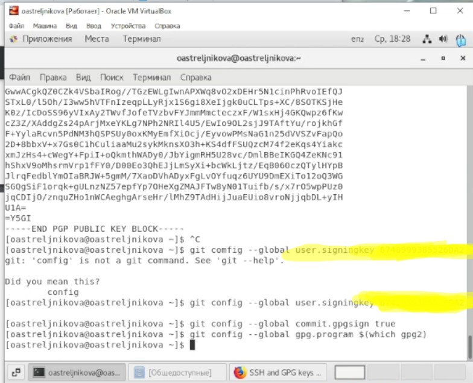{#fig:009 width=70%}

   2. В домашнем каталоге создим одной командой три новых каталога с именами letters, memos, misk. Затем удалим эти каталоги одной командой  (рис. @fig:010):

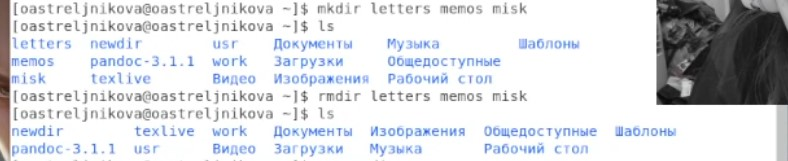{#fig:010 width=70%}

4. С помощью команды man мы определеили что опция котрую нужно использовать для просмотра содержимого не только указанного каталога, но и подкаталогов, входящих в него является -R.  (рис. @fig:011) определим:
 
5. С помощью команды man мы определеили что опция котрую нужно использовать для того что бы отсортировать по времени последнего изменения выводимый список содержимого каталога с развёрнутым описанием файлов является -ltc (сочетание нужныхэ команд было найдено в мануале)

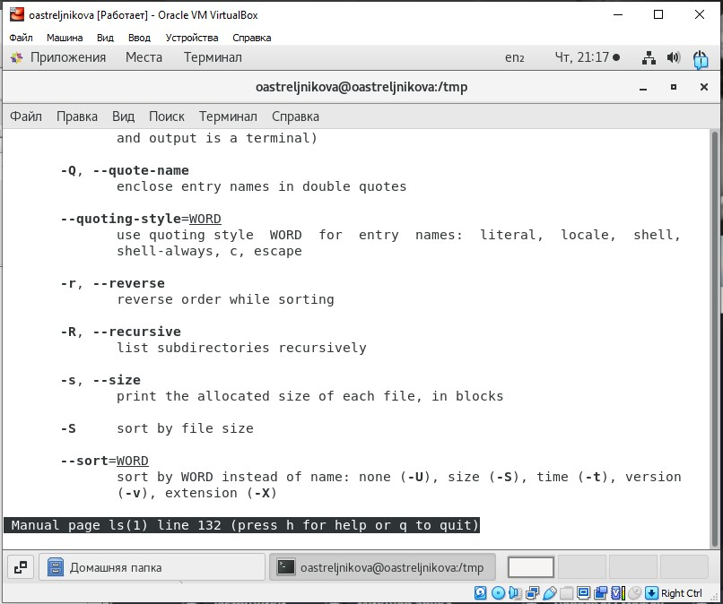{#fig:011 width=70%}

6. Используем команду man для просмотра описания следующих команд: cd, pwd, mkdir, rmdir, rm.

- cd (рис. @fig:012):
   -  -P - позволяет следовать по символическим ссылкам перед тем, как будут обработаны все переходы "..";
   -  -L - переходит по символическим ссылкам только после того, как были обработаны "..";
   -  -e - если папку, в которую нужно перейти не удалось найти - выдает ошибку.
 
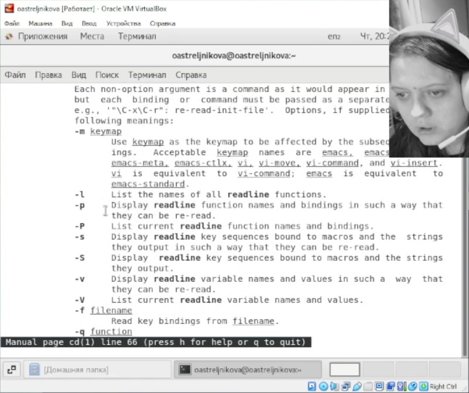{#fig:012 width=70%}

- pwd (рис. @fig:013):

   - -L, --logical - брать директорию из переменной окружения, даже если она содержит символические ссылки;
   - -P - отбрасывать все символические ссылки;
   - --help - отобразить справку по утилите;
   - --version - отобразить версию утилиты.

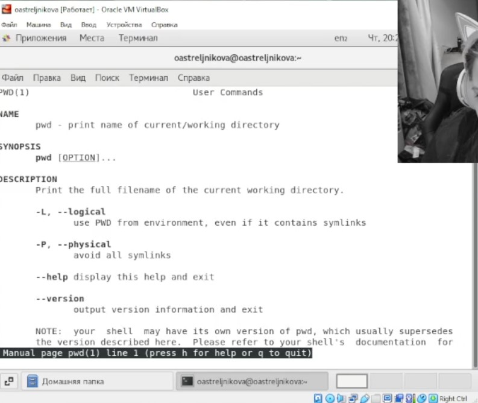{#fig:013 width=70%}

- mkdir (рис. @fig:014):

  -  -m (--mode=режим) - назначить режим доступа (права). По умолчанию mod принимает значение 0777, что обеспечивает неограниченные права.
  -  -p (--parents) - не показывать ошибки, а также их игнорировать.
  -  -z  (--context=CTX ) принимает контекст SELinux для каталога по умолчанию.
  -  -v (--verbose) - выводить сообщение о каждом новым каталоге.
  -  --help - вывести справочную информацию.
  -  --version - выводит информацию о текущей версии утилиты.

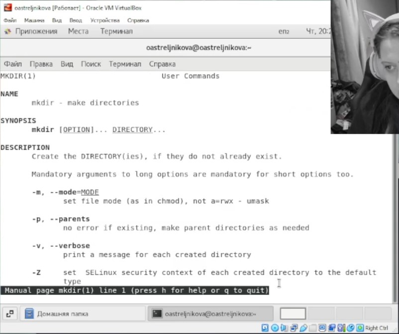{#fig:014 width=70%}

- rmdir (рис. @fig:015): 

 -  -p	Позволяет удалить каталог и вышележащие каталоги, оказавшиеся пустыми. На стандартный вывод выдается сообщение об удалении всех указанных в маршруте каталогов или о сохранении части из них по каким-либо причинам.
  - -s	Подавление сообщения, выдаваемого при действии опции -p.

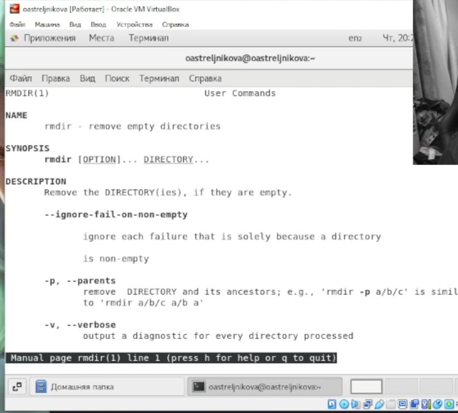{#fig:015 width=70%}

- rm (рис. @fig:016):
 - -f	Команда не выдает сообщений, когда удаляемый файл не существует, не запрашивает подтверждения при удалении файлов, на запись в которые нет прав. Если нет права и на запись в каталог, файлы не удаляются. Сообщение об ошибке выдается лишь при попытке удалить каталог, на запись в который нет прав (см. опцию -r).
 - -r	Происходит рекурсивное удаление всех каталогов и подкаталогов, перечисленных в списке аргументов. Сначала каталоги опустошаются, затем удаляются. Подтверждение при удалении файлов, на запись в которые нет прав, не запрашивается, если задана опция -f или стандартный ввод не назначен на терминал и не задана опция -i. При удалении непустых каталогов команда rm -r предпочтительнее команды rmdir, так как последняя способна удалить только пустой каталог. Но команда rm -r может доставить немало острых впечатлений при ошибочном указании каталога!
 - -i	Перед удалением каждого файла запрашивается подтверждение. Опция -i устраняет действие опции -f; она действует даже тогда, когда стандартный ввод не назначен на терминал.

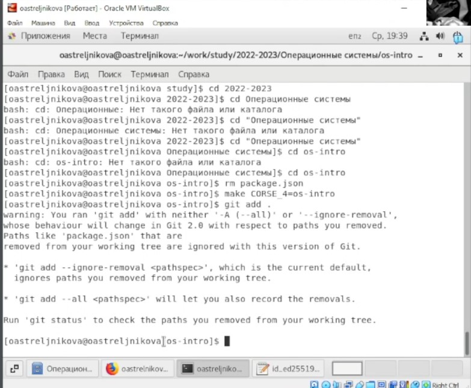{#fig:016 width=70%}

7. Используя информацию, полученную при помощи команды history (рис. @fig:017), выполним модификацию и исполнение нескольких команд из буфера команд (рис. @fig:018) и (рис. @fig:019).

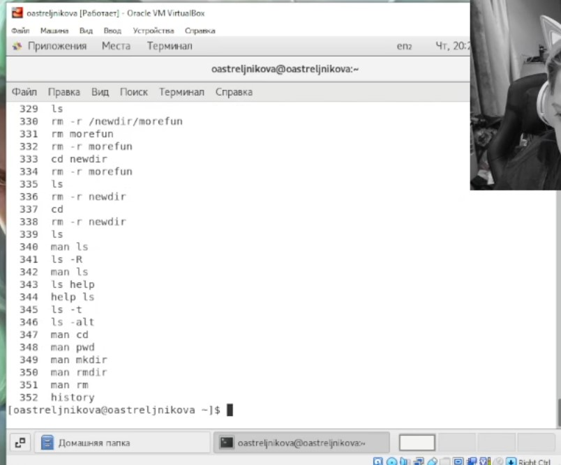{#fig:017 width=70%}

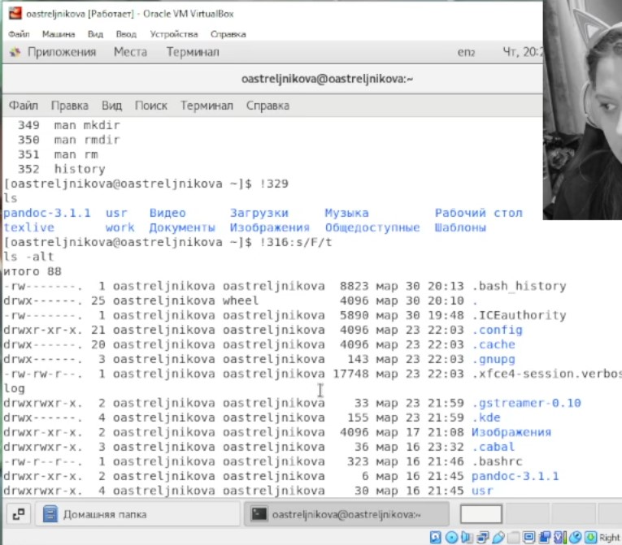{#fig:018 width=70%}

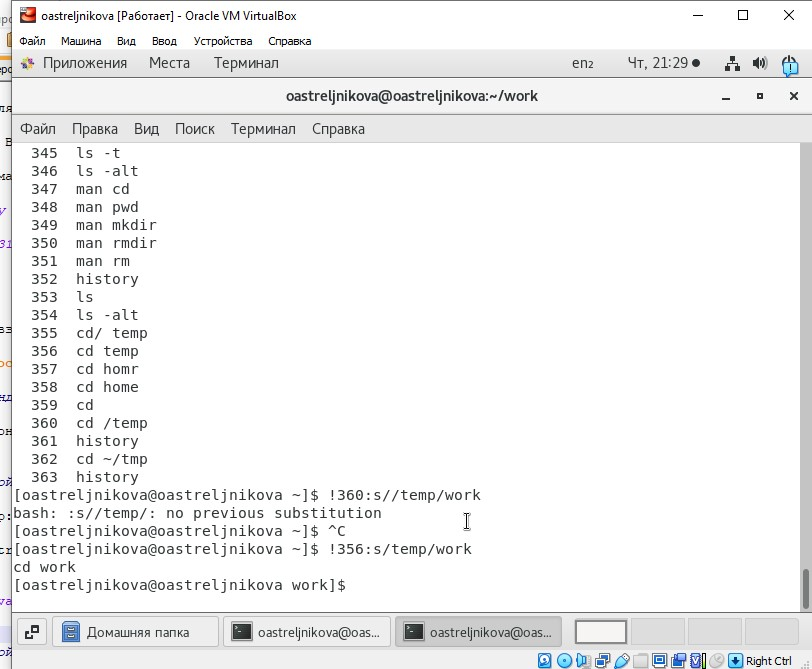{#fig:019 width=70%}

# Выводы

В данной лабороторной работе были получены практические навыки взаимодействия с ситемой с помощью консоли.

# Контрольные вопросы

1. Командой в операционной системе называется записанный по специальным правилам текст (возможно с аргументами), представляющий собой указание на выполнение каких-либо функций (или действий) в операционной системе. 
2. Команда pwd. Пример: 
$ pwd
/home/oastreljnikova/work/study/2022-2023/Операционные системы/os-intro
3. Команда ls -F выведет имена файлов в текущем каталоге и их типы. Тип каталога обозначается /, тип исполняемого файла обозначается *, тип ссылки обозначается @. 
Находясь в папке os-intro применяем  ls -F, получаем

CHANGELOG.md  labs/     prepare            README.en.md        template/
config/       LICENSE   presentation/      README.git-flow.md  новый 2.tex
COURSE        Makefile  project-personal/  README.md

4. Некоторые файлы в операционной системе скрыты от просмотра и обычно используются для настройки рабочей среды. Имена таких файлов начинаются с точки. Для того, чтобы отобразить имена скрытых файлов, необходимо использовать команду ls с опцией a: ls -a. 
Находясь в папке os-intro применяем  ls -a, получаем
.             COURSE          .gitmodules  prepare           README.git-flow.md
..            .git            labs         presentation      README.md
CHANGELOG.md  .gitattributes  LICENSE      project-personal  template
config        .gitignore      Makefile     README.en.md

5. Команда rm используется для удаления файлов и/или каталогов. Команда rm -r необходима, чтобы удалить каталог, содержащий файлы. Без указания этой опции команда не будет выполняться. Если каталог пуст, то можно воспользоваться командой rmdir. Если удаляемый каталог содержит файлы, то команда не будет выполнена – нужно использовать «rm -r имя_каталога». Таким образом, каталог, не содержащий файлов, можно удалить и командой rm, и командой rmdir. Пример вы видим на изображени рис. @fig:010 . Файл командой rmdir удалить нельзя. 

6. Чтобы определить, какие команды выполнил пользователь в сеансе работы, необходимо воспользоваться командой «history».

7. Можно модифицировать команду из выведенного на экран списка при помощи следующей конструкции: *![номер_команды]:s/[что_меняем]/[на_что_меняем]*. Пример можно увидеть на рис. @fig:018 и рис. @fig:019 .

8. Чтобы записать в одной строке несколько команд, необходимо между ними поставить ;. Пример:
cd labs;ls
Выведет в консоль следующее 
lab01  lab03  lab05  lab07  lab09  lab11  lab13  lab15      README.ru.md
lab02  lab04  lab06  lab08  lab10  lab12  lab14  README.md

9. Символ обратного слэша \ позволяет использовать управляющие символы ( ".", "/", "$", "*", "[", "]", "^", "&") без их интерпретации командной оболочкой; процедура добавления данного символа перед управляющими символами называется экранированием символов. Например, команда «ls os-intro/labs» отобразит содержимое каталога os-intro/labs.

10. Тип файла, право доступа, число ссылок, владелец, размер, дата последней ревизии,имя файла или папки.
 oastreljnikova@oastreljnikova report $ ls -l
итого 4000
drwxrwxr-x. 2 oastreljnikova oastreljnikova      22 мар 30 22:57 bib
drwxrwxr-x. 2 oastreljnikova oastreljnikova    4096 мар 30 23:04 image
-rw-rw-r--. 1 oastreljnikova oastreljnikova 1295481 мар 30 23:12 Lab5_oastrelnikova.docx
-rw-rw-r--. 1 oastreljnikova oastreljnikova   20308 мар 30 23:11 Lab5_oastrelnikova.md
-rw-rw-r--. 1 oastreljnikova oastreljnikova 1503608 мар 30 23:12 Lab5_oastrelnikova.pdf
-rw-r--r--. 1 oastreljnikova oastreljnikova 1260386 мар 30 23:16 Lab5_oastrelnukova (arhiv).7z
-rw-rw-r--. 1 oastreljnikova oastreljnikova    1064 мар 30 22:57 Makefile
drwxrwxr-x. 4 oastreljnikova oastreljnikova      32 мар 30 22:57 pandoc

11. Абсолютный путь от корня файловой системы – этот путь начинается от корня "/" и описывает весь путь к файлу или каталогу.

Относительный путь – это путь к файлу относительно текущего каталога (каталога, где находится пользователь). 

Пример: 

Абсолютный:

oastreljnikova@oastreljnikova:~$ cd /home/oastreljnikova/work/study/2022-2023/"Операционные системы"/os-intro/labs/lab05/report

oastreljnikova@oastreljnikova:~/work/study/2022-2023/Операционные системы/os-intro/labs/lab05/report$ 

Относительный:

oastreljnikova@oastreljnikova:~$ cd work/study/2022-2023/"Операционные системы"/os-intro/labs/lab05/report

oastreljnikova@oastreljnikova:~/work/study/2022-2023/Операционные системы/os-intro/labs/lab05/report$ 

12. Воспользоваться конструкцией *man [имя_команды]*.

13. Клавиша Tab. 

