---
## Front matter
title: "Отчёт по лабораторной работе № 4"
subtitle: "Операционные системы"
author: "Ильина Любовь Александровна"

## Generic otions
lang: ru-RU
toc-title: "Содержание"

## Bibliography
bibliography: bib/cite.bib
csl: pandoc/csl/gost-r-7-0-5-2008-numeric.csl

## Pdf output format
toc: true # Table of contents
toc-depth: 2
lof: true # List of figures
lot: true # List of tables
fontsize: 12pt
linestretch: 1.5
papersize: a4
documentclass: scrreprt
## I18n polyglossia
polyglossia-lang:
  name: russian
  options:
	- spelling=modern
	- babelshorthands=true
polyglossia-otherlangs:
  name: english
## I18n babel
babel-lang: russian
babel-otherlangs: english
## Fonts
mainfont: PT Serif
romanfont: PT Serif
sansfont: PT Sans
monofont: PT Mono
mainfontoptions: Ligatures=TeX
romanfontoptions: Ligatures=TeX
sansfontoptions: Ligatures=TeX,Scale=MatchLowercase
monofontoptions: Scale=MatchLowercase,Scale=0.9
## Biblatex
biblatex: true
biblio-style: "gost-numeric"
biblatexoptions:
  - parentracker=true
  - backend=biber
  - hyperref=auto
  - language=auto
  - autolang=other*
  - citestyle=gost-numeric
## Pandoc-crossref LaTeX customization
figureTitle: "Рис."
tableTitle: "Таблица"
listingTitle: "Листинг"
lofTitle: "Список иллюстраций"
lotTitle: "Список таблиц"
lolTitle: "Листинги"
## Misc options
indent: true
header-includes:
  - \usepackage{indentfirst}
  - \usepackage{float} # keep figures where there are in the text
  - \floatplacement{figure}{H} # keep figures where there are in the text
---

# Цель работы
Познакомиться с операционной системой Linux, получить практические навыки рабо-
ты с консолью и некоторыми графическими менеджерами рабочих столов операционной
системы.

# Задание

1. Ознакомиться с теоретическим материалом.
2. Загрузить компьютер.
3. Перейти на текстовую консоль. Сколько текстовых консолей доступно на вашем ком-
пьютере?
4. Перемещаться между текстовыми консолями. Какие комбинации клавиш необходимо
при этом нажимать?
5. Зарегистрироваться в текстовой консоли операционной системы. Какой логин вы при
этом использовали? Какие символы отображаются при вводе пароля?
6. Завершить консольный сеанс. Какую команду или комбинацию клавиш необходимо
для этого использовать?
7. Переключиться на графический интерфейс. Какую комбинацию клавиш для этого
необходимо нажать?
8. Ознакомиться с менеджером рабочих столов. Как называется менеджер, запускаемый
по умолчанию?
9. Поочерёдно зарегистрироваться в разных графических менеджерах рабочих столов
(GNOME, KDE, XFCE) и оконных менеджерах (Openbox). Продемонстрировать разницу
между ними, сделав снимки экрана (скриншоты). Какие графические менеджеры
установлены на вашем компьютере?
10. Изучить список установленных программ. Обратить внимание на предпочтитель-
ные программы для разных применений. Запустите поочерёдно браузер, текстовой
редактор, текстовой процессор, эмулятор консоли. Укажите названия программ.

# Выполнение лабораторной работы

1. Перейдем на текстовую консоль. Увидим, что доступно 6 текстовых консолей: 1 в графическом окружении и 5 вне его. (рис. @fig:001 - @fig:006).

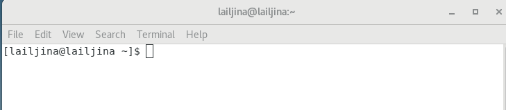{#fig:001}

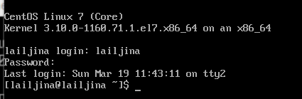{#fig:002}

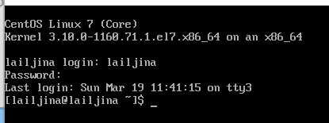{#fig:003}

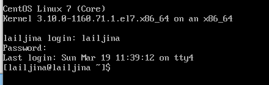{#fig:004}

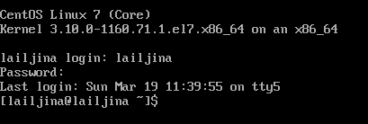{#fig005}

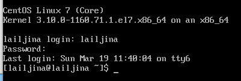{#fig006}

2. Перемещаемся между текстовыми консолями комбинациями Ctrl+Alt+F1-F6. 

3. Зарегистрируемся в текстовой консоли операционной системе, используя логин lailjina. Не отображаются символы при вводе пароля. Завершим консольный сеанс, введя команду logout или комбинацию клавиш ctrl+D (рис. @fig:007).

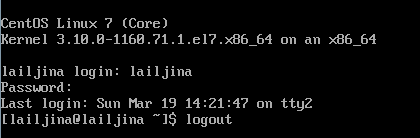{#fig:007}

4. Переключаемся на графическое окружение комбинацией Ctrl+Alt+F1 

5. Ознакомимся с менеджером рабочих столов. Командой $echo $DESKTOP_SESSION выясним менеджер, запускаемый по умолчанию, - gnome classic. (рис. @fig:008)

{#fig:008}

6. Поочерёдно зарегистрироваться в разных графических менеджерах рабочих столов
(GNOME (рис. @fig:009), KDE (рис. @fig:010), XFCE (рис. @fig:011) и оконных менеджерах (Openbox) (рис. @fig:013). Продемонстрируем разницу между ними, сделав снимки экрана (скриншоты). (рис. @fig:014)

sudo yum groupinstall "GNOME Desktop"

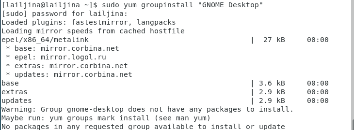{#fig:009}

sudo yum -y groups install "KDE Plasma Workspaces"

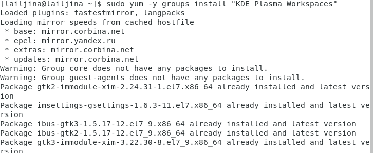{#fig:010}

sudo yum groupinstall "Xfce" -y

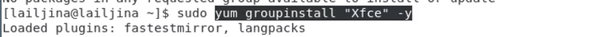{#fig:011} 

{#fig:012} 

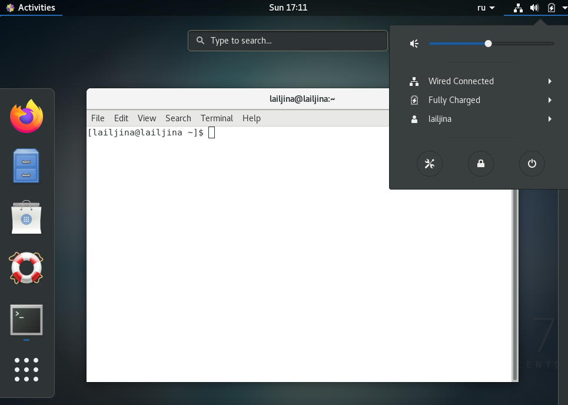{#fig:013}

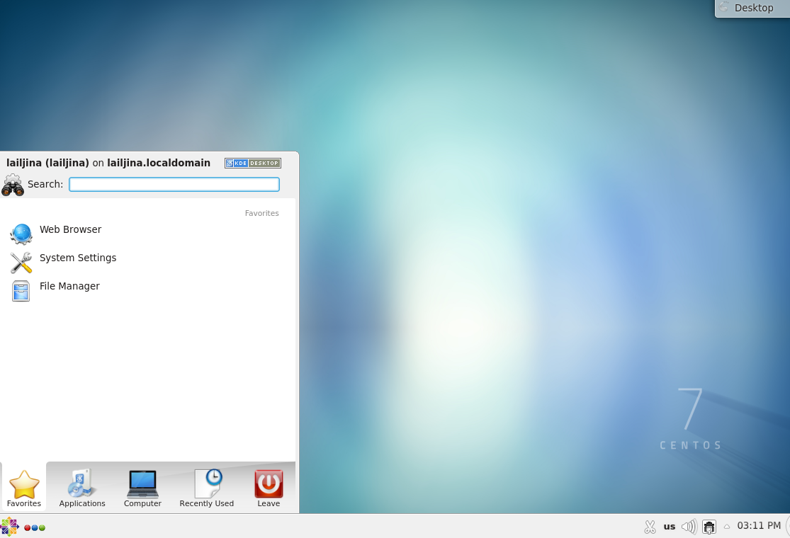{#fig:014}

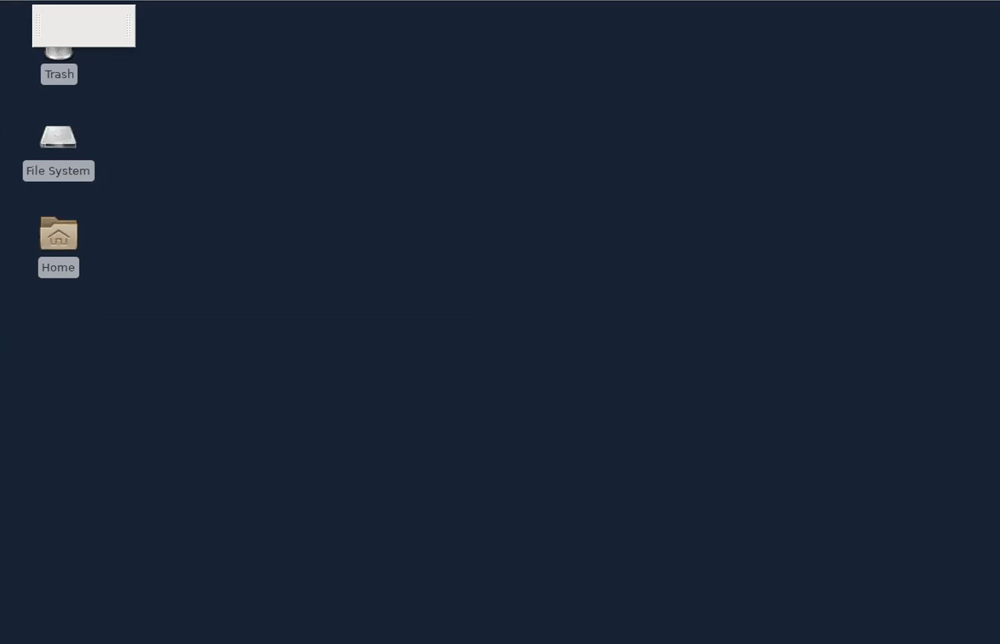{#fig:015} 

Графические менеджеры, установленные на гостевой ОС на рис.(рис. @fig:016)

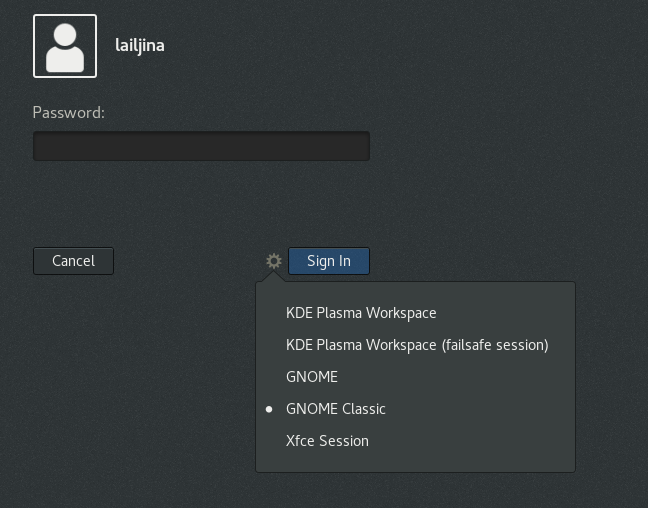{#fig:016} 

Ответы на контрольные вопросы
Компьютерный терминал — устройство ввода/вывода, основные функции которого заключаются в вводе и отображении данных. У него есть преимущества, т. к. можно использовать лишь команды с клавиатуры.

Входное имя пользователя или Login — название учётной записи пользователя.

Изначально поле пароля содержало хеш пароля и использовалось для аутентификации. Однако из соображений безопасности все пароли были перенесены в специальный файл /etc/shadow, недоступный для чтения обычным пользо- вателям. Поэтому в файле /etc/passwd поле password имеет значение x.

Для каждого пользователя организуется домашний каталог, где хранятся его данные и настройки рабочей среды.

Учётная запись пользователя с UID=0 называется root и присутствует в любой системе типа Linux. Пользователь root имеет права администратора и может выполнять любые действия в системе.

Полномочия администратора не ограничены, поэтому он имеет доступ и к настройкам пользователей.

Процедура регистрации в системе обязательна для Linux. Каждый пользователь операционный системы имеет определенные ограничения на возможные с его стороны действия: чтение, изменение, запуск файлов, а также на ресурсы: пространство на файловой системе, процессорное время для выполнение текущих задач (процессов). При этом действия одного пользователя не влияют на работу другого. Такая модель разграничения доступа к ресурсам операционной системы получила название многопользовательской.

Кроме пароля и логина учётная запись пользователя содержит : 
• внутренний идентификатор пользователя (User ID); 
• идентификатор группы (Group ID); 
• анкетные данные пользователя (General Information); 
• домашний каталог (Home Dir); 
• указатель на программную оболочку (Shell).

Входному имени пользователя ставится в соответствие внутренний идентификатор пользователя в системе (User ID, UID) — положительное целое число в диапазоне от 0 до 65535, по которому в системе однозначно отслеживаются действия пользователя. Пользователю может быть назначена определенная группа для доступа к некоторым ресурсам, разграничения прав доступа к различным файлам и директориям. Каждая группа пользователей в операционной системе имеет свой идентификатор — Group ID или GID.

Анкетные данные пользователя (General Information)являются необязательным параметром учётной записи и могут содержать реальное имя пользователя, адрес, телефон.

В домашнем каталоге пользователя хранятся данные (файлы) пользователя, на стройки рабочего стола и других приложений. Содержимое домашнего каталога обычно не доступно другим пользователям с обычными правами и не влияет на работу и настройки рабочей среды других пользователей.

Мой домашний каталог называется: lailjina

Администратор имеет возможность изменить содержимое домашнего каталога пользователя.

Учётные записи пользователей хранятся в файле /etc/passwd.

Символ * в поле password некоторой учётной записи в файле /etc/passwd означает, что пользователь не сможет войти в систему.

. Виртуальные консоли — реализация концепции многотерминальной работы в рамках одного устройства. Виртуальный означает, что можно выполнять много действий в одном окне со многими папками.

getty (сокращение от get teletype) — программа для UNIX-подобных операционных систем, управляющая доступом к физическим и виртуальным терминалам (tty).

Весь процесс взаимодействия пользователя с системой с момента регистрации до выхода называется сеансом работы

. Toolkit (Tk, набор инструментов)— кроссплатформенная библиотека базовых элементов графического интерфейса, распространяемая с открытыми исходными текстами.

Используются следующие основные тулкиты: • GTK+ (сокращение от GIMP Toolkit) — кроссплатформенная библиотека эле- ментов интерфейса; • Qt — кросс-платформенный инструментарий разработки программного обеспе- чения на языке программирования C++. • GTK+ состоит из двух компонентов: 1.GTK — содержит набор элементов пользовательского интерфейса (таких, как кнопка, список, поле для ввода текста и т. п.) для различных задач; 2.GDK — отвечает за вывод информации на экран, может использовать для этого X Window System, Linux Framebuffer, WinAPI.

# Выводы

Ознакомилась с операционной системой Linux, получила практические навыки рабо-
ты с консолью и некоторыми графическими менеджерами рабочих столов операционной
системы.
