---
## Front matter
title: "Лабораторная работа №5"
subtitle: "Основы интерфейса взаимодействия пользователя с системой Unix на уровне командной строки"
author: "Стрельникова Ольга Александровна"

## Generic otions
lang: ru-RU
toc-title: "Содержание"

## Bibliography
bibliography: bib/cite.bib
csl: pandoc/csl/gost-r-7-0-5-2008-numeric.csl

## Pdf output format
toc: true # Table of contents
toc-depth: 2
lof: true # List of figures
lot: true # List of tables
fontsize: 12pt
linestretch: 1.5
papersize: a4
documentclass: scrreprt
## I18n polyglossia
polyglossia-lang:
  name: russian
  options:
	- spelling=modern
	- babelshorthands=true
polyglossia-otherlangs:
  name: english
## I18n babel
babel-lang: russian
babel-otherlangs: english
## Fonts
mainfont: PT Serif
romanfont: PT Serif
sansfont: PT Sans
monofont: PT Mono
mainfontoptions: Ligatures=TeX
romanfontoptions: Ligatures=TeX
sansfontoptions: Ligatures=TeX,Scale=MatchLowercase
monofontoptions: Scale=MatchLowercase,Scale=0.9
## Biblatex
biblatex: true
biblio-style: "gost-numeric"
biblatexoptions:
  - parentracker=true
  - backend=biber
  - hyperref=auto
  - language=auto
  - autolang=other*
  - citestyle=gost-numeric
## Pandoc-crossref LaTeX customization
figureTitle: "Рис."
tableTitle: "Таблица"
listingTitle: "Листинг"
lofTitle: "Список иллюстраций"
lotTitle: "Список таблиц"
lolTitle: "Листинги"
## Misc options
indent: true
header-includes:
  - \usepackage{indentfirst}
  - \usepackage{float} # keep figures where there are in the text
  - \floatplacement{figure}{H} # keep figures where there are in the text
---

# Цель работы

Приобретение практических навыков взаимодействия пользователя с системой посредством командной строки.

# Задание

1. Определить полное имя домашнего каталога. Далее относительно этого каталога будут выполняться последующие упражнения.
2. Выполнить следующие действия:
   1. Перейти в каталог /tmp.
   2. Вывести на экран содержимое каталога /tmp. Для этого использовать команду ls с различными опциями. Пояснить разницу в выводимой на экран информации.
   3. Определить, есть ли в каталоге /var/spool подкаталог с именем cron?
   4. Перейти в домашний каталог и вывести на экран его содержимое. Определить, кто является владельцем файлов и подкаталогов?
3. Выполнить следующие действия:
   1. В домашнем каталоге создать новый каталог с именем newdir.
   2. В каталоге ~/newdir создать новый каталог с именем morefun.
   3. В домашнем каталоге создать одной командой три новых каталога с именами letters, memos, misk. Затем удалить эти каталоги одной командой.
   4. Попробовать удалить ранее созданный каталог ~/newdir командой rm. Проверить, был ли каталог удалён.
   5. Удалить каталог ~/newdir/morefun из домашнего каталога. Проверить, был ли каталог удалён.
4. С помощью команды man определить, какую опцию команды ls нужно использовать для просмотра содержимого не только указанного каталога, но и подкаталогов, входящих в него.
5. С помощью команды man определить набор опций команды ls, позволяющий отсортировать по времени последнего изменения выводимый список содержимого каталога с развёрнутым описанием файлов.
6. Использоватт команду man для просмотра описания следующих команд: cd, pwd, mkdir, rmdir, rm. Пояснить основные опции этих команд.
7. Используя информацию, полученную при помощи команды history, выполнить модификацию и исполнение нескольких команд из буфера команд.

# Выполнение лабораторной работы

1. Определим полное имя домашнего каталога в моём случае это /home/oastrejnikova (рис. @fig:001):

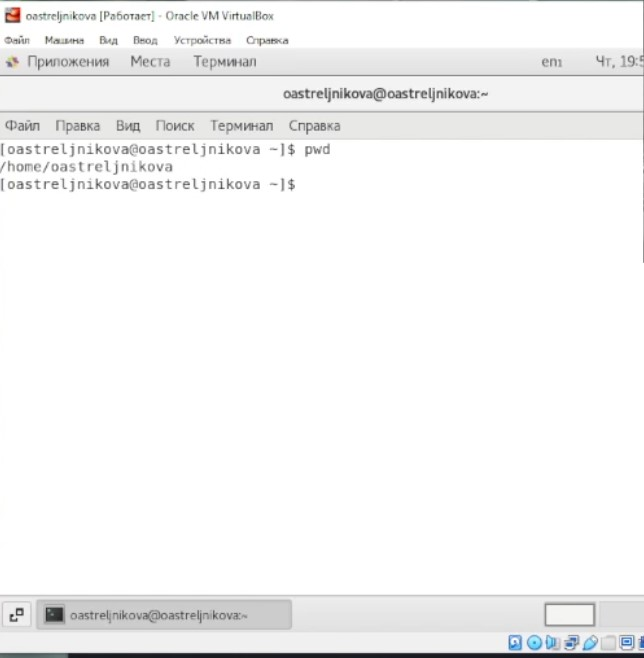{#fig:001 width=70%}

2. Выполняем ниже приведённый список действий:

	1 Перейдем в каталог /tmp и выведем на экран содержимое каталога используем команду, cd tmp  и ls последовательно для вывода содержимого каталога.(рис. @fig:002): 

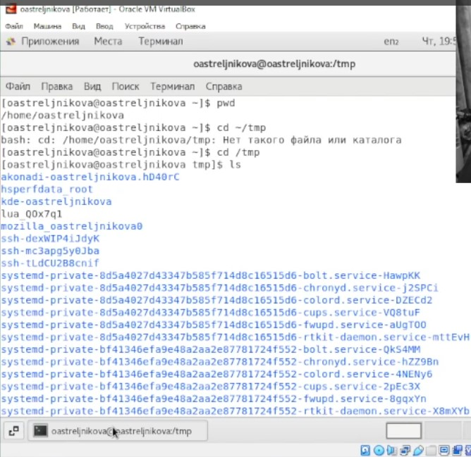{#fig:002 width=70%}

ls -a (просмотр содержимого и скрытых файлов) (рис. @fig:003):

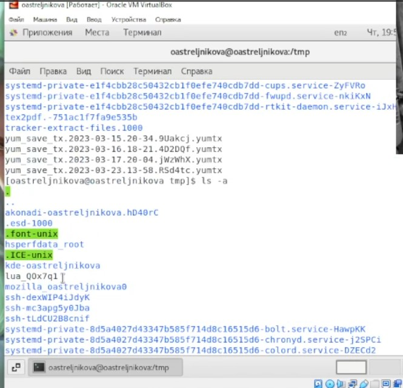{#fig:003 width=70%}

ls -alF просмотр содержимого со скрытыми файлами, с типами, и с подробным описанием. (рис. @fig:004):

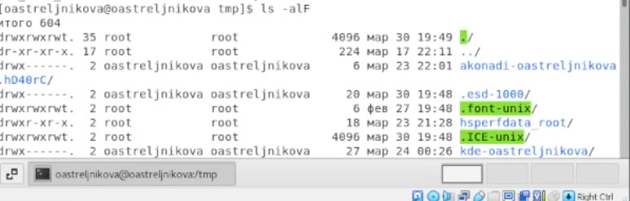{#fig:004 width=70%}

ls -l (просмотр содержимого с подробным описанием) (рис. @fig:005): 

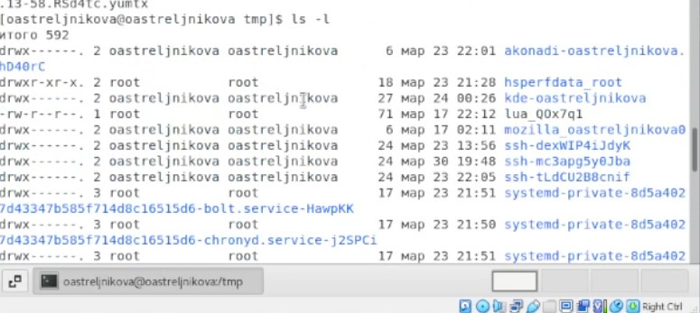{#fig:005 width=70%}

	2. Определим, есть ли в каталоге /var/spool подкаталог с именем cron на изображении(рис. @fig:006) видно что такой каталог присутвует в папке. 

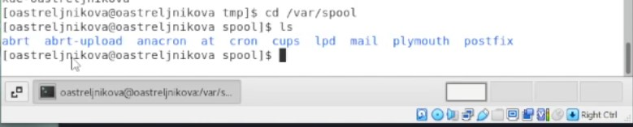{#fig:006 width=70%}

	3. Перейдем в домашний каталог и выведем на экран его содержимое (рис. @fig:007): 

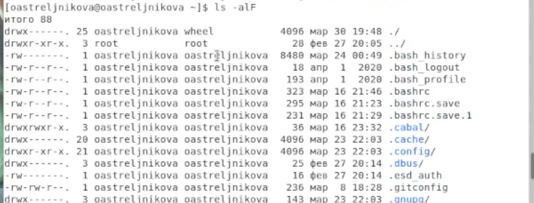{#fig:007 width=70%}

Как видно, вледельцем файлов и каталогов являюсь я.

	
3. Выполняем ниже приведённый список действий:
	1. В домашнем каталоге создим новый каталог с именем newdir и в каталоге ~/newdir создадим новый каталог с именем morefun (рис. @fig:008):

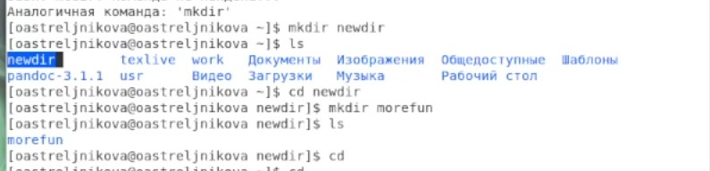{#fig:008 width=70%}

А затем следуя выполнению лабороторной работы далльше удалим их в видео мы это делали последовательно, но тут приведу выполнение команд чуть раньше.. (рис. @fig:009):

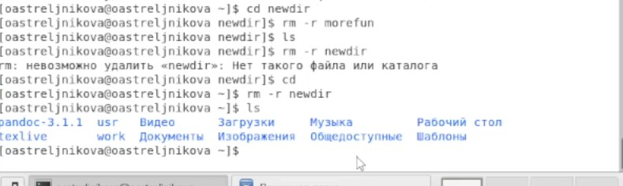{#fig:009 width=70%}

	2. В домашнем каталоге создим одной командой три новых каталога с именами letters, memos, misk. Затем удалим эти каталоги одной командой  (рис. @fig:010):

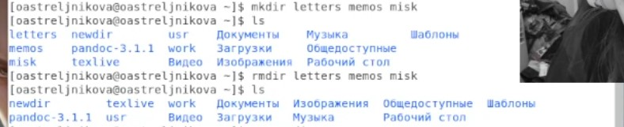{#fig:010 width=70%}

4. С помощью команды man мы определеили что опция котрую нужно использовать для просмотра содержимого не только указанного каталога, но и подкаталогов, входящих в него является -R.  (рис. @fig:011) определим:
 
5. С помощью команды man мы определеили что опция котрую нужно использовать для того что бы отсортировать по времени последнего изменения выводимый список содержимого каталога с развёрнутым описанием файлов является -ltc (сочетание нужныхэ команд было найдено в мануале)

{#fig:011 width=70%}

6. Используем команду man для просмотра описания следующих команд: cd, pwd, mkdir, rmdir, rm.

- cd (рис. @fig:012):

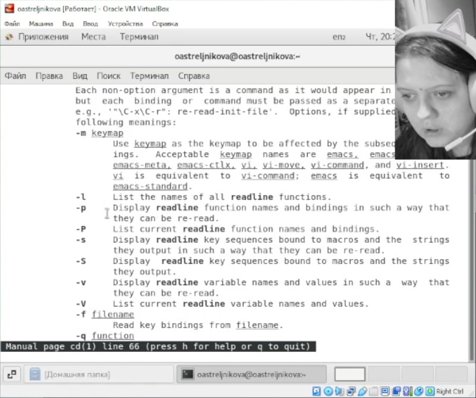{#fig:012 width=70%}

- pwd (рис. @fig:013):

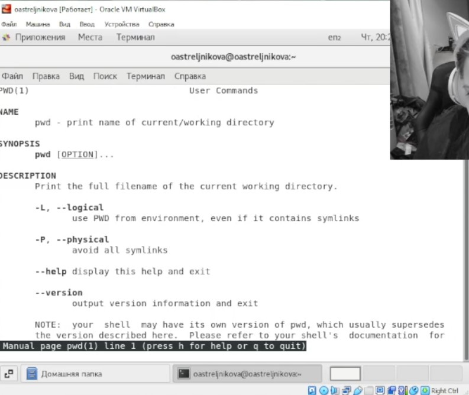{#fig:013 width=70%}

- mkdir (рис. @fig:014):

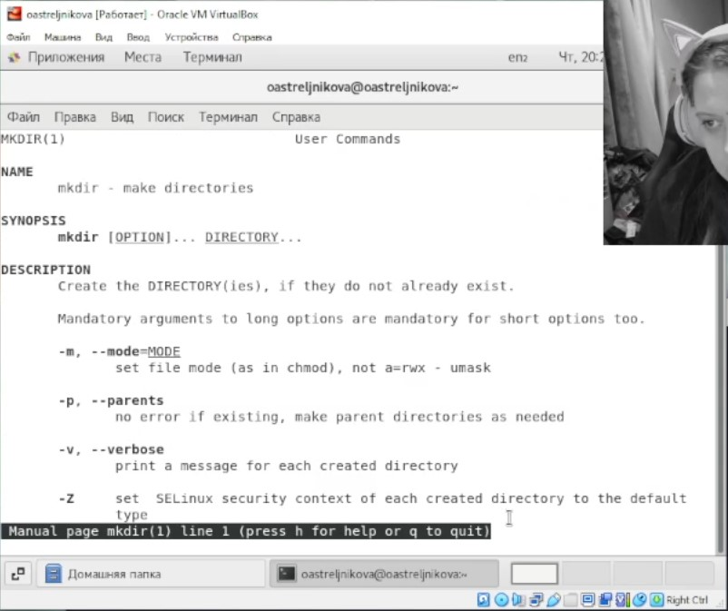{#fig:014 width=70%}

- rmdir (рис. @fig:015): 

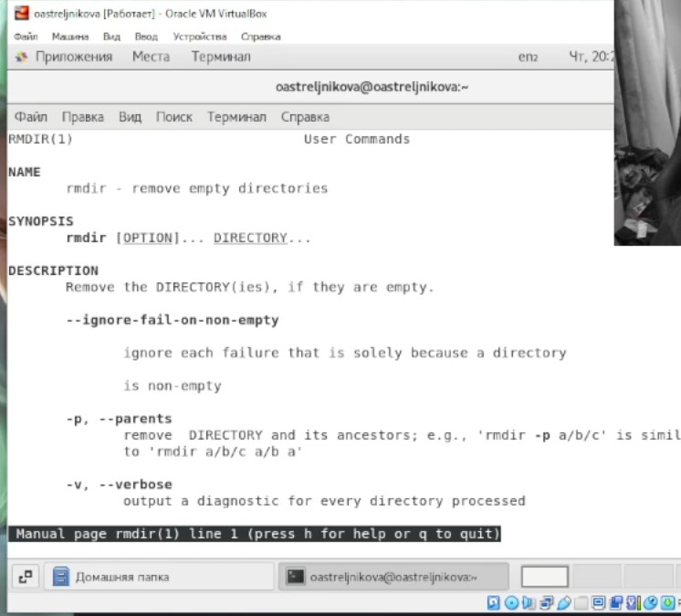{#fig:015 width=70%}

- rm (рис. @fig:016):

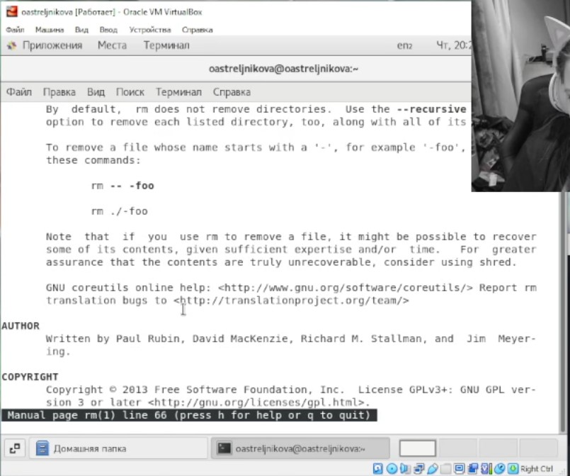{#fig:016 width=70%}

7. Используя информацию, полученную при помощи команды history (рис. @fig:017), выполним модификацию и исполнение нескольких команд из буфера команд (рис. @fig:018) и (рис. @fig:019).

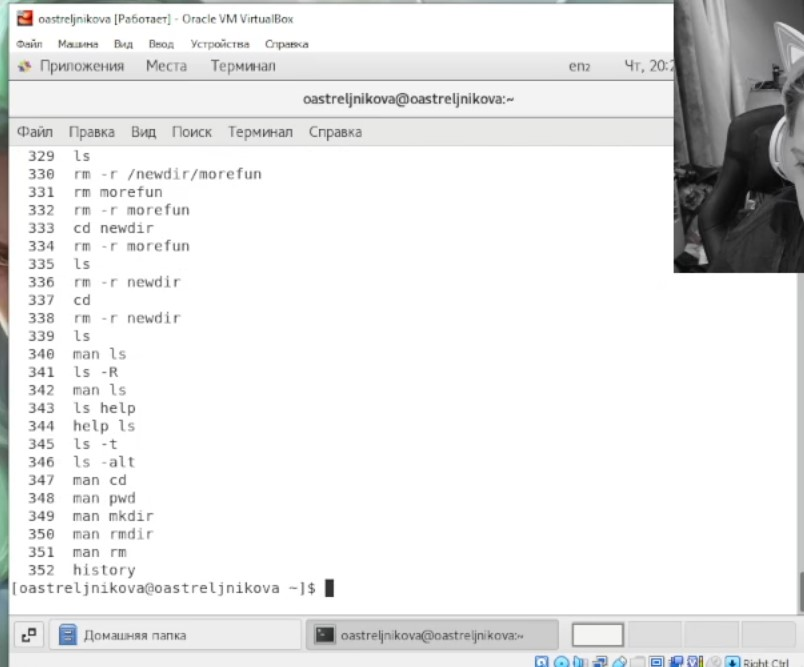{#fig:017 width=70%}

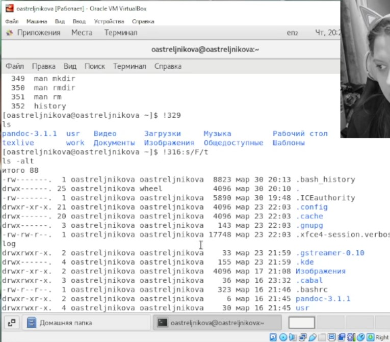{#fig:018 width=70%}

{#fig:018 width=70%}

# Выводы

Я получила навыки взаимодействия пользователя с системой посредством командной строки.

# Контрольные вопросы

1. Командой в операционной системе называется записанный по специальным правилам текст (возможно с аргументами), представляющий собой указание на выполнение каких-либо функций (или действий) в операционной системе. 

2.Команда pwd. Пример: 

oastreljnikova@oastreljnikova:~/work/study/2022-2023/Операционные системы/os-intro/labs/la
b05/report$ pwd

/home/oastreljnikova/work/study/2022-2023/Операционные системы/os-intro/labs/lab05/report

3. Команда ls -F выведет имена файлов в текущем каталоге и их типы. Тип каталога обозначается /, тип исполняемого файла обозначается *, тип ссылки обозначается @. Пример: 

oastreljnikova@oastreljnikova:~/work/study/2022-2023/Операционные системы/os-intro/labs/la
b05/report$ ls -F

bib/  image/  Makefile  pandoc/  report.docx  report.md  report.pdf

4. Некоторые файлы в операционной системе скрыты от просмотра и обычно используются для настройки рабочей среды. Имена таких файлов начинаются с точки. Для того, чтобы отобразить имена скрытых файлов, необходимо использовать команду ls с опцией a: ls -a. Пример: 

oastreljnikova@oastreljnikova:~/work/study/2022-2023/Операционные системы/os-intro/labs/la
b05/report$ ls -a

.  ..  bib  image  Makefile  pandoc  report.docx  report.md  report.pdf

*5. При помощи каких команд можно удалить файл и каталог? Можно ли это сделать одной и той же командой? Приведите примеры.*

Команда rm используется для удаления файлов и/или каталогов. Команда rm -r необходима, чтобы удалить каталог, содержащий файлы. Без указания этой опции команда не будет выполняться. Если каталог пуст, то можно воспользоваться командой rmdir. Если удаляемый каталог содержит файлы, то команда не будет выполнена – нужно использовать «rm -r имя_каталога». Таким образом, каталог, не содержащий файлов, можно удалить и командой rm, и командой rmdir. Файл командой rmdir удалить нельзя. Пример (рис. @fig:010). 

*6. Как определить, какие команды выполнил пользователь в сеансе работы?*

Чтобы определить, какие команды выполнил пользователь в сеансе работы, необходимо воспользоваться командой «history».

*7. Каким образом можно исправить и запустить на выполнение команду, которую пользователь уже использовал в сеансе работы? Приведите примеры.*

Можно модифицировать команду из выведенного на экран списка при помощи следующей конструкции: *![номер_команды]:s/[что_меняем]/[на_что_меняем]*. Пример (рис. @fig:018) и (рис. @fig:018).

*8. Можно ли в одной строке записать несколько команд? Если да, то как? Приведите примеры.*

Чтобы записать в одной строке несколько команд, необходимо между ними поставить ;. Пример:

oastreljnikova@oastreljnikova:~/work/study/2022-2023/Операционные системы/os-intro/labs/la
b05$ cd report;ls

bib  image  Makefile  pandoc  report.docx  report.md  report.pdf

*9. Что такое символ экранирования? Приведите примеры использования этого символа.*

Символ обратного слэша \ позволяет использовать управляющие символы ( ".", "/", "$", "*", "[", "]", "^", "&") без их интерпретации командной оболочкой; процедура добавления данного символа перед управляющими символами называется экранированием символов. Например, команда «ls newdir/morefun» отобразит содержимое каталога newdir/morefun.

*10. Какая информация выводится на экран о файлах и каталогах, если используется опция l в команде ls?*

Тип файла, право доступа, число ссылок, владелец, размер, дата последней ревизии,

*11. Что такое относительный путь к файлу? Приведите примеры использования относительного и абсолютного пути при выполнении какой-либо команды.*

Абсолютный путь от корня файловой системы – этот путь начинается от корня "/" и описывает весь путь к файлу или каталогу.

Относительный путь – это путь к файлу относительно текущего каталога (каталога, где находится пользователь). 

Пример: 

Абсолютный:

oastreljnikova@oastreljnikova:~$ cd /home/oastreljnikova/work/study/2022-2023/"Операционные системы"/os-intro/labs/lab05/report

oastreljnikova@oastreljnikova:~/work/study/2022-2023/Операционные системы/os-intro/labs/la
b05/report$ 

Относительный:

oastreljnikova@oastreljnikova:~$ cd work/study/2022-2023/"Операционные системы"/os-intro/labs/lab05/report

oastreljnikova@oastreljnikova:~/work/study/2022-2023/Операционные системы/os-intro/labs/la
b05/report$ 

*12. Как получить информацию об интересующей вас команде?*

Воспользоваться конструкцией *man [имя_команды]*.

*13. Какая клавиша или комбинация клавиш служит для автоматического дополнения вводимых команд?*

Клавиша Tab. 

# Список литературы{.unnumbered}

1. https://yandex.ru
