---
## Front matter
title: "Лабораторная работа No 6."
subtitle: "Анализ файловой структуры UNIX. Команды для работы с файлами и каталогами"
author: "Стрельникова Ольга Александровна"

## Generic otions
lang: ru-RU
toc-title: "Содержание"

## Bibliography
bibliography: bib/cite.bib
csl: pandoc/csl/gost-r-7-0-5-2008-numeric.csl

## Pdf output format
toc: true # Table of contents
toc-depth: 2
lof: true # List of figures
lot: true # List of tables
fontsize: 12pt
linestretch: 1.5
papersize: a4
documentclass: scrreprt
## I18n polyglossia
polyglossia-lang:
  name: russian
  options:
	- spelling=modern
	- babelshorthands=true
polyglossia-otherlangs:
  name: english
## I18n babel
babel-lang: russian
babel-otherlangs: english
## Fonts
mainfont: PT Serif
romanfont: PT Serif
sansfont: PT Sans
monofont: PT Mono
mainfontoptions: Ligatures=TeX
romanfontoptions: Ligatures=TeX
sansfontoptions: Ligatures=TeX,Scale=MatchLowercase
monofontoptions: Scale=MatchLowercase,Scale=0.9
## Biblatex
biblatex: true
biblio-style: "gost-numeric"
biblatexoptions:
  - parentracker=true
  - backend=biber
  - hyperref=auto
  - language=auto
  - autolang=other*
  - citestyle=gost-numeric
## Pandoc-crossref LaTeX customization
figureTitle: "Рис."
tableTitle: "Таблица"
listingTitle: "Листинг"
lofTitle: "Список иллюстраций"
lotTitle: "Список таблиц"
lolTitle: "Листинги"
## Misc options
indent: true
header-includes:
  - \usepackage{indentfirst}
  - \usepackage{float} # keep figures where there are in the text
  - \floatplacement{figure}{H} # keep figures where there are in the text
---

# Цель работы

Ознакомление с файловой системой Linux, её структурой, именами и содержанием каталогов. Приобретение практических навыков по применению команд для работы с файлами и каталогами, по управлению процессами (и работами), по проверке использования диска и обслуживанию файловой системы.

# Задание

1. Выполнить все примеры, приведённые в первой части описания лабораторной работы.
2. Выполнить следующие действия, зафиксировав в отчёте по лабораторной работе используемые при этом команды и результаты их выполнения:
   1. Скопировать файл /usr/include/sys/io.h в домашний каталог и назвать его equipment. Если файла io.h нет, то использовать любой другой файл в каталоге /usr/include/sys/ вместо него.
   2. В домашнем каталоге создать директорию ~/ski.plases.
   3. Переместить файл equipment в каталог ~/ski.plases.
   4. Переименовать файл ~/ski.plases/equipment в ~/ski.plases/equiplist.
   5. Создать в домашнем каталоге файл abc1 и скопировать его в каталог ~/ski.plases, назвать его equiplist2.
   6. Создать каталог с именем equipment в каталоге ~/ski.plases.
   7. Переместить файлы ~/ski.plases/equiplist и equiplist2 в каталог ~/ski.plases/equipment.
   8. Создать и переместить каталог ~/newdir в каталог ~/ski.plases и назвать его plans.
3. Определить опции команды chmod, необходимые для того, чтобы присвоить перечисленным ниже файлам выделенные права доступа, считая, что в начале таких прав нет:
   1. drwxr--r-- ... australia
   2. drwx--x--x ... play
   3. -r-xr--r-- ... my_os
   4. -rw-rw-r-- ... feathers
   При необходимости создать нужные файлы.
4. Проделать приведённые ниже упражнения, записываемв отчёт по лабораторной работе используемые при этом команды:
   1. Просмотреть содержимое файла /etc/password.
   2. Скопировать файл ~/feathers в файл ~/file.old.
   3. Переместить файл ~/file.old в каталог ~/play.
   4. Скопировать каталог ~/play в каталог ~/fun.
   5. Переместить каталог ~/fun в каталог ~/play и назвать его games.
   6. Лишить владельца файла ~/feathers права на чтение.
   7. Что произойдёт, если попытаться просмотреть файл ~/feathers командой cat?
   8. Что произойдёт, если попытаться скопировать файл ~/feathers?
   9. Дайть владельцу файла ~/feathers право на чтение.
   10. Лишить владельца каталога ~/play права на выполнение.
   11. Перейти в каталог ~/play.
   12. Дайть владельцу каталога ~/play право на выполнение.
5. Прочитать man по командам mount, fsck, mkfs, kill и кратко их охарактеризовать, приведя примеры.

# Выполнение лабораторной работы

1. Выполняю все примеры, приведённые в первой части описания лабораторной работы.

   1. Скопировать файл ~/abc1 в файл april и в файл may (рис. @fig:001):

   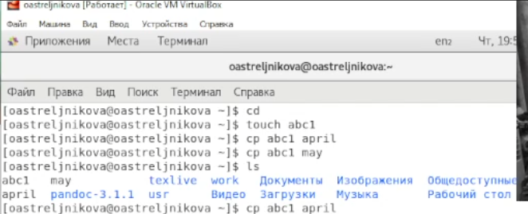{#fig:001 width=70%}

   2. Скопировать файлы april и may в каталог monthly (рис. @fig:002):

   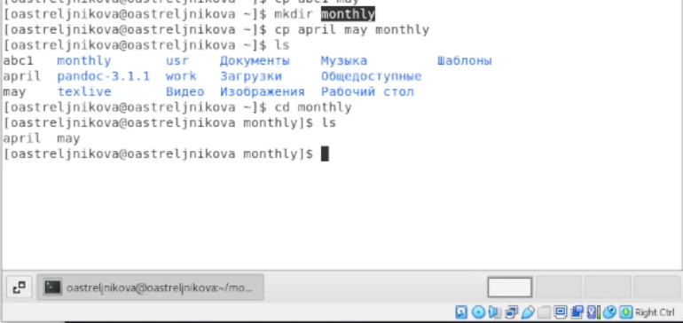{#fig:002 width=70%}

   3. Скопировать файл monthly/may в файл с именем june (рис. @fig:003):

   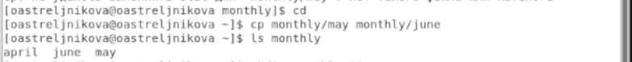{#fig:003 width=70%}

   4. Скопировать каталог monthly в каталог monthly.00 (рис. @fig:004):

   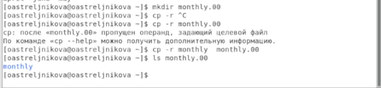{#fig:004 width=70%}

   5. Скопировать каталог monthly.00 в каталог /tmp (рис. @fig:005):

   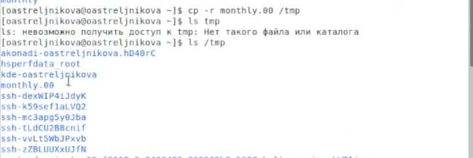{#fig:005 width=70%}

   6.  Изменить название файла april на july в домашнем каталоге (рис. @fig:006):

   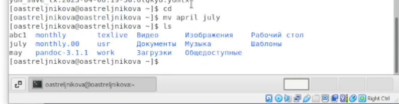{#fig:006 width=70%}

   7. Переместить файл july в каталог monthly.00 (рис. @fig:007):

   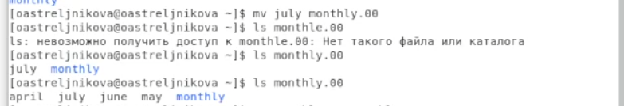{#fig:007 width=70%}

   8. Переименовать каталог monthly.00 в monthly.01 (рис. @fig:008):

   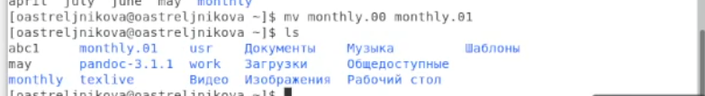{#fig:008 width=70%}

   9. Переместить каталог monthly.01 в каталог reports (рис. @fig:009):

   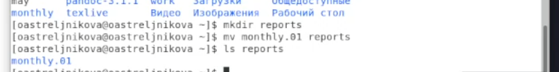{#fig:009 width=70%}

   10. Переименовать каталог reports/monthly.01 в reports/monthly (рис. @fig:010):

   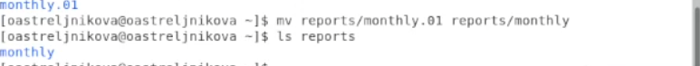{#fig:010 width=70%}

   11. Требуется создать файл ~/may с правом выполнения для владельца (рис. @fig:011):

   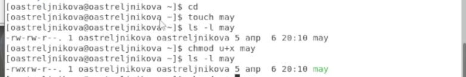{#fig:011 width=70%}

   12. Требуется лишить владельца файла ~/may права на выполнение (рис. @fig:012):

   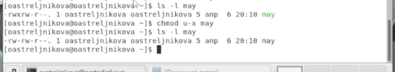{#fig:012 width=70%} 

   13. Требуется создать каталог monthly с запретом на чтение для членов группы и всех остальных пользователей (рис. @fig:013):

   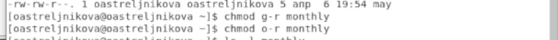{#fig:013 width=70%} 

   14. Требуется создать файл ~/abc1 с правом записи для членов группы (рис. @fig:014):

   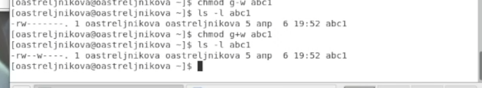{#fig:014 width=70%} 

   15. Определение свободного объёма пространства  в файловой системе с помощью команды df.(рис. @fig:015)

 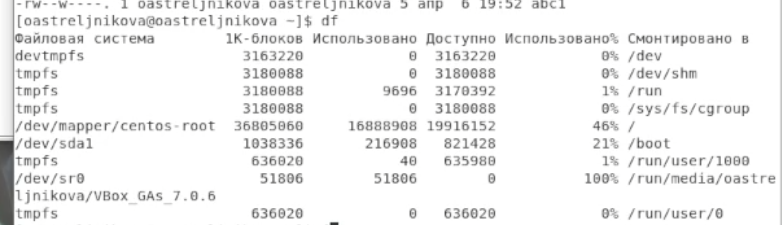{#fig:015 width=70%} 
	
   16. Проверка целостности файлов с помощью команды  fsck.(рис. @fig:016)

 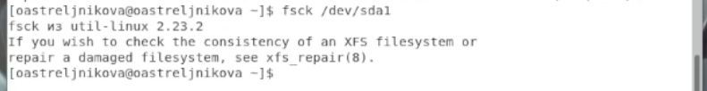{#fig:016 width=70%} 

2. Выполняю следующие действия, зафиксировав в отчёте по лабораторной работе используемые при этом команды и результаты их выполнения:

   1. Требуемых папок у меня не было поэтому я их создала и произвела копирование файла io.h с его переименованием в файл equipment в корневой каталог. (рис. @fig:017)

   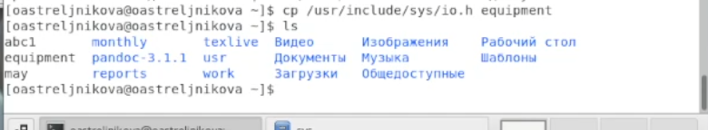{#fig:017 width=70%} 

  
   2. В домашнем каталоге Создание директорию ~/ski.plases с помощью команды mkdir(рис. @fig:018) 
  

   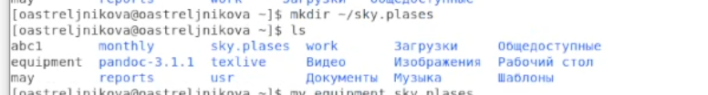{#fig:018 width=70%}

 

   3. Перемещаем файл equipment в каталог ~/ski.plases с помощью команды mv (рис. @fig:019).

   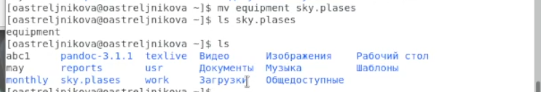{#fig:019 width=70%} 

   
   4. Переименоваю файл ~/ski.plases/equipment в ~/ski.plases/equiplist с помощью команды mv (рис. @fig:020) 

   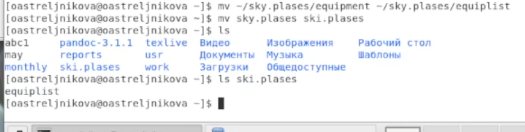{#fig:020 width=70%} 

   5. Создание в домашнем каталоге файл abc1 и Копируем его в каталог ~/ski.plases назвав его equiplist2 с помощью команд touch, mv. (рис. @fig:021).

   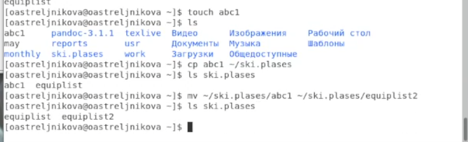{#fig:021 width=70%} 

   6. Создание каталог с именем equipment в каталоге ~/ski.plases с помощью команды mkdir (рис. @fig:022).

   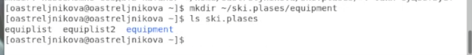{#fig:022 width=70%} 

   
   7. Перемещаем файлы ~/ski.plases/equiplist и equiplist2 в каталог ~/ski.plases/equipment с помощью команды mv.(рис. @fig:023).

   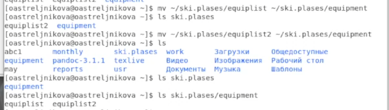{#fig:023 width=70%} 

   
   8. Создание и Перемещаем каталог ~/newdir в каталог ~/ski.plases, назвав его plans с помощью команд mkdir, mv. (рис. @fig:024)

   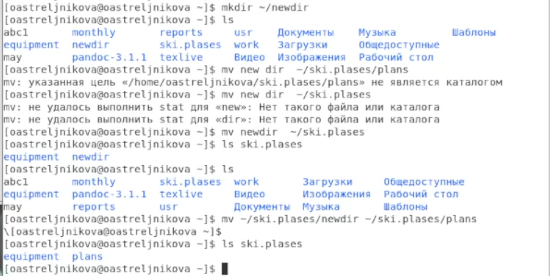{#fig:024 width=70%} 

  
3. Определию опции команды chmod, необходимые для того, чтобы присвоить перечисленным ниже файлам выделенные права доступа, считая, что в начале таких прав нет:

   1. drwxr--r-- ... australia (рис. @fig:025) результат выполнения опций (рис. @fig:026):

   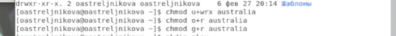{#fig:025 width=70%} 

 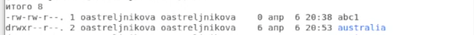{#fig:026 width=70%} 
   
   
   
   2. drwx--x--x ... play (рис. @fig:027) результат выполнения опций (рис. @fig:028):

   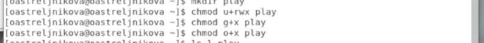{#fig:027 width=70%} 

 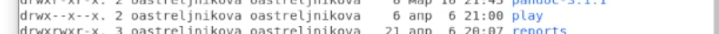{#fig:028 width=70%} 

     
   
   3. -r-xr--r-- ... my_os (рис. @fig:029) результат выполнения опций (рис. @fig:030):

   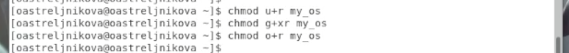{#fig:029 width=70%} 

 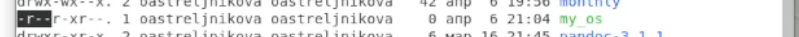{#fig:030 width=70%} 
   
   
   
   4. -rw-rw-r-- ... feathers (рис. @fig:031) результат выполнения опций (рис. @fig:032):

   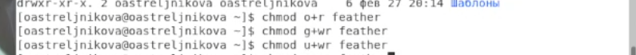{#fig:031 width=70%} 

 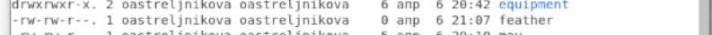{#fig:032 width=70%} 

4. Проделываем приведённые ниже упражнения, записываем в  отчёт по лабораторной работе используемые при этом команды:

   1. С помощью команды less (рис. @fig:033) просмотриваю содержимое файла /etc/password (рис. @fig:034) :

   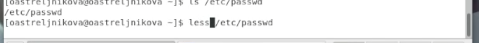{#fig:033 width=70%} 
   
   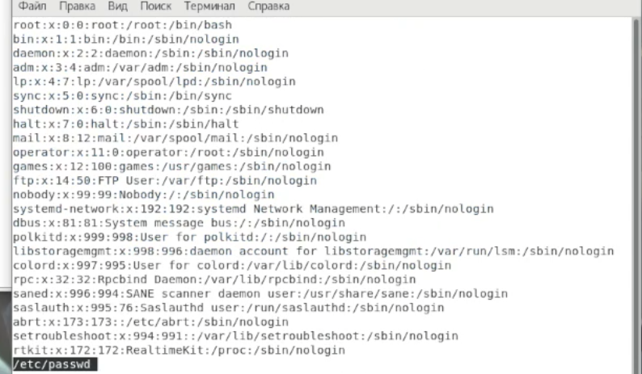{#fig:034 width=70%} 
   
   2. Копируем файл ~/feathers в файл ~/file.old с помощью команды cp (рис. @fig:035):

   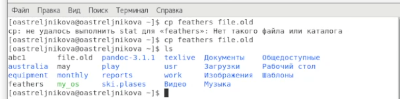{#fig:035 width=70%} 
   
   
   3. Перемещаем файл ~/file.old в каталог ~/play с помощью команды mv (рис. @fig:036):

   {#fig:036 width=70%} 
   
      
   4. Копируем каталог ~/play в каталог ~/fun с помощью команды cp(рис. @fig:037):

   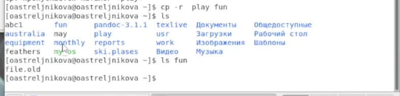{#fig:037 width=70%} 
   
   
   
   5. Перемещаем каталог ~/fun в каталог ~/play и называю его games с помощью команды mv (рис. @fig:038):

   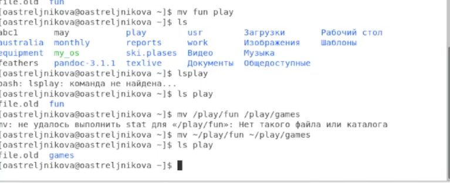{#fig:038 width=70%} 
   
   
   
   6. Лишаем владельца файла ~/feathers права на чтение с помощью команды chmod (рис. @fig:039) и результат показанны на рис. @fig:040:

   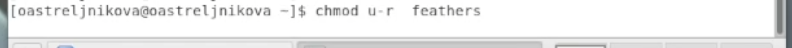{#fig:039 width=70%} 
   
   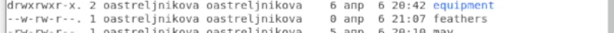{#fig:040 width=70%} 
   
   7. Если попытаться просмотреть файл ~/feathers командой cat то будет отказано в доступе.(рис. @fig:041)
   
   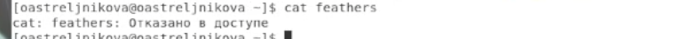{#fig:041 width=70%}
   
   8. Если попытаться скопировать файл ~/feathers то будет отказано в доступе (рис. @fig:042):

   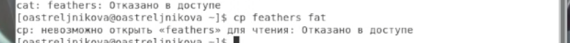{#fig:042 width=70%}
   
   
   
   9. Даём владельцу файла ~/feathers право на чтение с помощью команды chmod (рис. @fig:043) результат показан на рис. @fig:044:

   {#fig:043 width=70%}
   
   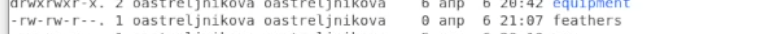{#fig:044 width=70%}
   
   
   10. Лишаем владельца каталога ~/play права на выполнение с помощью команды chmod (рис. @fig:045) результат показан на рис. @fig:046:

   {#fig:045 width=70%}

  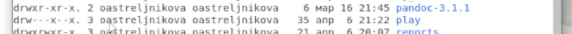{#fig:046 width=70%}
   
   
   
   11. При попытке перехода в каталог ~/play с помощью команды cd, выскакивает сообщение об ошибке доступа (рис. @fig:047):

   {#fig:047 width=70%}
   
   
   
   12. Даём владельцу каталога ~/play право на выполнение с помощью команды chmod (рис. @fig:048) результат показан на рис. @fig:049 :

   {#fig:048 width=70%}

 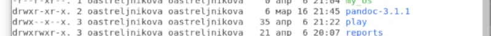{#fig:049 width=70%}

5. Выведение справочной информации по командам mount, fsck, mkfs, kill (рис. @fig:050):

   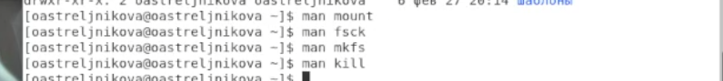{#fig:050 width=70%}
   
   

# Выводы

В данной лабороторной работе мы ознакомились с файловой системой Linux, её структурой, именами и содержанием каталогов. Приобрела практические навыки по применению команд для работы с файлами и каталогами, по управлению процессами (и работами), по проверке использования диска и обслуживанию файловой системы.
ьщгте
# Контрольные вопросы

1. *Дайте характеристику каждой файловой системе, существующей на жёстком диске компьютера, на котором вы выполняли лабораторную работу.*

Ext4 - журналируемая файловая система, используемая в ОС на ядре Linux. Основана на файловой системе Ext3, но отличается тем, что в ней представлен механизм записи файлов в непрерывные участки блоков (екстенты), уменьшающий фрагментацию и повышающий производительность. В Ubuntu, начиная с версии 9.10, эта файловая система используется по умолчанию при автоматическом разбиении диска инсталлятором.

Ext3 - журналируемая файловая система, используемая в ОС на ядре Linux. Является файловой системой по умолчанию во многих дистрибутивах. Основана на Ext2, но отличается тем, что в ней есть журналирование, то есть в ней предусмотрена запись некоторых данных, позволяющих восстановить файловую систему при сбоях в работе компьютера.

Ext2 - файловая система, используемая в операционных системах на ядре Linux. Достаточно быстра для того, чтобы служить эталоном в тестах производительности файловых систем. Она не является журналируемой файловой системой и это её главный недостаток.

BTRFS - Достаточно новая универсальная ФС, используемая в операционных системах на ядре Linux. Ее особенностями являются: индексное хранение структур данных (в В-деревьях), возможность создания снепшотов, и многие другие интересные вещи.

XFS - высокопроизводительная журналируемая файловая система. Распределение дискового пространства - екстентами, храниение каталогов в B-деревьях. Автоматическая аллокация и высвобождение I-node. Дефрагментируется «на лету». Невозможно уменьшить размер существующей файловой системы. При сбое питания во время записи возможна потеря данных (хотя этот недостаток нельзя относить к одной только XFS, он свойственен любой журналируемой ФС, но, вместе с тем, XFS, по умолчанию, достаточно активно использует буферы в памяти).

Fat16 - файловая система, сейчас широко используемая в картах памяти фотоаппаратов и других устройств.

Fat32 - файловая система основанная на Fat16. Cоздана, чтобы преодолеть ограничения на размер тома в Fat16.

NTFS - файловая система для семейства операционных систем Microsoft Windows. Поддержка в Ubuntu осуществляется специальным драйвером - NTFS-3G.

HFS - файловая система, разработанная Apple Inc. для использования на компьютерах, работающих под управлением операционной системы Mac OS.

HSF+ - файловая система, разработанная Apple Inc. для замены HFS. Является улучшенной версией HFS, с поддержкой файлов большого размера и использует кодировку Unicode для имён файлов и папок.

JFS - журналируемая файловая система. В отличие от Ext3, в которую добавили поддержку журналирования, JFS изначально была журналируемой. На момент выхода в свет JFS была самой производительной из существовавших файловых систем. На текущий момент сохраняет за собой одно из лидирующих мест по этому показателю.

SWAP - раздел жёсткого диска, предназначенная для виртуальной памяти (файла/раздела подкачки).

ReiserFS - журналируемая файловая система, разработанная специально для Linux. Обычно под словом ReiserFS понимают третью версию (последняя — 3.6.21), а четвёртую называют Reiser4. В настоящий момент разработка Reiser3 прекращена.

Reiser4 - журналируемая файловая система ReiserFS (4-я версия), разработанная специально для Linux. Одна из самых быстрых файловых систем для Linux (с включённым плагином-архиватором - самая быстрая).

UFS - файловая система, созданная для операционных систем семейства BSD. Linux поддерживает UFS на уровне чтения, но не имеет полной поддержки для записи UFS. Родной Linux ext2 создан по подобию UFS.

2. *Приведите общую структуру файловой системы и дайте характеристику каждой директории первого уровня этой структуры.*

Ubuntu поддерживает стандарт FHS1, описывающий какая информация должна находится в том или ином месте «дерева». Ниже приведена таблица с кратким описанием основных директорий.

/	Корневая директория, содержащая всю файловую иерархию.

/bin/	Основные системные утилиты, необходимые как в однопользовательском режиме, так и при обычной работе всем пользователям (например: cat, ls, cp).

/boot/	Загрузочные файлы (в том числе файлы загрузчика, ядро и т.д.). Часто выносится на отдельный раздел.

/dev/	Основные файлы устройств системы (например физические устройства sata винчестеры /dev/sda, видео камеры или TV-тюнеры /dev/video или псевдоустройства, например «чёрные дыры» /dev/null, /dev/zero ).

/etc/	Общесистемные конфигурационные файлы, лежат в корне директории и файлы конфигурации установленных программ (имя происходит от et cetera).

/etc/X11/	Файлы конфигурации X Window System версии 11.

/etc/apt/	Файлы конфигурации пакетного менеджера Apt.

/etc/samba/	Файлы конфигурации сервера Samba, расшаривающего файлы по сети с windows машинами.

/home/	Содержит домашние директории пользователей, которые в свою очередь содержат персональные настройки и данные пользователя. Часто размещается на отдельном разделе.

/lib/	Основные библиотеки, необходимые для работы программ из /bin/ и /sbin/.

/media/	Точки монтирования для сменных носителей, таких как CD-ROM, DVD-ROM, flash дисков.

/opt/	Дополнительное программное обеспечение.

/proc/	Виртуальная файловая система, представляющая состояние ядра операционной системы и запущенных процессов в виде каталогов файлов.

/root/	Домашняя директория пользователя root.

/sbin/	Основные системные программы для администрирования и настройки системы, например, init, iptables, ifconfig.

/srv/	Данные, специфичные для окружения системы.

/tmp/	Временные файлы (см. также /var/tmp).

/usr/	Вторичная иерархия для данных пользователя; содержит большинство пользовательских приложений и утилит, используемых в многопользовательском режиме. Может быть смонтирована по сети только для чтения и быть общей для нескольких машин.

/usr/bin/	Дополнительные программы для всех пользователей, не являющиеся необходимыми в однопользовательском режиме.

/usr/include/	Стандартные заголовочные файлы.

/usr/lib/	Библиотеки для программ, находящихся в /usr/bin/ и /usr/sbin/.

/usr/sbin/	Дополнительные системные программы (такие как демоны различных сетевых сервисов).

/usr/share/	Архитектурно-независимые общие данные.

/usr/src/	Исходные коды (например, здесь располагаются исходные коды ядра).

/usr/local/	Третичная иерархия для данных, специфичных для данного хоста. Обычно содержит такие поддиректории, как bin/, lib/, share/. Она пригодится, когда /usr/ используется по сети.

/var/	Изменяемые файлы, такие как файлы регистрации (log-файлы), временные почтовые файлы, файлы спулеров.

/var/cache/	Данные кэша приложений. Сюда скачиваются пакеты перед их установкой в систему, здесь же они какое-то время и хранятся

/var/lib/	Информация о состоянии. Постоянные данные, изменяемые программами в процессе работы (например, базы данных, метаданные пакетного менеджера и др.).

/var/lock/	Lock-файлы, указывающие на занятость некоторого ресурса.

/var/log/	Различные файлы регистрации (log-файлы).

/var/mail/	Почтовые ящики пользователей.

/var/run/	Информация о запущенных программах (в основном, о демонах).

/var/spool/	Задачи, ожидающие обработки (например, очереди печати, непрочитанные или неотправленные письма).

/var/tmp/	Временные файлы, которые должны быть сохранены между перезагрузками.

/var/www/	Директория веб-сервера Apache, всё что находится внутри транслируется им в интернет (конфигурация по-умолчанию)

3. *Какая операция должна быть выполнена, чтобы содержимое некоторой файловой системы было доступно операционной системе?*

Монтирование тома.

4. *Назовите основные причины нарушения целостности файловой системы. Как устранить повреждения файловой системы?*

Отсутствие синхронизации между образом файловой системы в памяти и ее данными на диске в случае аварийного останова может привести к появлению следующих ошибок:

   1. Один блок адресуется несколькими mode (принадлежит нескольким файлам).

   2. Блок помечен как свободный, но в то же время занят (на него ссылается onode).

   3. Блок помечен как занятый, но в то же время свободен (ни один inode на него не ссылается).

   4. Неправильное число ссылок в inode (недостаток или избыток ссылающихся записей в каталогах).

   5. Несовпадение между размером файла и суммарным размером адресуемых inode блоков.

   6. Недопустимые адресуемые блоки (например, расположенные за пределами файловой системы).

   7. "Потерянные" файлы (правильные inode, на которые не ссылаются записи каталогов).

   8. Недопустимые или неразмещенные номера inode в записях каталогов.

5. *Как создаётся файловая система?*

mkfs - позволяет создать файловую систему Linux.

6. *Дайте характеристику командам, которые позволяют просмотреть текстовые файлы.*

Cat - выводит содержимое файла на стандартное устройство вывода

7. *Приведите основные возможности команды cp в Linux.*

Cp – копирует или перемещает директорию, файлы.

8. *Назовите и дайте характеристику командам перемещения и переименования файлов и каталогов.*

Mv - переименовать или переместить файл или директорию

9. *Что такое права доступа? Как они могут быть изменены?*

Права доступа к файлу или каталогу можно изменить, воспользовавшись командой chmod. Сделать это может владелец файла (или каталога) или пользователь с правами администратора.

