---
## Front matter
title: "Отчёт по лабораторной работе № 5"
subtitle: "Операционные системы"
author: "Ильина Любовь Александровна"

## Generic otions
lang: ru-RU
toc-title: "Содержание"

## Bibliography
bibliography: bib/cite.bib
csl: pandoc/csl/gost-r-7-0-5-2008-numeric.csl

## Pdf output format
toc: true # Table of contents
toc-depth: 2
lof: true # List of figures
lot: true # List of tables
fontsize: 12pt
linestretch: 1.5
papersize: a4
documentclass: scrreprt
## I18n polyglossia
polyglossia-lang:
  name: russian
  options:
	- spelling=modern
	- babelshorthands=true
polyglossia-otherlangs:
  name: english
## I18n babel
babel-lang: russian
babel-otherlangs: english
## Fonts
mainfont: PT Serif
romanfont: PT Serif
sansfont: PT Sans
monofont: PT Mono
mainfontoptions: Ligatures=TeX
romanfontoptions: Ligatures=TeX
sansfontoptions: Ligatures=TeX,Scale=MatchLowercase
monofontoptions: Scale=MatchLowercase,Scale=0.9
## Biblatex
biblatex: true
biblio-style: "gost-numeric"
biblatexoptions:
  - parentracker=true
  - backend=biber
  - hyperref=auto
  - language=auto
  - autolang=other*
  - citestyle=gost-numeric
## Pandoc-crossref LaTeX customization
figureTitle: "Рис."
tableTitle: "Таблица"
listingTitle: "Листинг"
lofTitle: "Список иллюстраций"
lotTitle: "Список таблиц"
lolTitle: "Листинги"
## Misc options
indent: true
header-includes:
  - \usepackage{indentfirst}
  - \usepackage{float} # keep figures where there are in the text
  - \floatplacement{figure}{H} # keep figures where there are in the text
---

# Цель работы

Приобретение практических навыков взаимодействия пользователя с системой
посредством командной строки.

# Задание
1. Определите полное имя вашего домашнего каталога. Далее относительно этого
каталога будут выполняться последующие упражнения.
2. Выполните следующие действия:
2.1. Перейдите в каталог /tmp.
2.2. Выведите на экран содержимое каталога /tmp. Для этого используйте команду ls с различными опциями. Поясните разницу в выводимой на экран
информации.
2.3. Определите, есть ли в каталоге /var/spool подкаталог с именем cron?
2.4. Перейдите в Ваш домашний каталог и выведите на экран его содержимое.
Определите, кто является владельцем файлов и подкаталогов?
3. Выполните следующие действия:
3.1. В домашнем каталоге создайте новый каталог с именем newdir.
3.2. В каталоге ~/newdir создайте новый каталог с именем morefun.
3.3. В домашнем каталоге создайте одной командой три новых каталога с именами letters, memos, misk. Затем удалите эти каталоги одной командой.
3.4. Попробуйте удалить ранее созданный каталог ~/newdir командой rm. Проверьте, был ли каталог удалён.
3.5. Удалите каталог ~/newdir/morefun из домашнего каталога. Проверьте,
был ли каталог удалён.
4. С помощью команды man определите, какую опцию команды ls нужно использовать для просмотра содержимое не только указанного каталога, но и подкаталогов, входящих в него.
5. С помощью команды man определите набор опций команды ls, позволяющий отсортировать по времени последнего изменения выводимый список содержимого каталога с развёрнутым описанием файлов.
6. Используйте команду man для просмотра описания следующих команд: cd, pwd,
mkdir, rmdir, rm. Поясните основные опции этих команд.
7. Используя информацию, полученную при помощи команды history, выполните
модификацию и исполнение нескольких команд из буфера команд.
                                                                     

# Выполнение лабораторной работы

1. Определим полное имя домашнего каталога с помощью команды pwd (рис. @fig:001).

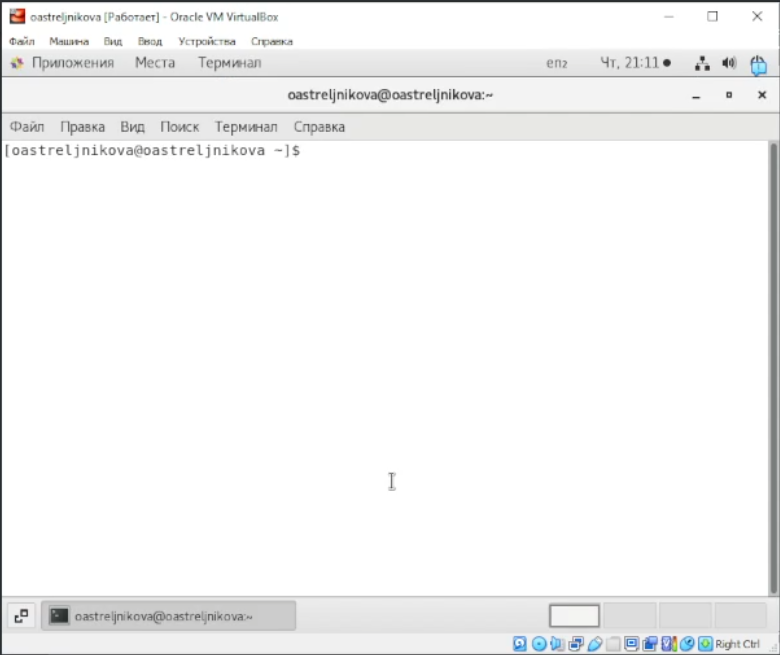{#fig:001}

2. Определим содержимое каталога /tmp командой ls с разными конфигурациями: 
• «ls» − выводится список каталогов и файлов, которые можно увидеть, «вручную» открыв каталог tmp (рис. @fig:002)
• «ls -a» − к списку, описанному в предыдущем пункте, добавляются скрытые каталоги и файлы (их имена начинаются с точки) (рис. @fig:003)
• «ls -l» − получаем список каталогов и файлов, но уже с более подробной информацией о них (рис. @fig:004)
• «ls -F» − с помощью этой команды получаем информацию о типах файлов (рис. @fig:005)
• «ls -alF» − данная команда отобразит список всех каталогов и файлов, в том числе и скрытых, с подробной информацией о них (рис. @fig:006)

2.1. Перейдите в каталог /tmp и выведем его содержимой командой ls с разными опциями.

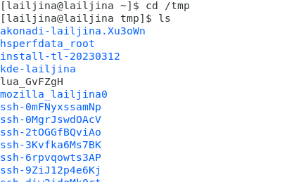{#fig:002}

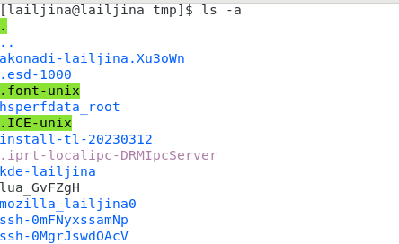{#fig:003}

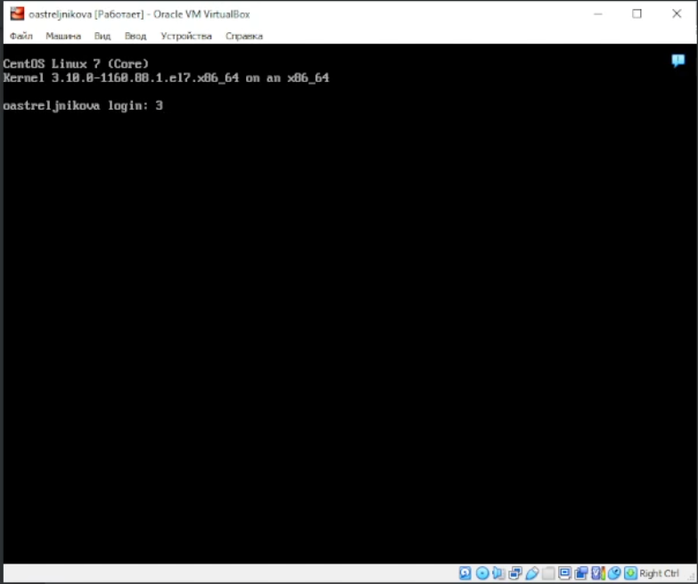{#fig:004}

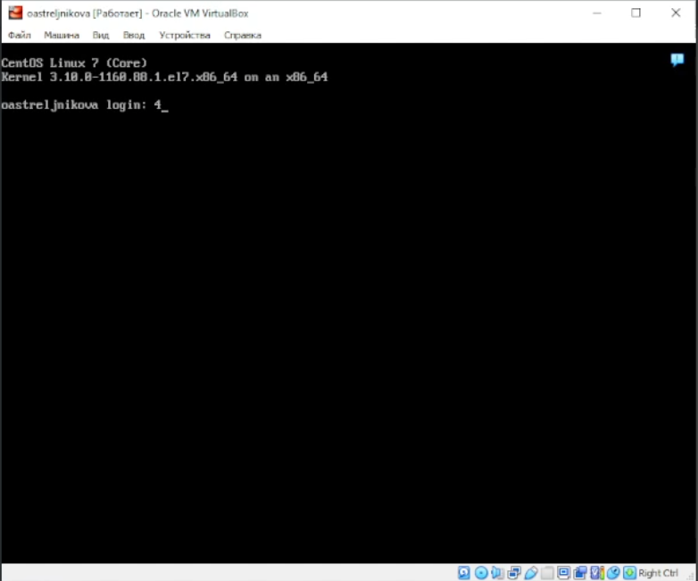{#fig:005}

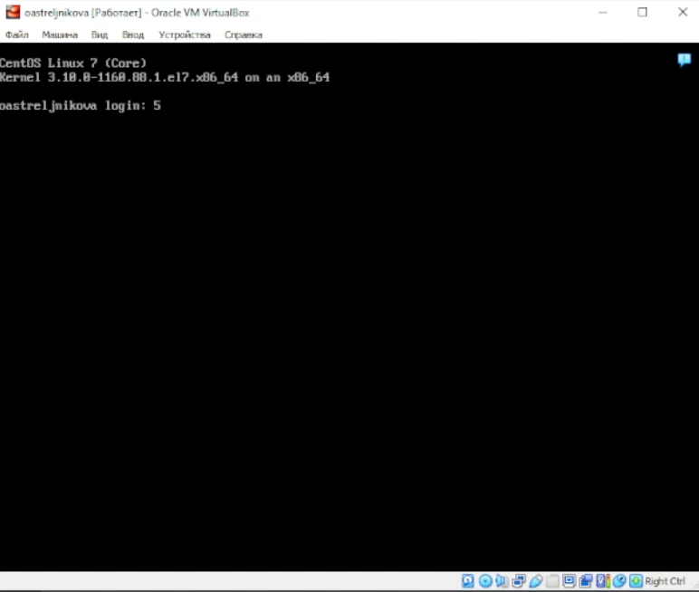{#fig:006}

2.2. Проверим в каталоге /var/spool подкаталог с именем cron, зайдя в каталог командой cd и проверив состав каталога по команде ls (рис. @fig:007)

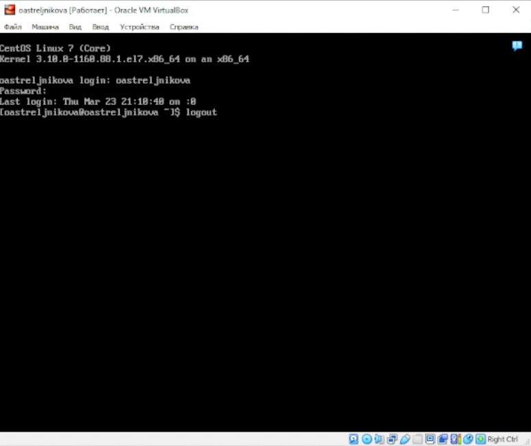{#fig:007}

2.3. Перейдем в домашний каталог и выведем на экран его содержимое командой ls. Владельцем родительского каталога является root, а у остальных файлов и подкаталогов - lailjina. (рис. @fig:008).

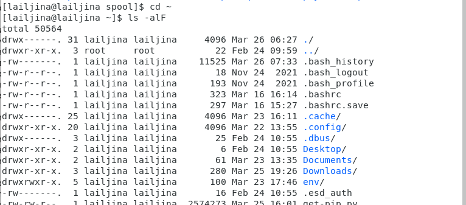{#fig:008}

3.1. В домашнем каталоге командой mkdir создаем новый каталог с именем newdir (рис. @fig:009).

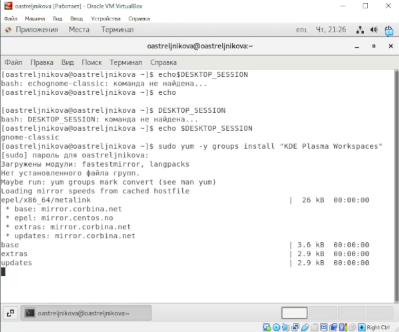{#fig:009}

3.2. Зайдем в каталог ~/newdir и создадим новый каталог с именем morefun командой mkdir (рис. @fig:010).

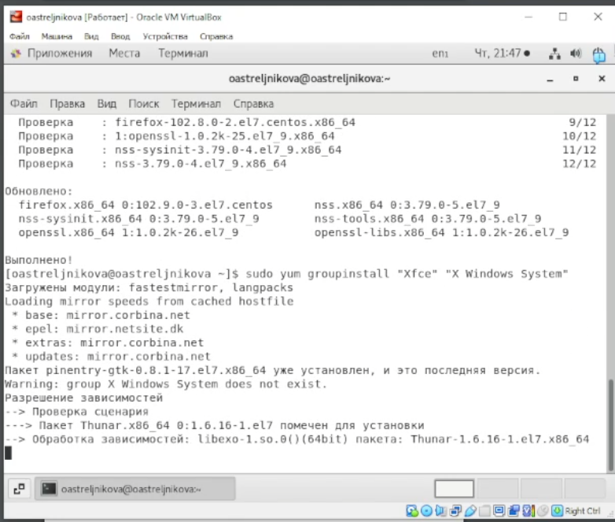{#fig:010}

3.3. В домашнем каталоге создаем одной командой mkdir три новых каталога с именами letters, memos, misk (рис. @fig:011). Затем удалим эти каталоги одной командой rm –r. (рис. @fig:012).

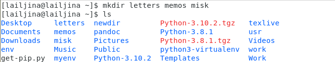{#fig:011}

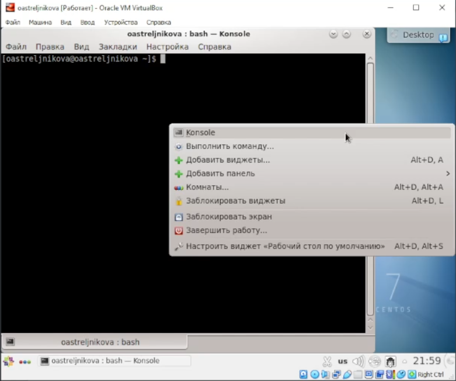{#fig:012}

3.4. Удалим ранее созданный каталог ~/newdir командой rm. Убедимся, что он не удалился. (рис. @fig:013)

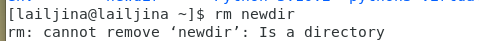{#fig:013}

3.5. Удалим командой rm –r каталог ~/newdir/morefun из домашнего каталога. Проверим, что каталог удалён (рис. @fig:014).

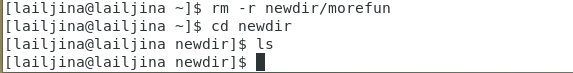{#fig:014}

4. С помощью команды man ls (рис. @fig:015) определим, что для просмотра содержимого указанного каталога и подкаталогов, входящих в него, используем опцию -R, --recursive в команде ls (рис. @fig:016).

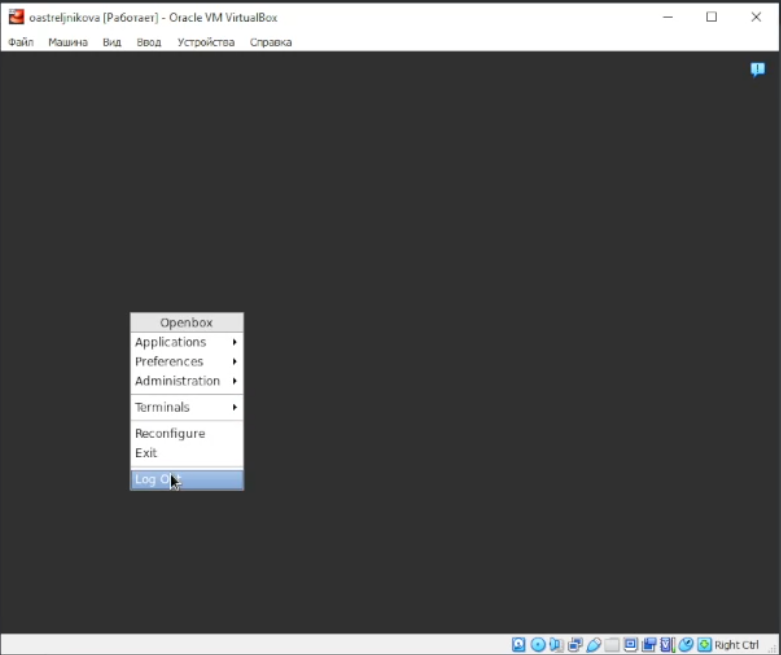{#fig:015}

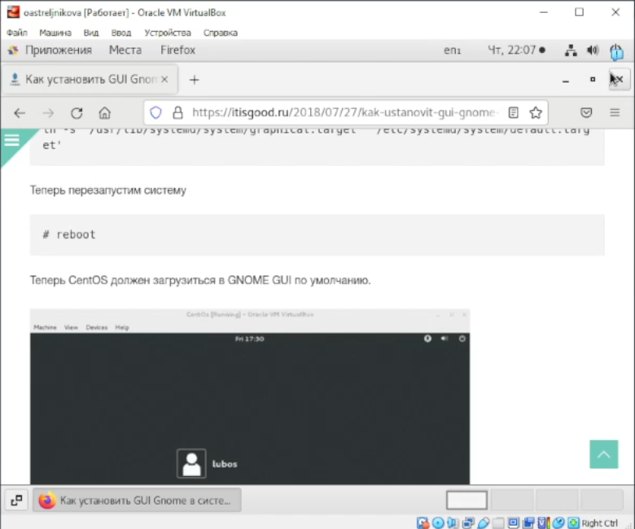{#fig:016}

5. С помощью команды man ls определим, что нужно использовать опцию -t, для вывода списка, отсортированного по времени последнего изменения содержимого каталога с развёрнутым описанием файлов (рис. @fig:017).

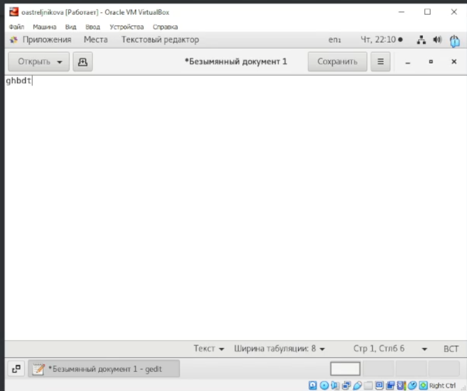{#fig:017}

6. Используем команду man для просмотра описания следующих команд: cd, pwd, mkdir, rmdir, rm. Поясним основные опции этих команд.

У команды cd нет доп.опций (рис. @fig:018)

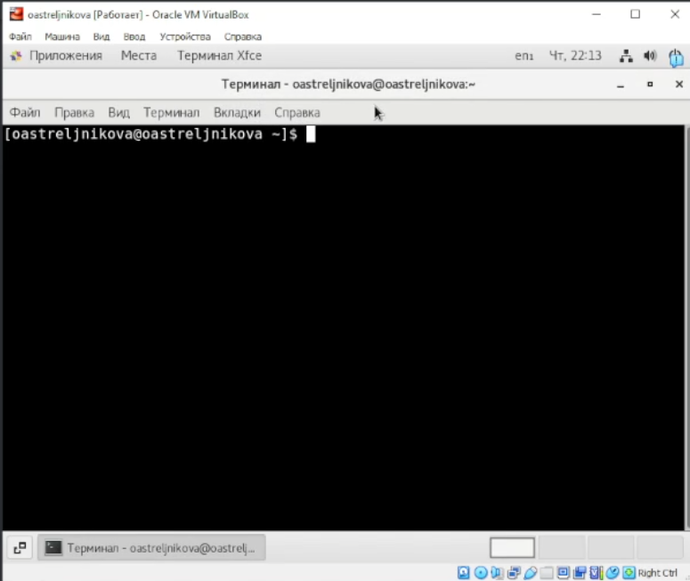{#fig:018}

Опции команды pwd (рис. @fig:019): 
• -L, --logical не разыменовывать символические ссылки. Если путь содержит символические ссылки, то выводить их без преобразования в исходный путь; 
• -P, --physical преобразовывать (отбрасывать символические ссылки) символические ссылки в исходные имена. Если путь содержит символические ссылки, то они будут преобразованы в названия исходных директорий, на которые они указывают; 
• --help показать справку по команде pwd; 
• --version показать версию утилиты pwd.

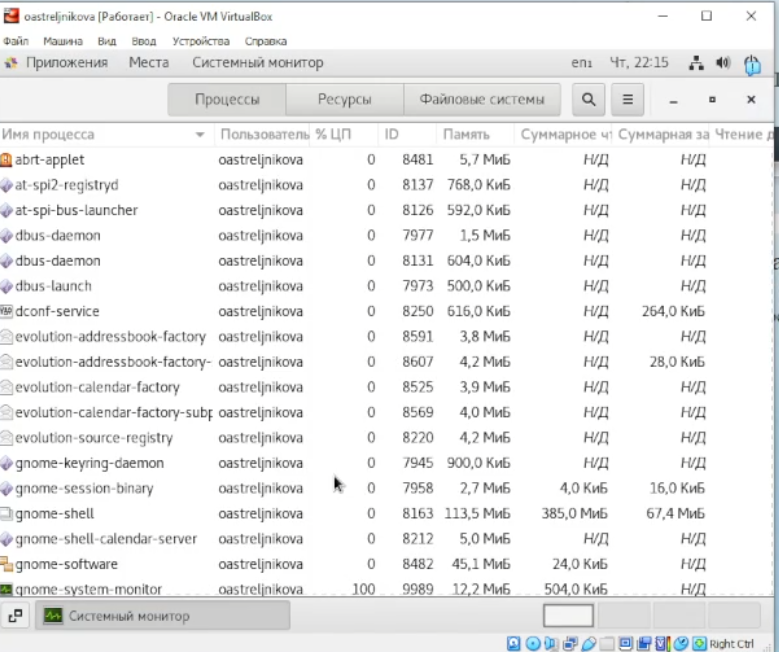{#fig:019}

Опции команды mkdir (рис. @fig:020): 

• -m, --mode=MODE устанавливает права доступа для создаваемой директории. Синтаксис MODE такой же как у команды chmod; 
• -p, --parents создать все директории, которые указаны внутри пути. Если какая-либо директория существует, то предупреждение об этом не выводится; 
• -v, --verbose выводить сообщение о каждой создаваемой директории; 
• -z установить контекст SELinux для создаваемой директории по умолчанию; 
• --context[=CTX] установить контекст SELinux для создаваемой директории в значение CTX; 
• --help показать справку по команде mkdir; 
• --version показать версию утилиты mkdir

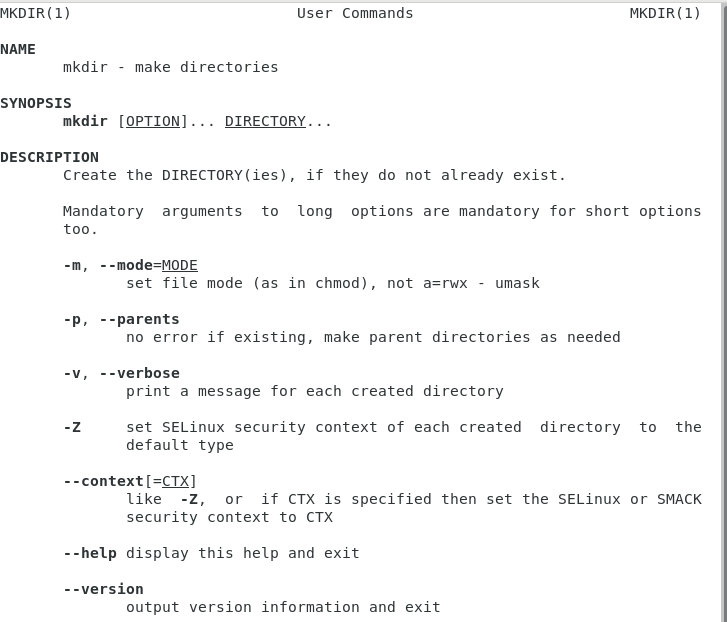{#fig:020}

Опции команды rmdir (рис. @fig:021): 

• --ignore-fail-on-non-empty игнорировать директории, которые содержат в себе файлы; 
• -p, --parents в этой опции каждый аргумент каталога обрабатывается как путь, из которого будут удалены все компоненты, если они уже пусты, начиная с последнего компонента; 
• -v, --verbose отображение подробной информации для каждого обрабатываемого каталога; 
• --help показать справку по команде rmdir; 
• --version показать версию утилиты rmdi

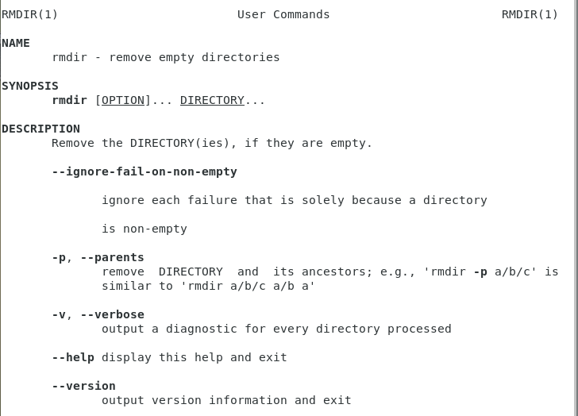{#fig:021}

Опции команды rm (рис. @fig:022):

• -f, --force игнорировать несуществующие файлы и аргументы. Никогда не выдавать запросы на подтверждение удаления; 
• -i выводить запрос на подтверждение удаления каждого файла; 
• -I выдать один запрос на подтверждение удаления всех файлов, если удаляется больше трех файлов или используется рекурсивное удаление. Опция применяется, как более «щадящая» версия опции –i; 
• --interactive[=WHEN] вместо WHEN можно использовать: never — никогда не выдавать запросы на подтверждение удаления. once — выводить запрос один раз (аналог опции -I) always — выводить запрос всегда (аналог опции -i). Если значение КОГДА не задано, то используется always; 
• --one-file-system во время рекурсивного удаления пропускать директории, которые находятся на других файловых системах; 
• --no-preserve-root если в качестве директории для удаления задан корневой раздел /, то считать, что это обычная директория и начать выполнять удаление;
• --preserve-root[=all] если в качестве директории для удаления задан корневой раздел /, то запретить выполнять команду rm над корневым разделом. Данное поведение используется по умолчанию; 
• -r, -R, --recursive удаление директорий и их содержимого. Рекурсивное удаление; 
• -d, --dir удалять пустые директории; 
• -v, --verbose выводить информацию об удаляемых файлах; 
• --help показать справку по команде rm; 
• --version показать версию утилиты rm

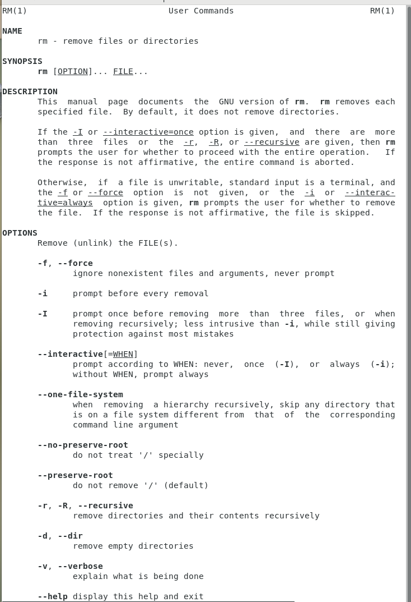{#fig:022}

7. Выведем историю команд с помощью команды history. Далее, используя команды: !500:s/ls/rm и !499, - выполним команды в строках 500 и 499 (рис. @fig:023)

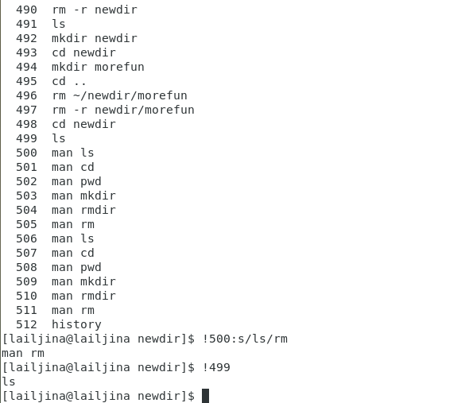{#fig:023}

# Выводы

В ходе выполнения лабораторной работы, мной приобретены практические навыки взаимодействия пользователя с системой посредством командной строки.

# Контрольные вопросы:

1. Командная строка – специальная программа, позволяющая управлять операционной системой при помощи текстовых команд, вводимых в окне приложения.
2. Для определения абсолютного пути к текущему каталогу используется команда pwd (print working directory). Например, команда «pwd» в моем домашнем каталоге выведет: /home/lailjina
3. Команда «ls -F» (или «ls -aF», тогда появятся еще скрытые файлы) выведет имена файлов в текущем каталоге и их типы. Тип каталога обозначается /, тип исполняемого файла обозначается *, тип ссылки обозначается @. Пример на рис. @fig:006

4. Имена скрытых файлов начинаются с точки. Эти файлы в операционной системе скрыты от просмотра и обычно используются для настройки рабочей среды. Для того, чтобы отобразить имена скрытых файлов, необходимо использовать команду «ls –a». Пример на рис. @fig:003

5. Команда rm используется для удаления файлов и/или каталогов. Команда rm -i выдает запрос подтверждения на удаление файла. Команда rm -r необходима, чтобы удалить каталог, содержащий файлы. Без указания этой опции команда не будет выполняться. Если каталог пуст, то можно воспользоваться командой rmdir. Если удаляемый каталог содержит файлы, то команда не будет выполнена – нужно использовать «rm -r имя_каталога». Таким образом, каталог, не содержащий файлов, можно удалить и командой rm, и командой rmdir. Файл командой rmdir удалить нельзя. Примеры на рис. @fig:013, @fig:014.

6. Чтобы определить, какие команды выполнил пользователь в сеансе работы, необходимо воспользоваться командой «history».
7. Чтобы исправить или запустить на выполнение команду, которую пользователь уже использовал в сеансе работы, необходимо: в первом случае: воспользоваться конструкцией !:s//, во втором случае: !. Примеры на рис.@fig:023

8. Чтобы записать в одной строке несколько команд, необходимо между ними поставить ; . Например, «cd /tmp; ls».
9. Символ обратного слэша \ позволяет использовать управляющие символы ( ".", "/", "$", "*", "[", "]", "^", "&") без их интерпретации командной оболочкой; процедура добавления данного символа перед управляющими символами называется экранированием символов. Например, команда «ls newdir/morefun» отобразит содержимое каталога newdir/morefun.
10. Команда «ls -l» отображает список каталогов и файлов с подробной информацией о них (тип файла, право доступа, число ссылок, владелец, размер, дата последней ревизии, имя файла или каталога).
11. Полный, абсолютный путь от корня файловой системы – этот путь начинается от корня "/" и описывает весь путь к файлу или каталогу; 
Относительный путь – это путь к файлу относительно текущего каталога (каталога, где находится пользователь). Например, «cd /newdir/morefun» – абсолютный путь, «cd newdir» – относительный путь.
12. Чтобы получить необходимую информацию о команде, необходимо воспользоваться конструкцией man [имя_команды], либо использовать опцию help, которая предусмотрена для некоторых команд.
13. Для автоматического дополнения вводимых команд служит клавиша Tab. Вывод: В ходе выполнения данной лабораторной работы я приобрела практические навыки взаимодействия с системой посредством командной строки.

