---
## Front matter
title: "Отчёт по лабораторной работе №6"
subtitle: "Операционные системы"
author: "Ильина Любовь Александровна"

## Generic otions
lang: ru-RU
toc-title: "Содержание"

## Bibliography
bibliography: bib/cite.bib
csl: pandoc/csl/gost-r-7-0-5-2008-numeric.csl

## Pdf output format
toc: true # Table of contents
toc-depth: 2
lof: true # List of figures
lot: true # List of tables
fontsize: 12pt
linestretch: 1.5
papersize: a4
documentclass: scrreprt
## I18n polyglossia
polyglossia-lang:
  name: russian
  options:
	- spelling=modern
	- babelshorthands=true
polyglossia-otherlangs:
  name: english
## I18n babel
babel-lang: russian
babel-otherlangs: english
## Fonts
mainfont: PT Serif
romanfont: PT Serif
sansfont: PT Sans
monofont: PT Mono
mainfontoptions: Ligatures=TeX
romanfontoptions: Ligatures=TeX
sansfontoptions: Ligatures=TeX,Scale=MatchLowercase
monofontoptions: Scale=MatchLowercase,Scale=0.9
## Biblatex
biblatex: true
biblio-style: "gost-numeric"
biblatexoptions:
  - parentracker=true
  - backend=biber
  - hyperref=auto
  - language=auto
  - autolang=other*
  - citestyle=gost-numeric
## Pandoc-crossref LaTeX customization
figureTitle: "Рис."
tableTitle: "Таблица"
listingTitle: "Листинг"
lofTitle: "Список иллюстраций"
lotTitle: "Список таблиц"
lolTitle: "Листинги"
## Misc options
indent: true
header-includes:
  - \usepackage{indentfirst}
  - \usepackage{float} # keep figures where there are in the text
  - \floatplacement{figure}{H} # keep figures where there are in the text
---

# Цель работы

Ознакомление с файловой системой Linux, её структурой, именами и содержа-
нием каталогов. Приобретение практических навыков по применению команд для
работы с файлами и каталогами, по управлению процессами (и работами), по проверке использования диска и обслуживанию файловой системы

# Задание

1. Выполните все примеры, приведённые в первой части описания лабораторной
работы.
2. Выполните следующие действия, зафиксировав в отчёте по лабораторной работе
используемые при этом команды и результаты их выполнения:
2.1. Скопируйте файл /usr/include/sys/io.h в домашний каталог и назовите
его equipment. Если файла io.h нет, то используйте любой другой файл в
каталоге /usr/include/sys/ вместо него.
2.2. В домашнем каталоге создайте директорию ~/ski.plases.
2.3. Переместите файл equipment в каталог ~/ski.plases.
2.4. Переименуйте файл ~/ski.plases/equipment в
~/ski.plases/equiplist.
2.5. Создайте в домашнем каталоге файл abc1 и скопируйте его в каталог
~/ski.plases, назовите его equiplist2.
2.6. Создайте каталог с именем equipment в каталоге ~/ski.plases.
2.7. Переместите файлы ~/ski.plases/equiplist и equiplist2 в каталог
~/ski.plases/equipment.
2.8. Создайте и переместите каталог ~/newdir в каталог ~/ski.plases и назо-
вите его plans.
3. Определите опции команды chmod, необходимые для того, чтобы присвоить пе-
речисленным ниже файлам выделенные права доступа, считая, что в начале та-
ких прав нет:
3.1. drwxr--r-- ... australia
3.2. drwx--x--x ... play
3.3. -r-xr--r-- ... my_os
3.4. -rw-rw-r-- ... feathers
При необходимости создайте нужные файлы.
4. Проделайте приведённые ниже упражнения, записывая в отчёт по лабораторной
работе используемые при этом команды:
4.1. Просмотрите содержимое файла /etc/password.
4.2. Скопируйте файл ~/feathers в файл ~/file.old.
4.3. Переместите файл ~/file.old в каталог ~/play.
4.4. Скопируйте каталог ~/play в каталог ~/fun.
4.5. Переместите каталог ~/fun в каталог ~/play и назовите его games.
4.6. Лишите владельца файла ~/feathers права на чтение.
4.7. Что произойдёт, если вы попытаетесь просмотреть файл ~/feathers ко-
мандой cat?
4.8. Что произойдёт, если вы попытаетесь скопировать файл ~/feathers?
4.9. Дайте владельцу файла ~/feathers право на чтение.
4.10. Лишите владельца каталога ~/play права на выполнение.
4.11. Перейдите в каталог ~/play. Что произошло?
4.12. Дайте владельцу каталога ~/play право на выполнение.
5. Прочитайте man по командам mount, fsck, mkfs, kill и кратко их охарактери-
зуйте, приведя примеры.

# Выполнение лабораторной работы

1. Выполните все примеры, приведённые в первой части описания лабораторной
работы. (рис. @fig:001) - @fig:006)).

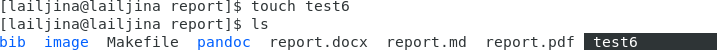{#fig:001}

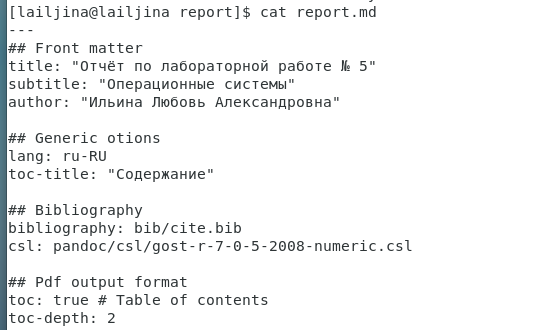{#fig:002}

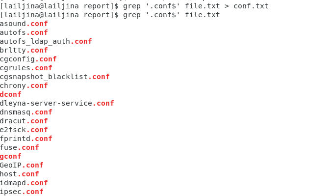{#fig:003}

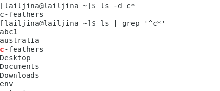{#fig:004}

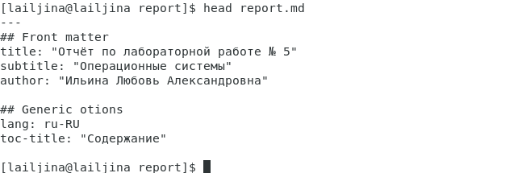{#fig:005}

{#fig:006}

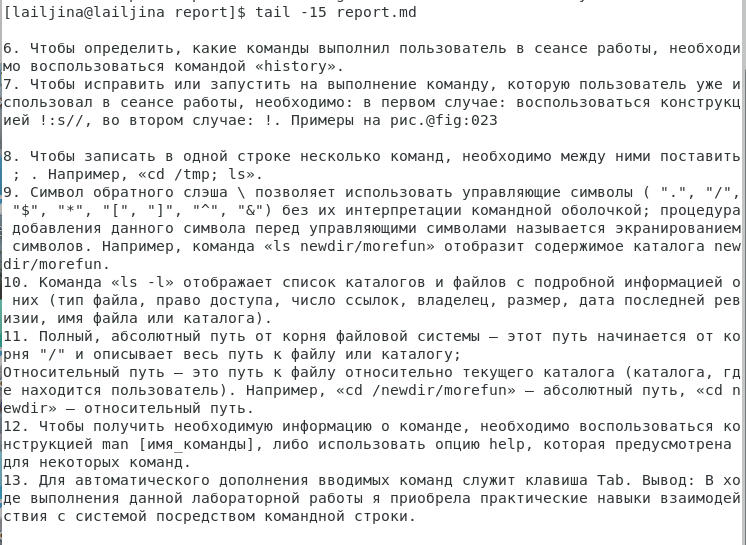{#fig:007}

2. Выполним следующие действия:
2.1. Скопируем файл /usr/include/sys/io.h в домашний каталог и назовем его equipment. Перед этим убедимся, что файл io.h есть в каталоге /usr/include/sys/. (рис. @fig:008)

{#fig:008}

2.2. В домашнем каталоге создаем директорию ~/ski.plases 
2.3. Переместим файл equipment в каталог ~/ski.plases.
2.4. Переименуем файл ~/ski.plases/equipment в ~/ski.plases/equiplist.
(рис. @fig:009)

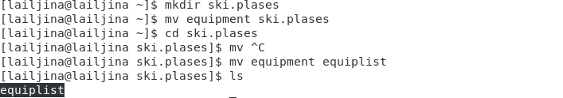{#fig:009}

2.5. Создадим в домашнем каталоге файл abc1 и скопируем его в каталог ~/ski.plases, назовем его equiplist2. (рис. @fig:010)

{#fig:010}

2.6. Создадим каталог с именем equipment в каталоге ~/ski.plases.
2.7. Переместим файлы ~/ski.plases/equiplist и equiplist2 в каталог ~/ski.plases/equipment. (рис. @fig:011)

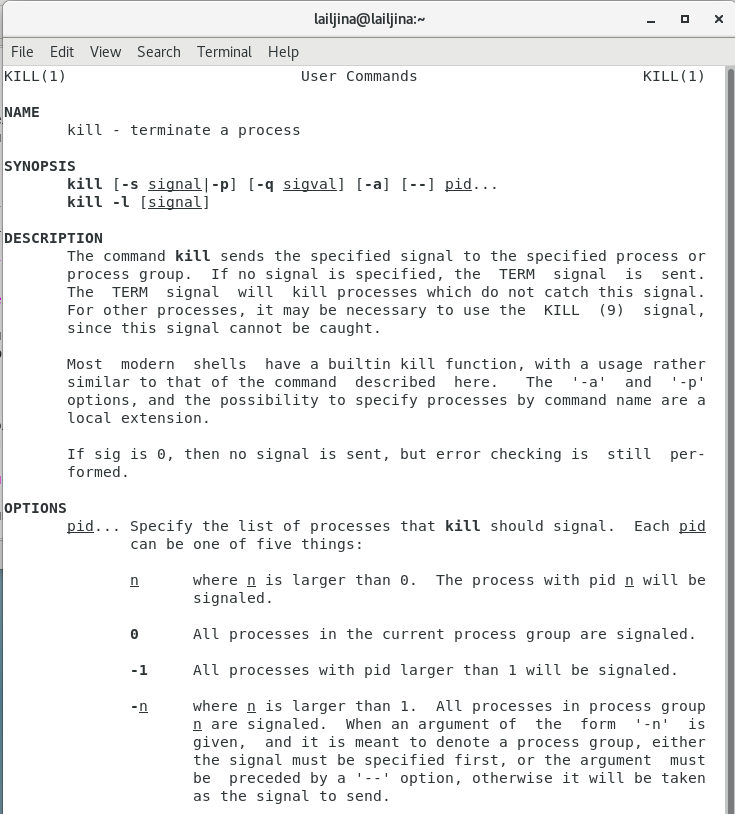{#fig:011}

2.8. Создадим и переместим каталог ~/newdir в каталог ~/ski.plases и назовем его plans. (рис. @fig:012)

{#fig:012}

3. Определим опции команды chmod, необходимые для того, чтобы присвоить перечисленным ниже файлам выделенные права доступа, считая, что в начале таких прав нет:
3.1. drwxr--r-- ... australia
3.2. drwx--x--x ... play
3.3. -r-xr--r-- ... my_os
3.4. -rw-rw-r-- ... feathers
При необходимости создадим нужные файлы. (рис. @fig:013)

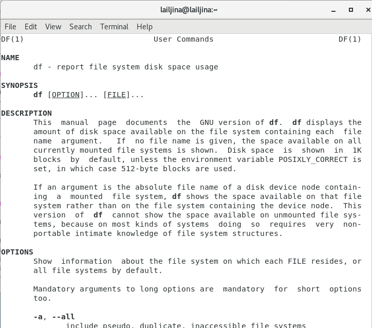{#fig:013}

4. Выполним упражнения ниже:
4.1. Просмотрим содержимое файла /etc/password командой less. (рис. @fig:014)-@fig:015))

{#fig:014}

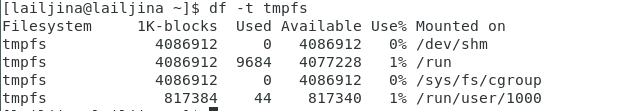{#fig:015}

4.2. Скопируем файл ~/feathers в файл ~/file.old.
4.3. Переместим файл ~/file.old в каталог ~/play.
4.4. Скопируем каталог ~/play в каталог ~/fun.
4.5. Переместим каталог ~/fun в каталог ~/play и назовем его games. (рис. @fig:016)

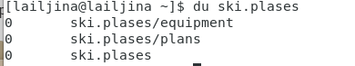{#fig:016}

4.6. Лишим владельца файла ~/feathers права на чтение.
4.7. Попробуем просмотреть файл ~/feathers командой cat.
4.8. Попробуем скопировать файл ~/feathers.
4.9. Дадим владельцу файла ~/feathers право на чтение. (рис. @fig:017)

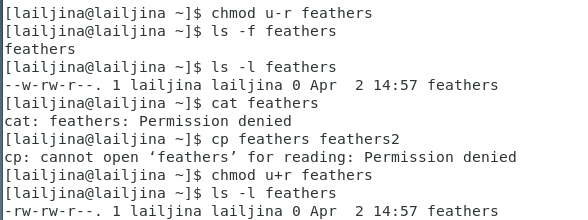{#fig:017}

4.10. Лишим владельца каталога ~/play права на выполнение.
4.11. Передадим в каталог ~/play. Что произошло?
4.12. Дайте владельцу каталога ~/play право на выполнение. (рис. @fig:018)

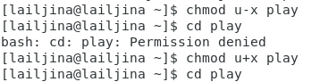{#fig:018}

5. Прочитайте man по командам mount, fsck, mkfs, kill и кратко их охарактеризуйте, приведя примеры. (рис. @fig:019)-@fig:024)

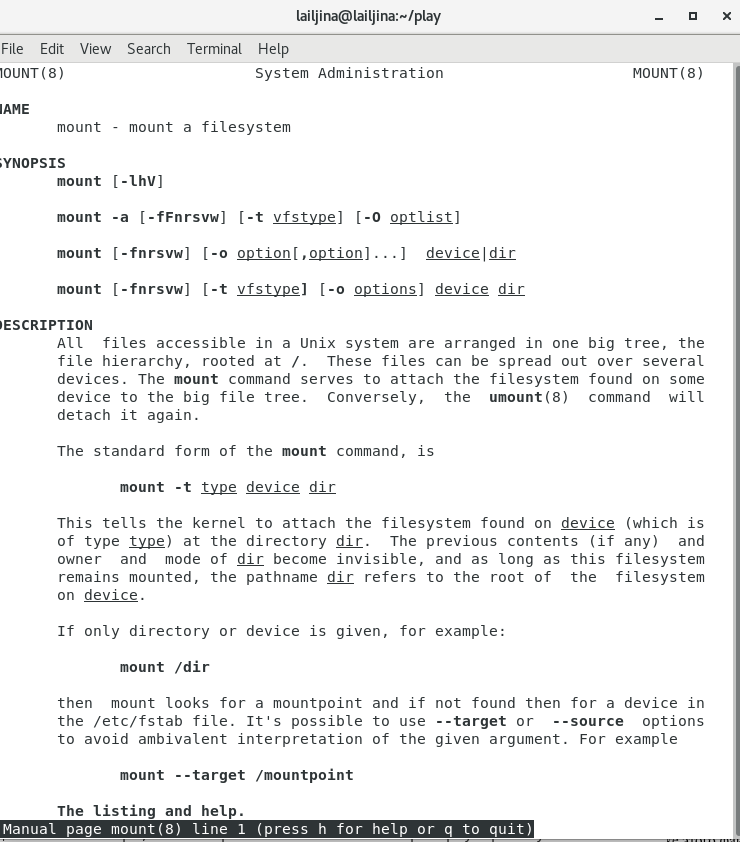{#fig:019}

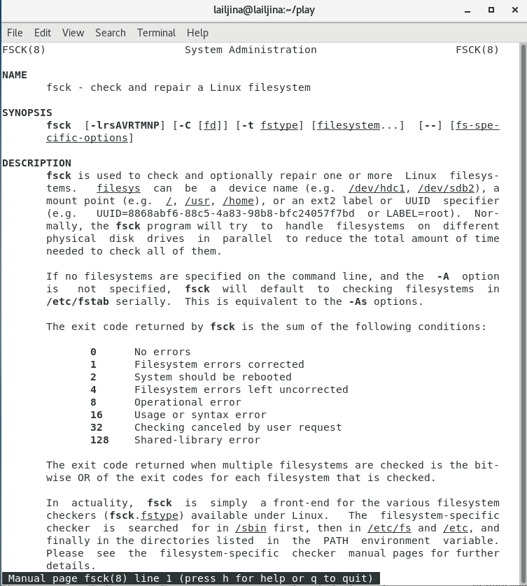{#fig:020}

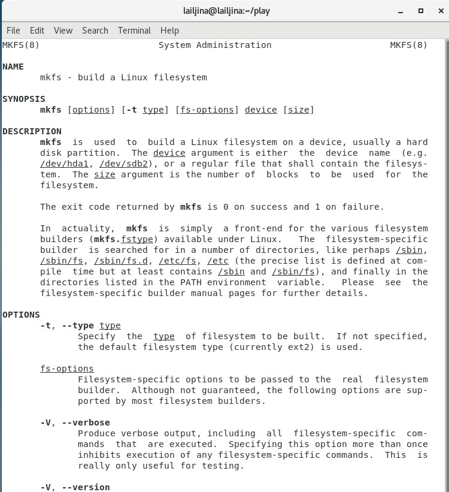{#fig:021}

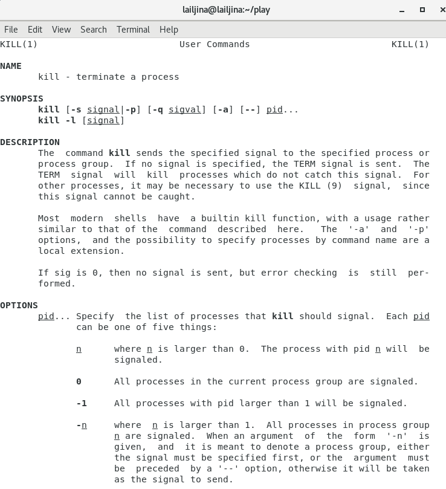{#fig:022}

Контрольные вопросы:

1. Дайте характеристику каждой файловой системе, существующей на жёстком диске компьютера, на котором вы выполняли лабораторную работу.
Чтобы узнать, какие файловые системы существуют на жёстком диске моего компьютера, используют команду «df -Th». 
На моем компьютере есть следующие файловые системы: xfs, devtmpfs,tmpfs. (рис. @fig:023)

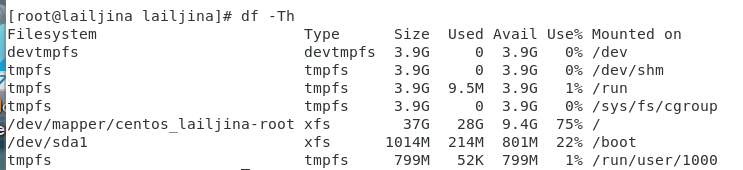{#fig:023}

XFS обладает преимуществами такие как журналирование метаданных для быстрого восстановления, но, кроме того, здесь поддерживается распределение потоков ввода/вывода по группам что сильно увеличивает производительность чтения и записи данных. Но это работает только для больших файлов. Также вы можете увеличить размер файловой системы или выполнить дефрагментацию, даже если она смонтирована.
devtmpfs позволяет ядру создать экземпляр tmpfs с именем devtmpfs при инициализации ядра, прежде чем регистрируется какое-либо устройство с драйверами. Каждое устройство с майором / минором будет предоставлять узел устройства в devtmpfs.
devtmpfs монтируется на /dev и содержит специальные файлы устройств для всех устройств.
tmpfs−временное файловое хранилище во многих Unix-подобных ОС. Предназначена для монтирования файловой системы, но размещается в ОЗУ вместо ПЗУ. Подобная конструкция является RAM диском. Данная файловая система, предназначенная для быстрого и ненадёжного хранения временных данных, подходит для /tmp и массовой сборки пакетов/образов, предполагает наличие достаточного объёма виртуальной памяти. Файловая система tmpfs предназначена для того, чтобы использовать часть физической памяти сервера как обычный дисковый раздел, в котором можно сохранять данные (чтение и запись). Поскольку данные размещены в памяти, то чтение или запись происходят во много раз быстрее, чем с обычного HDD диска.

2. Приведите общую структуру файловой системы и дайте характеристику каждой директории первого уровня этой структуры.

C помощью команды findmnt выясним директории первого уровня.(рис. @fig:024)

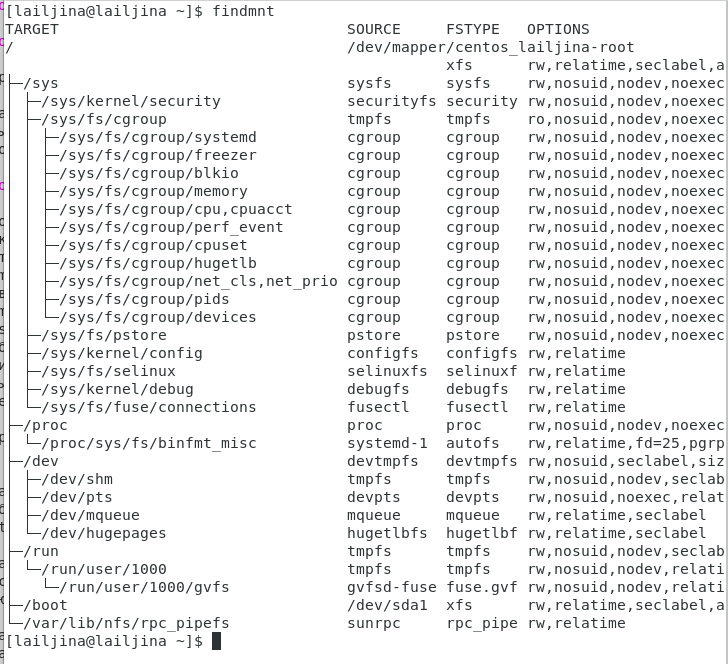{#fig:024}

 Файловая система Linux/UNIX физически представляет собой пространство раздела диска разбитое на блоки фиксированного размера, кратные
размеру сектора − 1024, 2048, 4096 или 8120 байт. Размер блока указывается при создании файловой системы.В файловой структуре Linux имеется один
корневой раздел −/ (он же root, корень). Все разделы жесткого диска (если их несколько) представляют собой структуру подкаталогов,
"примонтированных" к определенным каталогам.

"/" − корень. Это главный каталог в системе Linux. По сути, это и есть файловая система Linux.Адреса всех файлов начинаются с корня, а
дополнительные разделы, флешки или оптические диски подключаются в папки корневого каталога. Только пользователь root имеет право читать и
изменять файлы в этом каталоге.
/sys (system) - Информация о системе. Назначение каталогов Linux из этой папки - получение информации о системе непосредственно от ядра. Это еще одна файловая система организуемая ядром и позволяющая просматривать и изменить многие параметры работы системы, например, работу swap, контролировать вентиляторы и многое другое.
"/PROC" –информация о процессахПо сути, это псевдофайловая система, содержащая подробную информацию о каждом процессе, его Pid, имя исполняемого файла, параметры запуска, доступ к оперативной памяти и так далее. Также здесь можно найти информацию об использовании системных ресурсов.
"/DEV" – файлы устройств в Linux все, в том числе внешние устройства являются файлами. Таким образом, все подключенные флешки, клавиатуры, микрофоны, камеры −это просто файлы в каталоге /dev/. Выполняется сканирование всех подключенных устройств и создание для них специальных файлов.
"/RUN" - процессыКаталог,содержащий PID файлы процессов, похожий на "/var/run", но в отличие от него, он размещен в TMPFS, а поэтому после перезагрузки все файлы теряются.
/BOOT" – файлы загрузчика. Содержит все файлы,связанные с загрузчиком системы. Это ядро vmlinuz, образ initrd, а также файлы загрузчика, находящие в каталоге /boot/grub
"/VAR" – переменные файлы. Название каталога "/var" говорит само за себя, он должен содержать файлы, которые часто изменяются. Размер этих файлов постоянно увеличивается. Здесь содержатся файлы системных журналов, различные кеши, базы данных и так далее

3. Какая операция должна быть выполнена, чтобы содержимое некоторой файловой системы было доступно операционной системе?
Чтобы содержимое некоторой файловойсистемы было доступно операционной системе необходимо воспользоваться командой
mount.

4. Назовите основные причины нарушения целостности файловой системы. Как устранить повреждения файловой системы?
Целостность файловой системы может быть нарушена из-за перебоев в питании, неполадок в оборудовании или из-за некорректного/внезапного
выключения компьютера. Чтобы устранить повреждения файловой системы, необходимо использовать команду fsck.

5. Как создаётся файловая система?
Файловую систему можно создать, используя команду mkfs

6. Дайте характеристику командам, которые позволяют просмотреть текстовые файлы.
Команда cat читает данные из файла или стандартного ввода и выводит их на экран. Синтаксис утилиты:cat [опции] файл1
Основные опции cat:
b–нумеровать только непустые строки 
-E–показыватьсимвол $ в конце каждой строки
-n–нумеровать все строки
-s–удалять пустые повторяющиеся строки 
-T–отображать табуляции в виде ^I
-h–отобразить справку
-v–версия утилиты 
Команда nl. Команда nl действует аналогично команде cat, но выводит еще иномера строк встолбце слева. 
Команда less. Cущественно более развитая команда для пролистывания текста. При чтении данных со стандартного ввода она создает буфер, который позволяет листать текст как вперед, так и назад, а также искать как по направлению к концу, так и по направлению к началу текста. Синтаксис less аналогичный синтаксису команды cat. 
Некоторые опции less: 
-g –при поиске подсвечивать только текущее найденное слово (по умолчанию подсвечиваются все вхождения)
-N –показывать номера строк head. 
Команда head выводит начальные строки (по умолчанию − 10) из одного или нескольких документов. Также она может показывать данные, которые передает на вывод другая утилита. Синтаксис аналогичный синтаксису команды cat. 
Основные опции head:
-c (--bytes) −позволяет задавать количество текста не в строках, а в байтах
-n (--lines) −показывает заданное количество строк вместо 10, которые выводятся по умолчанию
-q (--quiet, --silent) −выводит только текст, недобавляя к нему название файла
-v (--verbose) −перед текстом выводит название файла 
-z (--zero-terminated) −символы перехода на новую строку заменяет символами завершения строк 
Команда tail позволяет выводить заданное количество строк с конца файла, а также выводить новые строки в интерактивном режиме. Синтаксис
аналогичный синтаксису команды cat.
Основные опции tail:
-c −выводить указанное количество байт с конца файла
-f −обновлять информацию по мере появления новых строк в файле
-n −выводить указанное количество строк из конца файла
--pid −используется с опцией -f, позволяет завершить работу утилиты, когда завершится указанный процесс
-q −не выводить имена файлов
--retry− повторять попытки открыть файл, если он недоступен
-v −выводить подробную информацию о файле.

7. Приведите основные возможности команды cp в Linux.
Команда cp позволяет полностью копировать файлы и директории.Cинтаксис:cp [опции] файл-источник файлприемник. После выполнения команды файл-источник будет полностью перенесен в файл-приемник. Если в конце указан слэш, файл будет записан в заданную директорию с оригинальным именем.
Основные опции:
--attributes-only −не копировать содержимое файла, а только флаги доступа и владельца 
-f, --force −перезаписывать существующие файлы
-i, --interactive −спрашивать, нужно ли перезаписывать существующие файлы
-L −копировать не символические ссылки, а то, на что они указывают 
-n −не перезаписывать существующие файлы
-P −не следовать символическим ссылкам
-r −копировать папку Linux рекурсивно
-s −не выполнять копирование файлов в Linux, асоздавать символические ссылки-u −скопировать файл, только если он был изменён
-x −не выходить за пределы этой файловой системы
-p −сохранять владельца, временные метки и флаги доступа при копировании
-t −считать файл-приемник директорией и копировать файл-источник в эту директорию.

8. Назовите и дайте характеристику командам перемещения и переименования файлов и каталогов.
Команда mv используется для перемещения одного или нескольких файлов (или директорий) вдругую директорию, атакже для переименования
файлов идиректорий. Синтаксис: mv [-опции] старыйфайл новыйфайл
Основные опции:
--help −выводит на экран официальную документацию об утилите
--version −отображает версию mv
-b−создает копию файлов, которые были перемещены или перезаписаны
-f −при активации не будет спрашивать разрешение у владельца файла, если речь идет о перемещении или переименовании файла 
-i −наоборот, будет спрашивать разрешение у владельца
-n −отключает перезапись уже существующих объектов
--strip-trailing-slashes —удаляет завершающий символ / у файла при его наличии
-t [директория] — перемещает все файлы в указанную директорию
-u −осуществляет перемещение только в том случае, если исходный файл новее объекта назначения 
-v −отображает сведения о каждом элементе во время обработки команды
Команда rename также предназначена, чтобы переименовать файл. Синтаксис:rename [опции] староеимя новоеимя файлы. 
Основные опции:
-v −вывести список обработанных файлов
-n −тестовый режим, на самом деле никакие действия выполнены не будут 
-f −принудительно перезаписывать существующие файлы.

9. Что такое права доступа? Как они могут быть изменены?
Права доступа− совокупность правил, регламентирующих порядок и условия доступа субъекта к объектам информационной системы (информации,
её носителям, процессам и другим ресурсам) установленных правовыми документами или собственником, владельцем информации. 
Права доступа к файлу или каталогу можно изменить, воспользовавшись командой chmod. Сделать это может владелец файла (или каталога) или пользователь с
правами администратора. 
Синтаксис команды: chmod режим имя_файла.
Режим имеет следующие компоненты структуры и способ записи:
= установить право, - лишить права, + дать право, r - чтение, w - запись, x - выполнение, u (user) - владелец файла, g (group) - группа, к которой принадлежит владелец файла, o (others) - все остальные.

# Выводы
Ознакомилась с файловой системой Linux, её структурой, именами и содержа-
нием каталогов. Приобрела практические навыки по применению команд для
работы с файлами и каталогами, по управлению процессами (и работами), по проверке использования диска и обслуживанию файловой системы.

::: {#refs}
:::
