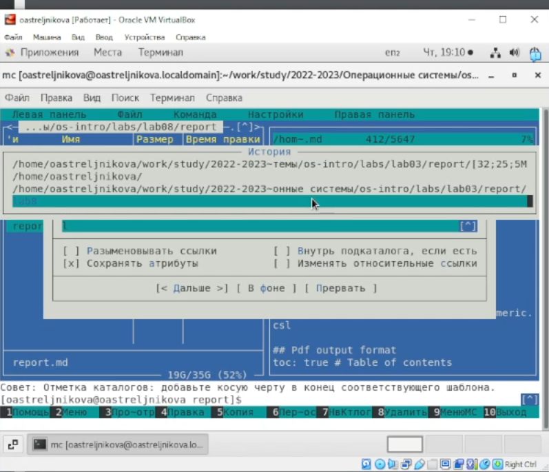
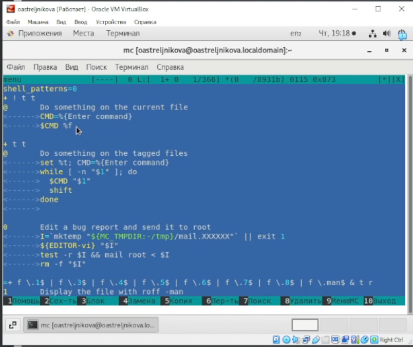

---
## Front matter
title: "Отчёта по лабораторной работе № 7"
subtitle: "Поиск файов. Перенаправление ввода-вывода.Просмотр запущенных процессов"
author: "Стрельникова Ольга Александровна"

## Generic otions
lang: ru-RU
toc-title: "Содержание"

## Bibliography
bibliography: bib/cite.bib
csl: pandoc/csl/gost-r-7-0-5-2008-numeric.csl

## Pdf output format
toc: true # Table of contents
toc-depth: 2
lof: true # List of figures
lot: true # List of tables
fontsize: 12pt
linestretch: 1.5
papersize: a4
documentclass: scrreprt
## I18n polyglossia
polyglossia-lang:
  name: russian
  options:
	- spelling=modern
	- babelshorthands=true
polyglossia-otherlangs:
  name: english
## I18n babel
babel-lang: russian
babel-otherlangs: english
## Fonts
mainfont: PT Serif
romanfont: PT Serif
sansfont: PT Sans
monofont: PT Mono
mainfontoptions: Ligatures=TeX
romanfontoptions: Ligatures=TeX
sansfontoptions: Ligatures=TeX,Scale=MatchLowercase
monofontoptions: Scale=MatchLowercase,Scale=0.9
## Biblatex
biblatex: true
biblio-style: "gost-numeric"
biblatexoptions:
  - parentracker=true
  - backend=biber
  - hyperref=auto
  - language=auto
  - autolang=other*
  - citestyle=gost-numeric
## Pandoc-crossref LaTeX customization
figureTitle: "Рис."
tableTitle: "Таблица"
listingTitle: "Листинг"
lofTitle: "Список иллюстраций"
lotTitle: "Список таблиц"
lolTitle: "Листинги"
## Misc options
indent: true
header-includes:
  - \usepackage{indentfirst}
  - \usepackage{float} # keep figures where there are in the text
  - \floatplacement{figure}{H} # keep figures where there are in the text
---

# Цель работы

Освоение основных возможностей командной оболочки Midnight Commander. Приобретение навыков практической работы по просмотру каталогов и файлов; манипуляций с ними.

# Задание

Задание по mc

1. Изучить информацию о mc, вызвав в командной строке man mc.
2. Запустить из командной строки mc, изучить его структуру и меню.
3. Выполнить несколько операций в mc, используя управляющие клавиши (операции с панелями; выделение/отмена выделения файлов, копирование/перемещение файлов, получение информации о размере и правах доступа на файлы и/или каталоги и т.п.)
4. Выполнить основные команды меню левой (или правой) панели. Оценить степень подробности вывода информации о файлах.
5. Используя возможности подменю Файл , выполнить:
– просмотр содержимого текстового файла;
– редактирование содержимого текстового файла (без сохранения результатов
редактирования);
– создание каталога;
– копирование в файлов в созданный каталог.
6. С помощью соответствующих средств подменю Команда осуществить:
– поиск в файловой системе файла с заданными условиями (например, файла с расширением .c или .cpp, содержащего строку main);
– выбор и повторение одной из предыдущих команд;
– переход в домашний каталог;
– анализ файла меню и файла расширений.
7. Вызвать подменю Настройки . Освоить операции, определяющие структуру экрана mc (Full screen, Double Width, Show Hidden Files и т.д.).

Задание по встроенному редактору mc

1. Создайте текстовый файл text.txt.
2. Открыть этот файл с помощью встроенного в mc редактора.
3. Вставить в открытый файл небольшой фрагмент текста, скопированный из любого другого файла или Интернета.
4. Проделать с текстом следующие манипуляции, используя горячие клавиши:

   1. Удалить строку текста.
   2. Выделить фрагмент текста и скопировать его на новую строку.
   3. Выделить фрагмент текста и перенести его на новую строку.
   4. Сохранить файл.
   5. Отменить последнее действие.
   6. Перейдти в конец файла (нажав комбинацию клавиш) и написать некоторый текст.
   7. Перейти в начало файла (нажав комбинацию клавиш) и написать некоторый текст.
   8. Сохранить и закрыть файл.
   
5. Открыть файл с исходным текстом на некотором языке программирования (например C или Java)
6. Используя меню редактора, включить подсветку синтаксиса, если она не включена, или выключить, если она включена.

# Теоретическое введение

Командная оболочка — интерфейс взаимодействия пользователя с операционной системой и программным обеспечением посредством команд.

Midnight Commander (или mc) — псевдографическая командная оболочка для UNIX/Linux систем. 

Возможности:

1. Работа с различными архивами и образами файловых систем, как если бы они являлись обычными каталогами.
2. Работа с сетевыми файловыми системами Samba, FTP, SFTP.
3. Выполнение операций копирования и перемещения файлов в фоновом режиме.
4. Встроенный текстовый редактор с подсветкой синтаксиса.
5. Текстовый режим, основанный на библиотеках ncurses и S-Lang. Это позволяет программе работать как в консоли, так и в различных эмуляторах терминала и через удалённые соединения, например, по протоколу SSH. Поддерживает мышь.
6. Поддержка многоязыкового интерфейса.
7. Поддержка кодировки UTF-8 (начиная с 2009 года).
8. Настраиваемое пользовательское меню, вызывается по F2. Каждый пункт меню выполняет набор команд оболочки (shell). Команды прописываются в файл ~/.config/mc/.mc.menu (или ~/.config/mc/menu).
9. Список каталогов для быстрого доступа, вызывается по Ctrl+\. Настраивается непосредственно в панели быстрого доступа, либо редактированием файла ~/.config/mc/hotlist.

Встроенный в mc редактор вызывается с помощью функциональной клавиши F4.

# Выполнение лабораторной работы

**Задание по mc**

1. Изучаю информацию о mc в интернете (т.к. команда man выдает текст на анлийском) (рис. @fig:001):

   

{#fig:001 width=70%}

2. Устанавливаю (рис. @fig:002) и запускаю mc .

   

{#fig:002 width=70%}

3. Выполнила несколько операций в mс: 
   
   1. операции с панелями,
   
   2. выделение/отмена выделения файлов (рис. @fig:003) 
   
   
   
   {#fig:003 width=70%}
   
   
   
   3. копирование (рис. @fig:004)  /перемещение файлов. (рис. @fig:005)
   
   
   
   {#fig:004 width=70%}
   
   
   
   {#fig:005 width=70%}
   
   
   
   4. получение информации о размере и правах доступа на файлы и/или каталоги (рис. @fig:006 - @fig:007 )
   
   
   
   {#fig:006 width=70%}
   
   
   
   {#fig:007 width=70%}
   
   
   
   4. выполнить основные команды меню или правой панели.(рис. @fig:007 - @fig:011 )
   
      

{#fig:008 width=70%}

{#fig:009 width=70%}

{#fig:010 width=70%}

{#fig:011 width=70%}

4. Выполнила:

- просмотр содержимого текстового файла (рис. @fig:012),

- редактирование содержимого текстового файла (без сохранения результатов редактирования) (рис. @fig:012),

- создание каталога (рис. @fig:013),

- копирование в файлов в созданный каталог (рис. @fig:014).

  

{#fig:012 width=70%}

{#fig:013 width=70%}

{#fig:014 width=70%}

5. С помощью соответствующих средств подменю Команда осуществила:
   - поиск в файловой системе файла с заданными условиями (например, файла с расширением .c или .cpp, содержащего строку main) (рис. @fig:015),
   
     
   
     {#fig:015 width=70%}
   
     
   
   - выбор и повторение одной из предыдущих команд; (рис. @fig:016),
   
     
   
     {#fig:016 width=70%}
   
     
   
   - переход в домашний каталог (рис. @fig:011),
   
   - анализ файла меню (рис. @fig:017) и файла расширений (рис. @fig:018).
   
     

{#fig:017 width=70%}

{#fig:018 width=70%}

6. Вызовала подменю Настройки и освоила операции, определяющие структуру экрана mc. Некоторые из них  изображены на  рис. @fig:019  - @fig:020 . 

{#fig:019 width=70%}

{#fig:020 width=70%}

**Задание по встроенному редактору mc**

1. Создала текстовой файл text.txt, открыла его с помощью встроенного в mc редактора и вставила в небольшой фрагмент текста, скопированный из Интернета (рис. @fig:021):

   

{#fig:021 width=70%}

2. Проделала с текстом следующие манипуляции:
   1. Удалить строку текста  Ctrl+y .
   2. Выделить фрагмент текста и скопируйте его на новую строку  выделение с помощью Shift+стрелочки копирование F5.
   3. Выделить фрагмент текста и перенесите его на новую строку выделение с помощью Shift+стрелочки копирование F6.
   4. Сохранить файл, F2
   5. Отменить последнее действие, Ctrl+u
   6. Перейдти в конец файла (нажав комбинацию клавиш) и написать некоторый текст  Ctrl+END
   7. Перейти в начало файла (нажав комбинацию клавиш) и написать некоторый текст Ctrl+HOME
   8. Сохранить и закрыть файл.
   
   Результат проделанных операций  изображён на рисунке  @fig:022

{#fig:022 width=70%}

3. Используя меню редактора снчала включила а потом так же, выключила подсветку синтаксиса (рис. @fig:023):

{#fig:023 width=70%}

# Выводы

Были освоены основные возможности командной оболочки Midnight Commander приобрели навыки практической работы по просмотру каталогов и файлов, манипуляций с ними. Научились создавать и удалять файлы, а также изменять их с помощью горячих клавиш.

Для себя принято решение что работать в таком виде крайне неудобно, и прибегать к таким навыкам стоит в крайних случаях отсутствия других вариантов.

# Контрольные вопросы

1. Какие режимы работы есть в mc. Охарактеризуйте их.

   - Midnight Commander имеет два основных режима работы:

     Командный режим: в этом режиме вы можете использовать mc как файловый менеджер и выполнить различные действия над файлами и каталогами, такие как копирование, перемещение, удаление, переименование, создание, изменение прав доступа и т.д. Для этого используются различные клавиши, например, F5 - копировать, F6 - переместить, F8 - удалить, F9 - создать каталог, F4 - редактировать файл и т.д.

     Режим редактирования: в этом режиме вы можете создавать и редактировать текстовые файлы. Для входа в этот режим необходимо выделить файл и нажать клавишу F4 или выбрать опцию "Редактировать" в верхней части экрана. В этом режиме вы можете использовать различные функции, такие как поиск, замена, копирование и вставка текста, а также изменение кодировки и перевода строк.

     Кроме того, в mc есть ряд дополнительных режимов работы, которые можно настроить в соответствии с индивидуальными потребностями и предпочтениями пользователя:

     Режим FTP: позволяет подключаться к удаленному серверу через протокол FTP и работать с файлами и каталогами на этом сервере, как если бы они были локальными.

     Режим терминала: позволяет работать с командной строкой внутри mc, что может быть удобно для выполнения различных задач, таких как управление файлами, настройка системы и т.д.

     Режим сравнения файлов: позволяет сравнивать содержимое двух файлов и выявлять различия между ними.

     Режим пакетной обработки файлов: позволяет выполнять однотипные действия с несколькими файлами или каталогами одновременно.

     Режим архивации: позволяет создавать и распаковывать архивы различных форматов (tar, gz, zip и т.д.)

2. Какие операции с файлами можно выполнить как с помощью команд shell, так и с помощью меню (комбинаций клавиш) mc? Приведите несколько примеров.

Создать файл, удалить файл, переименовать файл, копировать файл, редактировать файл, прочитать содержимое файла.

Перемещение файла: в командной строке можно выполнить команду "mv <source_file> <destination_file>", а в mc - нажать клавишу F6, выделить файл и выбрать опцию "Переместить" в меню.

Изменение прав доступа к файлу: в командной строке можно выполнить команду "chmod <permissions> <file>", а в mc - нажать клавишу F9, выделить файл и выбрать опцию "Свойства" в меню, затем изменить права доступа в соответствующем поле.

3. Опишите структура меню левой (или правой) панели mc, дайте характеристику
  командам.

  - Перейти в строку меню панелей mc можно с помощью функциональной клавиши F9 . В строке меню имеются пять меню: Левая панель , Файл , Команда , Настройки
    и Правая панель .
    Подпункт меню Быстрый просмотр позволяет выполнить быстрый просмотр содержимого панели.
    Подпункт меню Информация позволяет посмотреть информацию о файле или
    каталоге.
    В меню каждой (левой или правой) панели можно выбрать формат списка :
    – стандартный — выводит список файлов и каталогов с указанием размера и времени правки;
    – ускоренный — позволяет задать число столбцов, на которые разбивается панель при выводе списка имён файлов или каталогов без дополнительной информации;
    – расширенный — помимо названия файла или каталога выводит сведения о правах доступа, владельце, группе, размере, времени правки;
    – определённый пользователем — позволяет вывести те сведения о файле или каталоге, которые задаст сам пользователь.
    Подпункт меню Порядок сортировки позволяет задать критерии сортировки при
    выводе списка файлов и каталогов: без сортировки, по имени, расширенный, время правки, время доступа, время изменения атрибута, размер, узел

4. Опишите структура меню Файл mc, дайте характеристику командам.

   Просмотр – просмотр текущего файла

   Просмотр вывода команды – функция запроса команды с параметрами

   Правка – открывает текущий файл для его редактирования

   Копирование – копирует файлы или каталоги в указанное место

   Права доступа – позволяет изменить права доступа к одному или нескольким файлам/каталогам

   Жесткая ссылка – позволяет создать жёсткую ссылку к текущему файлу

   Символическая ссылка – позволяет создать символическую ссылку к файлу.

   Владелец/группа – позволяет задать владельца и имя группы для одного или нескольких файлов/каталогов

   Права (Расширенные) – позволяет изменить права доступа и владения для одного или нескольких файлов или каталогов

   Переименование – переименовывает файл/каталог

   Создание каталога – создает каталог

   Удалить – удаляет файл/каталог

   Выход – завершает работу MC

5. Опишите структура меню Команда mc, дайте характеристику командам.

   В меню Команда содержатся более общие команды для работы с mc 
   Команды меню Команда :

   – Дерево каталогов — отображает структуру каталогов системы.

   – Поиск файла — выполняет поиск файлов по заданным параметрам.

   – Переставить панели — меняет местами левую и правую панели.

   – Сравнить каталоги ( Ctrl-x d ) — сравнивает содержимое двух каталогов.

   – Размеры каталогов — отображает размер и время изменения каталога (по умолчанию в mc размер каталога корректно не отображается).

   – История командной строки — выводит на экран список ранее выполненных в оболочке команд.

   – Каталоги быстрого доступа ( Ctrl-\ ) — пр вызове выполняется быстрая смена текущего каталога на один из заданного списка.

   – Восстановление файлов — позволяет восстановить файлы на файловых системах ext2 и ext3.

   – Редактировать файл расширений — позволяет задать с помощью определённого синтаксиса действия при запуске файлов с определённым расширением (например, какое программного обеспечение запускать для открытия или редактирования файлов с расширением doc или docx).

   – Редактировать файл меню — позволяет отредактировать контекстное меню пользователя, вызываемое по клавише F2 .

   – Редактировать файл расцветки имён — позволяет подобрать оптимальную для пользователя расцветку имён файлов в зависимости от их типа.

6. Опишите структура меню Настройки mc, дайте характеристику командам.

   - Конфигурация — позволяет скорректировать настройки работы с панелями.
   - Внешний вид и Настройки панелей — определяет элементы (строка меню, командная строка, подсказки и прочее), отображаемые при вызове mc, а также геометрию расположения панелей и цветовыделение.
   - Биты символов — задаёт формат обработки информации локальным терминалом.
   - Подтверждение — позволяет установить или убрать вывод окна с запросом подтверждения действий при операциях удаления и перезаписи файлов, а также при выходе из программы.
   - Распознание клавиш — диалоговое окно используется для тестирования функциональных клавиш, клавиш управления курсором и прочее.
   - Виртуальные ФС — настройки виртуальной файловой системы: тайм-аут, пароль и прочее.

7. Назовите и дайте характеристику встроенным командам mc.

   Работа с панелями

   Ctrl + R - обновить активную панель

   Ctrl + \ - справочник каталогов быстрого доступа

   Ctrl + S или M + S- поиск файлов в текущем каталоге по начальным символам

   Ctrl + X H - добавить текущий каталог в справочник каталогов быстрого доступа

   M + G - перейти на первый файл или каталог в видимом списке на панели

   M + J - перейти на последний файл или каталог в видимом списке на панели

   M + R - перейти на средний файл или каталог в видимом списке на панели

   M + O - неактивная панель = активная панель

   M + . - показывать/скрыть скрытые файлы и каталоги

   M + T - cменить вид панели (стандартный, укороченный, расширенный)

   (Plus) - вызвать окно для выделения группы файлов (можно использовать регулярные выражения)

   \ (Backslash) - снять выделение с группы файлов (действие, обратное тому, которое вызывается по клавише "+").

   Работа с файлами

   Shift + F4 - открыть редактор на изменение нового файла, при сохранении будет запрошено его имя

   Shift + F5 - копирование файла в тот же каталог

   Shift + F6 - инлайн-переименование текущего файла

   Ctrl + X C - посмотреть/поменять права (chmod) для отмеченных файлов

   Ctrl + X I - быстрый просмотр информации о текущем объекте на второй панели

   Ctrl + X O - посмотреть/поменять владельца (chown) для отмеченных файлов

   Ctrl + X Q - быстрый просмотр содержимого файла на второй панели

   Ctrl + X S - создать символическую ссылку (symlink)

   Работа с командной строкой

   M + Enter - вставляет в командную строку имя файла, на котором находится курсор

   M + P - показывает в командной строке предыдущую команду

   M + N - показывает в командной строке следующую команду

   M + <TAB> или Esc + <TAB> - автодополнение команды, если вариантов несколько - то повторное нажатие высвечивает список возможных вариантов

   Ctrl + X P или M + A - вставить в командную строку путь текущей панели

   Ctrl + X T - вставить в командную строку выделенные объекты

8. Назовите и дайте характеристику командам встроенного редактора mc.

   Ctrl-y удалить строку

   Ctrl-u отмена последней операции

   Ins вставка/замена

   F7 поиск (можно использовать регулярные выражения)

   Shift-F7 повтор последней операции поиска

   F4 замена

   F3 первое нажатие — начало выделения, второе — окончание выделения

   F5 копировать выделенный фрагмент

   F6 переместить выделенный фрагмент

   F8 удалить выделенный фрагмент

   F2 записать изменения в файл

   F10 выйти из редактора

9. Дайте характеристику средствам mc, которые позволяют создавать меню, определяемые пользователем.
  Строка главного меню появляется в верхней части экрана после нажатия клавиши F9 или щелчка мыши по верхней рамке экрана. Меню состоит из пяти пунктов: "Левая", "Файл", Команды", Настройки" и "Правая" (в английской версии соответственно "Left", "File", "Command", "Options" и "Right"). При выборе одного из этих пунктов появляется соответствующее выпадающее меню. 

  Пункты меню "Левая" и "Правая " ("Верхняя" и "Нижняя") позволяют изменить вид, соответственно, левой и правой (или верней и нижней) панелей и характер отображаемой в панели информации, в частности, выполнить соединения с удаленными компьютерами.

  Меню "Файл" позволяет выполнить какие-то действия с выбранным файлом или группой помеченных файлов.

  Меню "Команды" перечисляет действия, которые имеют более общий характер и не относятся только к выделенному в данный момент файлу или группе помеченных файлов.

  Меню "Настройки" служит для задания ряда параметров, определяющих внешний вид и поведение программы Midnight Commander. Один из пунктов этого меню служит для сохранения настроек, заданных пользователем.

10. Дайте характеристику средствам mc, которые позволяют выполнять действия, определяемые пользователем, над текущим файлом.

C-l Обновляет всю информацию, отображаемую программой Midnight Commander.

C-x c Запускает команду Chmod для подсвеченного файла или группы отмеченных файлов.

C-x o Запускает команду Chown для подсвеченного файла или группы отмеченных файлов.

C-x l Запускает команду создания жесткой ссылки.

C-x s Запускает команду создания абсолютной символической ссылки.

C-x v Запускает команду создания относительной символической ссылки. Для более детальной информации о ссылках смотрите раздел Меню Файл

C-x i Переводит пассивную панель в режим "Информация".

C-x q Переводит пассивную панель в режим быстрого просмотра.

C-x ! Выполняется пункт меню "Критерий панелизации".

C-x h Добавить имя каталога в "Каталоги быстрого доступа".

M-! Выполняет пункт меню "Просмотр вывода команды", который описан подробнее в разделе "Меню "Файл".

M-? Вызов диалогового окна "Поиск файла".

M-c Вызов диалогового окна "Быстрая смена каталога".

C-o Если Midnight Commander запущен в консоли Linux или FreeBSD, или через xterm, вам будет показан вывод предыдущей команды. При этом на Linux-консоли Midnight Commander использует встроенную программу (cons.saver) для сохранения выводимой информации и демонстрации ее на экране.

