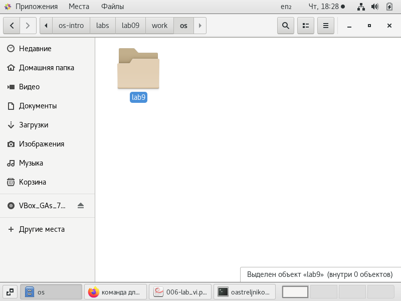
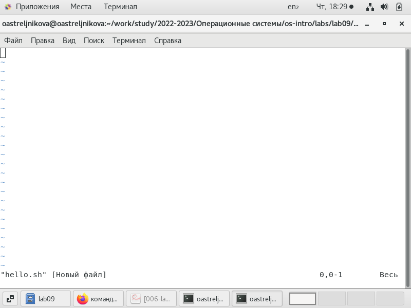
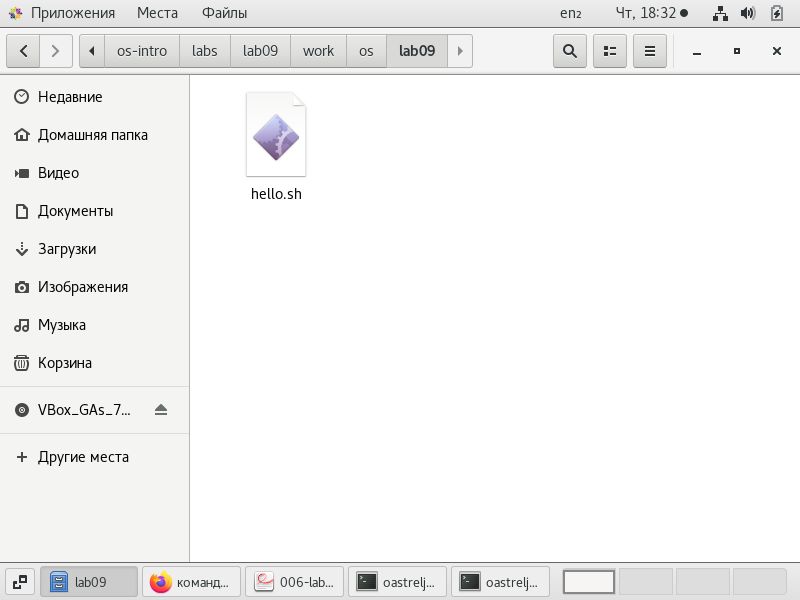
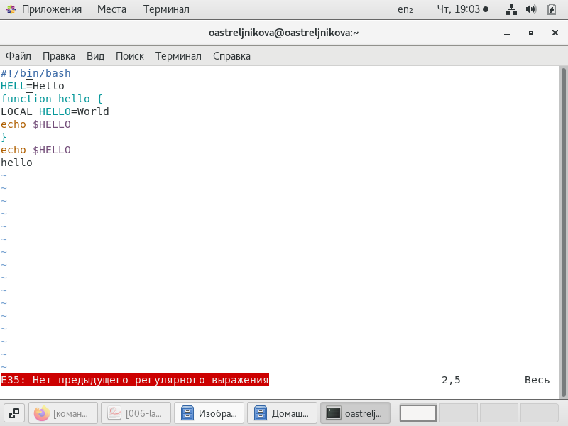
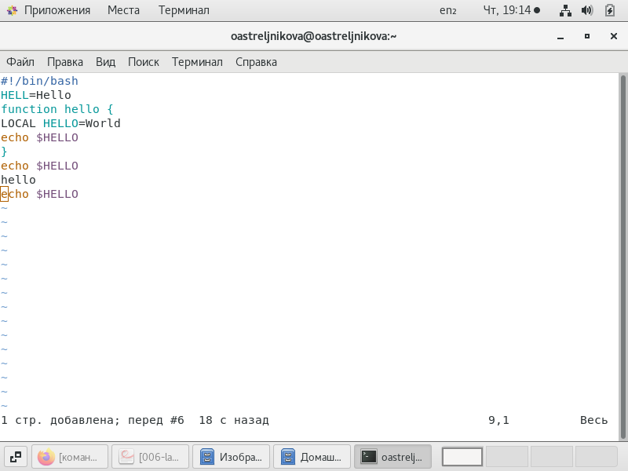
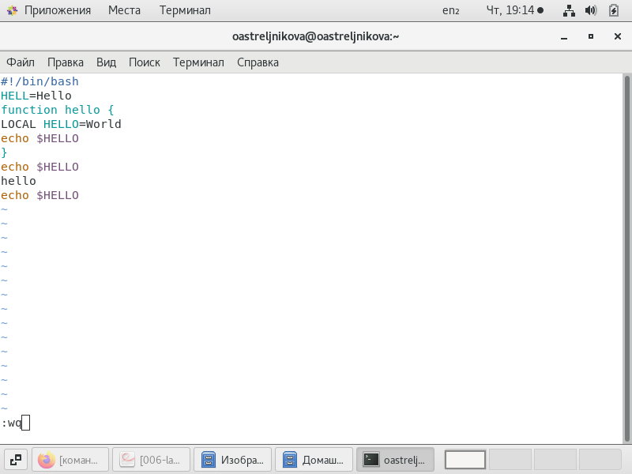

---
## Front matter
title: "Лабороторная работы №9"
subtitle: "Текстовый редактор vi"
author: "Стрельникова Ольга Александровна"

## Generic otions
lang: ru-RU
toc-title: "Содержание"

## Bibliography
bibliography: bib/cite.bib
csl: pandoc/csl/gost-r-7-0-5-2008-numeric.csl

## Pdf output format
toc: true # Table of contents
toc-depth: 2
lof: true # List of figures
lot: true # List of tables
fontsize: 12pt
linestretch: 1.5
papersize: a4
documentclass: scrreprt
## I18n polyglossia
polyglossia-lang:
  name: russian
  options:
	- spelling=modern
	- babelshorthands=true
polyglossia-otherlangs:
  name: english
## I18n babel
babel-lang: russian
babel-otherlangs: english
## Fonts
mainfont: PT Serif
romanfont: PT Serif
sansfont: PT Sans
monofont: PT Mono
mainfontoptions: Ligatures=TeX
romanfontoptions: Ligatures=TeX
sansfontoptions: Ligatures=TeX,Scale=MatchLowercase
monofontoptions: Scale=MatchLowercase,Scale=0.9
## Biblatex
biblatex: true
biblio-style: "gost-numeric"
biblatexoptions:
  - parentracker=true
  - backend=biber
  - hyperref=auto
  - language=auto
  - autolang=other*
  - citestyle=gost-numeric
## Pandoc-crossref LaTeX customization
figureTitle: "Рис."
tableTitle: "Таблица"
listingTitle: "Листинг"
lofTitle: "Список иллюстраций"
lotTitle: "Список таблиц"
lolTitle: "Листинги"
## Misc options
indent: true
header-includes:
  - \usepackage{indentfirst}
  - \usepackage{float} # keep figures where there are in the text
  - \floatplacement{figure}{H} # keep figures where there are in the text
---

# Цель работы

Познакомиться с операционной системой Linux. Получить практические навыки работы с редактором vi, установленным по умолчанию практически во всех дистрибутивах.

# Задание

1. Создайте каталог с именем ~/work/os/lab06.
2. Перейдите во вновь созданный каталог.
3. Вызовите vi и создайте файл hello.sh
vi hello.sh
4. Нажмите клавишу i и вводите следующий текст.
 #!/bin/bash
HELL=Hello
function hello {
LOCAL HELLO=World
echo $HELLO
}
echo $HELLO
hello
5. Нажмите клавишу Esc для перехода в командный режим после завершения ввода
текста
6. Нажмите : для перехода в режим последней строки и внизу вашего экрана
появится приглашение в виде двоеточия.
7. Нажмите w (записать) и q (выйти), а затем нажмите клавишу Enter для со-
хранения вашего текста и завершения работы.
8. Сделайте файл исполняемым
chmod +x hello.sh

6.3.2. Задание 2. Редактирование существующего файла
1. Вызовите vi на редактирование файла
vi ~/work/os/lab06/hello.sh
2. Установите курсор в конец слова HELL второй строки.
3. Перейдите в режим вставки и замените на HELLO. Нажмите Esc для возврата в
командный режим.
4. Установите курсор на четвертую строку и сотрите слово LOCAL.
5. Перейдите в режим вставки и наберите следующий текст: local, нажмите Esc
для возврата в командный режим.
6. Установите курсор на последней строке файла. Вставьте после неё строку, со-
держащую следующий текст: echo $HELLO.
7. Нажмите Esc для перехода в командный режим.
8. Удалите последнюю строку.
9. Введите команду отмены изменений u для отмены последней команды.
10. Введите символ : для перехода в режим последней строки. Запишите произ-
ведённые изменения и выйдите из vi.

# Выполнение лабораторной работы

1. Создайте каталог с именем ~/work/os/lab09. (рис. @fig:001)
2. Перейдите во вновь созданный каталог.
3. Вызовите vi и создайте файл hello.sh, вызвав vi hello.sh (рис. @fig:002)

{#fig:001}

{#fig:002}

4. Нажмите клавишу i и вводите следующий текст.(рис. @fig:003)
#!/bin/bash
HELL=Hello
function hello {
LOCAL HELLO=World
echo $HELLO
}
echo $HELLO
hello

{#fig:003}

5. Нажмите клавишу Esc для перехода в командный режим после завершения ввода
текста
6. Нажмите : для перехода в режим последней строки и внизу вашего экрана
появится приглашение в виде двоеточия.(рис. @fig:004)

{#fig:004}

7. Нажмите w (записать) и q (выйти), а затем нажмите клавишу Enter для со-
хранения вашего текста и завершения работы. 

8. Сделайте файл исполняемым chmod +x hello.sh (рис. @fig:005 - @fig:006)

{#fig:005}

{#fig:006}

*Задание 2. Редактирование существующего файла*

1. Вызовите vi на редактирование файла vi ~/work/os/lab06/hello.sh (рис. @fig:007)

{#fig:007}

2. Установите курсор в конец слова HELL второй строки.(рис. @fig:008)

{#fig:008}

3. Перейдите в режим вставки и замените на HELLO. Нажмите Esc для возврата в
командный режим. (рис. @fig:009)

{#fig:009}

4. Установите курсор на четвертую строку и сотрите слово LOCAL, нажав dw. 

5. Перейдите в режим вставки и наберите следующий текст: local, нажмите Esc
для возврата в командный режим.(рис. @fig:010)

{#fig:010}

6. Установите курсор на последней строке файла. Вставьте после неё строку, со-
держащую следующий текст: echo $HELLO. Копируем строку echo $HELLO, нажав shift Y, вставляем пустую строку, нажав o и затем вставив строку кнопкой p. 

7. Нажмите Esc для перехода в командный режим.
8. Удалите последнюю строку. 9d (рис. @fig:011)

{#fig:011}

9. Введите команду отмены изменений u для отмены последней команды.(рис. @fig:012)

{#fig:012}

10. Введите символ : для перехода в режим последней строки. Запишите произ-
ведённые изменения и выйдите из vi. :wq (рис. @fig:013)

{#fig:013}

Контрольные вопросы:
1. Дайте краткую характеристику режимам работы редактора vi.

Редактор vi имеет три режима работы:
– командный режим — предназначен для ввода команд редактирования и навигации по редактируемому файлу;
– режим вставки — предназначен для ввода содержания редактируемого файла;
– режим последней (или командной) строки — используется для записи изменений
в файл и выхода из редактора

2. Как выйти из редактора, не сохраняя произведённые изменения?

Набрав символ q (или q!) возможно выйти из редактора без сохранения

3. Назовите и дайте краткую характеристику командам позиционирования.
– 0 (ноль) — переход в начало строки;
– $ — переход в конец строки;
– G — переход в конец файла;
– n G — переход на строку с номером n.

4. Что для редактора vi является словом?
символ или текст без пробелов до символа

5. Каким образом из любого места редактируемого файла перейти в начало (конец)
файла?
Перемещение в начало файла по кнопке gg, Shift+G

6. Назоповите и дайте краткую характеристику основным группам команд редакти-
рования.
	Вставка текста
– а — вставить текст после курсора;
– А — вставить текст в конец строки;
– i — вставить текст перед курсором;
– n i — вставить текст n раз;
– I — вставить текст в начало строки.
	Вставка строки
– о — вставить строку под курсором;
– О — вставить строку над курсором.
	 Удаление текста
– x — удалить один символ в буфер;
– d w — удалить одно слово в буфер;
– d $ — удалить в буфер текст от курсора до конца строки;
– d 0 — удалить в буфер текст от начала строки до позиции курсора
– d d — удалить в буфер одну строку;
– n d d — удалить в буфер n строк.
	Отмена и повтор произведённых изменений
– u — отменить последнее изменение;
– . — повторить последнее изменение.
	 Копирование текста в буфер
– Y — скопировать строку в буфер;
– n Y — скопировать n строк в буфер;
– y w — скопировать слово в буфер.
	 Вставка текста из буфера
– p — вставить текст из буфера после курсора;
– P — вставить текст из буфера перед курсором.
	Замена текста
– c w — заменить слово;
– n c w — заменить n слов;
– c $ — заменить текст от курсора до конца строки;
– r — заменить слово;
– R — заменить текст.
	Поиск текста
– / текст — произвести поиск вперёд по тексту указанной строки символов
текст;
– ? текст — произвести поиск назад по тексту указанной строки символов
текст.

7. Необходимо заполнить строку символами $. Каковы ваши действия?
Переходим в командный режим через клавишу Esc. Перемещаем курсор с помощью стрелочек или другой команды в начало строки которую будем заполнять. Вводим команду i и вводим символ доллора несколько раз. Далее производим копирование и вставляем через ni столько раз сколько нам нужно.

8. Как отменить некорректное действие, связанное с процессом редактирования?
– u — отменить последнее изменение;

9. Назовите и дайте характеристику основным группам команд режима последней
строки.
	 Копирование и перемещение текста
– : n,m d — удалить строки с n по m;
– : i,j m k — переместить строки с i по j, начиная со строки k;
– : i,j t k — копировать строки с i по j в строку k;
– : i,j w имя-файла — записать строки с i по j в файл с именем имя-файла
	 Запись в файл и выход из редактора
– : w — записать изменённый текст в файл, не выходя из vi;
– : w имя-файла — записать изменённый текст в новый файл с именем имя файла;
– : w ! имя-файла — записать изменённый текст в файл с именем имя файла;
– : w q — записать изменения в файл и выйти из vi;
– : q — выйти из редактора vi;
– : q ! — выйти из редактора без записи;
– : e ! — вернуться в командный режим, отменив все изменения, произведённые со времени последней записи

10. Как определить, не перемещая курсора, позицию, в которой заканчивается строка?
Для определения без перемещения курсора позицию в которой заканчиваятся строка. Нужно в камандном режиме находясь на нужной строке нажать $ и посмотреть на число после запятой в правом нижнем углу экрана

11. Выполните анализ опций редактора vi (сколько их, как узнать их назначение и
т.д.).
Опции редактора vi позволяют настроить рабочую среду. Для задания опций
используется команда set (в режиме последней строки):
– : set all — вывести полный список опций;
– : set nu — вывести номера строк;
– : set list — вывести невидимые символы;
– : set ic — не учитывать при поиске, является ли символ прописным или
строчным.
Если вы хотите отказаться от использования опции, то в команде set перед именем опции надо поставить no.

12. Как определить режим работы редактора vi?
по слову Insert видим режим вставки
отсутствие слова Insert в командном режиме
режим последней строки переносит курсор в коней файла нажатием :

13. Постройте граф взаимосвязи режимов работы редактора vi. (рис. @fig:015)

{#fig:015}

# Выводы

В лабороторной работе мы  ознакомилась с операционной системой Linux, получили практические навыки работы с редактором vi, установленным по умолчанию практически во всех дистрибутивах.

