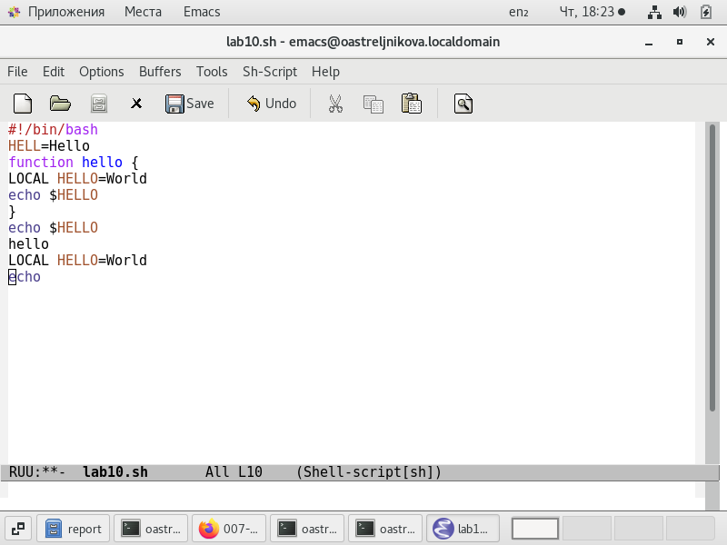
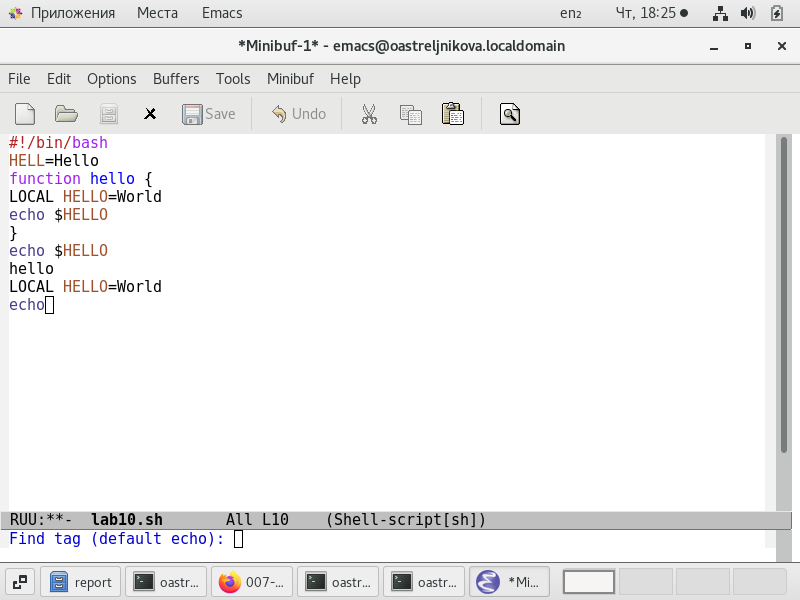
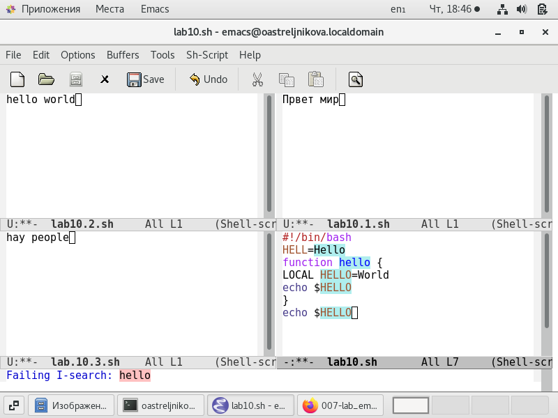

---
## Front matter
title: "Отчёт по лабораторной работе №10"
subtitle: "Операционные системы"
author: "Ильина Любовь Александровна"

## Generic otions
lang: ru-RU
toc-title: "Содержание"

## Bibliography
bibliography: bib/cite.bib
csl: pandoc/csl/gost-r-7-0-5-2008-numeric.csl

## Pdf output format
toc: true # Table of contents
toc-depth: 2
lof: true # List of figures
lot: true # List of tables
fontsize: 12pt
linestretch: 1.5
papersize: a4
documentclass: scrreprt
## I18n polyglossia
polyglossia-lang:
  name: russian
  options:
	- spelling=modern
	- babelshorthands=true
polyglossia-otherlangs:
  name: english
## I18n babel
babel-lang: russian
babel-otherlangs: english
## Fonts
mainfont: PT Serif
romanfont: PT Serif
sansfont: PT Sans
monofont: PT Mono
mainfontoptions: Ligatures=TeX
romanfontoptions: Ligatures=TeX
sansfontoptions: Ligatures=TeX,Scale=MatchLowercase
monofontoptions: Scale=MatchLowercase,Scale=0.9
## Biblatex
biblatex: true
biblio-style: "gost-numeric"
biblatexoptions:
  - parentracker=true
  - backend=biber
  - hyperref=auto
  - language=auto
  - autolang=other*
  - citestyle=gost-numeric
## Pandoc-crossref LaTeX customization
figureTitle: "Рис."
tableTitle: "Таблица"
listingTitle: "Листинг"
lofTitle: "Список иллюстраций"
lotTitle: "Список таблиц"
lolTitle: "Листинги"
## Misc options
indent: true
header-includes:
  - \usepackage{indentfirst}
  - \usepackage{float} # keep figures where there are in the text
  - \floatplacement{figure}{H} # keep figures where there are in the text
---

# Цель работы

Познакомиться с операционной системой Linux. Получить практические навыки работы с редактором Emacs.

# Задание

1. Открыть emacs.
2. Создать файл lab07.sh с помощью комбинации Ctrl-x Ctrl-f (C-x C-f).
3. Наберите текст:
#!/bin/bash
HELL=Hello
function hello {
LOCAL HELLO=World
echo $HELLO
}
echo $HELLO
hello
4. Сохранить файл с помощью комбинации Ctrl-x Ctrl-s (C-x C-s).
5. Проделать с текстом стандартные процедуры редактирования, каждое действие
должно осуществляться комбинацией клавиш.
5.1. Вырезать одной командой целую строку (С-k).
5.2. Вставить эту строку в конец файла (C-y).
5.3. Выделить область текста (C-space).
5.4. Скопировать область в буфер обмена (M-w).
5.5. Вставить область в конец файла.
5.6. Вновь выделить эту область и на этот раз вырезать её (C-w).
5.7. Отмените последнее действие (C-/).
6. Научитесь использовать команды по перемещению курсора.
6.1. Переместите курсор в начало строки (C-a).
6.2. Переместите курсор в конец строки (C-e).
6.3. Переместите курсор в начало буфера (M-<).
6.4. Переместите курсор в конец буфера (M->).
7. Управление буферами.
7.1. Вывести список активных буферов на экран (C-x C-b).
7.2. Переместитесь во вновь открытое окно (C-x) o со списком открытых буферов и переключитесь на другой буфер.
7.3. Закройте это окно (C-x 0).
7.4. Теперь вновь переключайтесь между буферами, но уже без вывода их списка
на экран (C-x b).
8. Управление окнами.
8.1. Поделите фрейм на 4 части: разделите фрейм на два окна по вертикали
(C-x 3), а затем каждое из этих окон на две части по горизонтали (C-x 2)
(см. рис. 7.1)
8.2. В каждом из четырёх созданных окон откройте новый буфер (файл) и введите несколько строк текста.
9. Режим поиска
9.1. Переключитесь в режим поиска (C-s) и найдите несколько слов, присутствующих в тексте.
9.2. Переключайтесь между результатами поиска, нажимая C-s.
9.3. Выйдите из режима поиска, нажав C-g.
9.4. Перейдите в режим поиска и замены (M-%), введите текст, который следует
найти и заменить, нажмите Enter , затем введите текст для замены. После того как будут подсвечены результаты поиска, нажмите ! для подтверждения
замены.
9.5. Испробуйте другой режим поиска, нажав M-s o. Объясните, чем он отличается от обычного режима?

# Выполнение лабораторной работы

1. Описываются проведённые действия, в качестве иллюстрации даётся ссылка на иллюстрацию .
Открыть emacs.
2. Создать файл lab07.sh с помощью комбинации Ctrl-x Ctrl-f (C-x C-f). (рис. @fig:001)

{#fig:001}

3. Наберите текст:
#!/bin/bash
HELL=Hello
function hello {
LOCAL HELLO=World
echo $HELLO
}
echo $HELLO
hello

4. Сохранить файл с помощью комбинации Ctrl-x Ctrl-s (C-x C-s). (рис. @fig:002)

{#fig:002}

5. Проделать с текстом стандартные процедуры редактирования, каждое действие
должно осуществляться комбинацией клавиш.
5.1. Вырезать одной командой целую строку (С-k). 
5.2. Вставить эту строку в конец файла (C-y). (рис. @fig:003)

{#fig:003}

5.3. Выделить область текста (C-space). (рис. @fig:004)
 
{#fig:004}

5.4. Скопировать область в буфер обмена (M-w).
5.5. Вставить область в конец файла. (рис. @fig:005)

{#fig:005}

5.6. Вновь выделить эту область и на этот раз вырезать её (C-w). (рис. @fig:006)

{#fig:006}

5.7. Отмените последнее действие (C-/). (рис. @fig:007)

{#fig:007}

6. Научитесь использовать команды по перемещению курсора.
6.1. Переместите курсор в начало строки (C-a). (рис. @fig:008)

{#fig:008}

6.2. Переместите курсор в конец строки (C-e). (рис. @fig:009)

{#fig:009}

6.3. Переместите курсор в начало буфера (M-<). (рис. @fig:010)

{#fig:010}

6.4. Переместите курсор в конец буфера (M->). (рис. @fig:011)

{#fig:011}

7. Управление буферами.
7.1. Вывести список активных буферов на экран (C-x C-b). (рис. @fig:012)

{#fig:012}

7.2. Переместитесь во вновь открытое окно (C-x) со списком открытых буферов и переключитесь на другой буфер. (рис. @fig:013)

{#fig:013}

7.3. Закройте это окно (C-x 0). (рис. @fig:014)

{#fig:014}

7.4. Теперь вновь переключайтесь между буферами, но уже без вывода их списка
на экран (C-x b) (нажимая на название окна внизу). (рис. @fig:015)

{#fig:015}

8. Управление окнами.
8.1. Поделите фрейм на 4 части: разделите фрейм на два окна по вертикали
(C-x 3), а затем каждое из этих окон на две части по горизонтали (C-x 2) (рис. @fig:016)

{#fig:016}

8.2. В каждом из четырёх созданных окон откройте новый буфер (файл) и введите несколько строк текста. (рис. @fig:017)

{#fig:017}

9. Режим поиска
9.1. Переключитесь в режим поиска (C-s) и найдите несколько слов, присутствующих в тексте.
9.2. Переключайтесь между результатами поиска, нажимая C-s. (рис. @fig:018)

{#fig:018}

9.3. Выйдите из режима поиска, нажав C-g. (рис. @fig:019)

{#fig:019}

9.4. Перейдите в режим поиска и замены (M-%), введите текст, который следует найти и заменить, нажмите Enter, затем введите текст для замены. После того как будут подсвечены результаты поиска, нажмите ! для подтверждения замены. (рис. @fig:020, @fig:021)

{#fig:020}

{#fig:021}

9.5. Испробуйте другой режим поиска, нажав M-s o. Объясните, чем он отличается от обычного режима?
Режим поиска M-s o отличается от предыдущего тем, что в одном из буферов показывает строку и ее номер с результатом поиска. (рис. @fig:022)

{#fig:022}

Контрольные вопросы
1. Кратко охарактеризуйте редактор emacE.
Emacs - экранный редактор текста, написанный на языке высокого уровня Elisp
2. Какие особенности данного редактора могут сделать его сложным для освоения
новичком?
Практически всё взаимодействие с пользователем, в том числе интерактивное, происходит посредством буферов. Для работы с emacs необходимо освоитиь определенные горячие клавиши.
3. Своими словами опишите, что такое буфер и окно в терминологии emacs’а.
В буфере можно редактировать файл, посмотреть подсказки и др. Окно отражает один из фреймов. 
4. Можно ли открыть больше 10 буферов в одном окне?
нет
5. Какие буферы создаются по умолчанию при запуске emacs?
По умолчанию при открытии Emacs создает два буфера — scratch и Messages. Первый можно использовать для временного хранения какого-нибудь текста или для выполнения Lisp-операций, а второй содержит отладочные сообщения редактора.
6. Какие клавиши вы нажмёте, чтобы ввести следующую комбинацию C-c | и
C-c C-|? Для использования C-c | нажму Ctrl+C Shift+\, а для C-c C-| - Ctrl+C Ctrl+Shift+\
7. Как поделить текущее окно на две части?
ctrl+3 или ctrl+2
8. В каком файле хранятся настройки редактора emacs?
в фвайле .emacs.
9. Какую функцию выполняет клавиша Backspace и можно ли её переназначить?
Backspace вызывает help, клавишу можно переназначить так, чтобы она действовала как Delete.
10. Какой редактор вам показался удобнее в работе vi или emacs? Поясните почему
понятнее оказался vi, т.к. разобралась быстрее с режимами работы vi 

# Выводы

Получила практические навыки работы с редактором Emacs.

